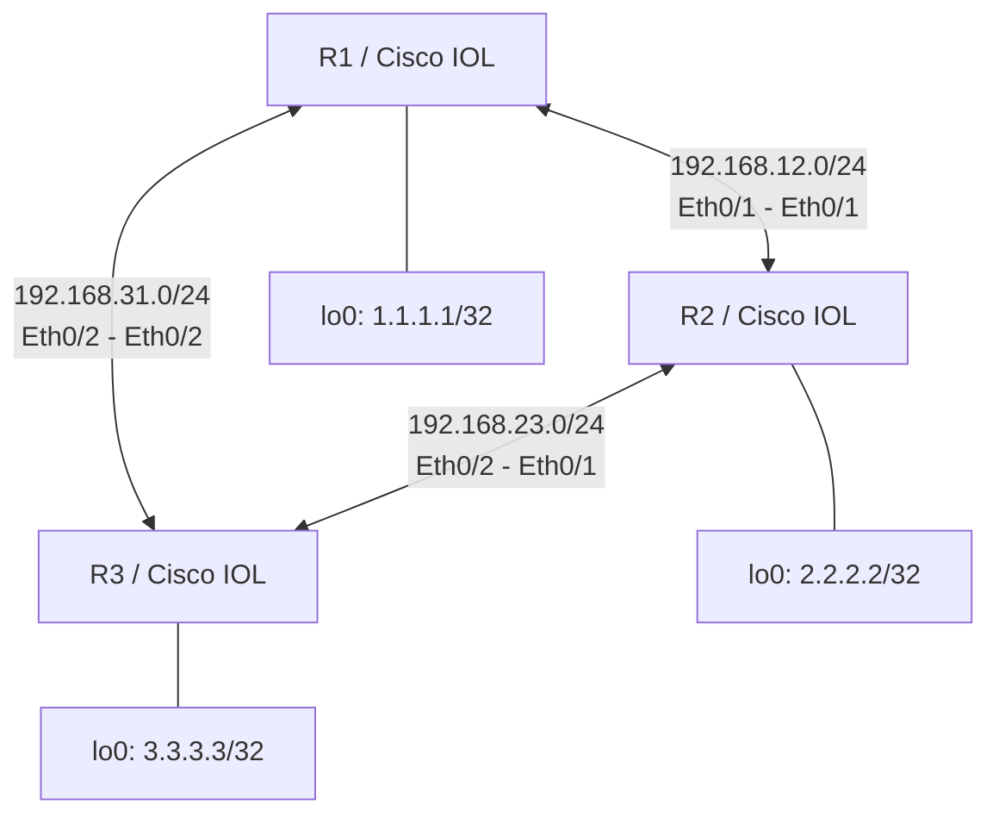

# 📖 Cisco IOL OSPF 3台三角形構成 手動構築ガイド

本ファイルは、Cisco IOLルータ3台を三角形（冗長構成）に結び、OSPF動的ルーティングを完全に手動で構築・検証していく進行記録ガイドです。

---

## 🗺️ トポロジーとIP設計要件

R1, R2, R3 が三角形に結ばれた冗長構成を設計します。



### 1. インターフェースIP設計

| デバイス | インターフェース | IPアドレス / サブネット | 接続相手 |
|---|---|---|---|
| **R1** | `Ethernet0/1` | `192.168.12.1/24` | R2 (`Ethernet0/1`) |
| **R1** | `Ethernet0/2` | `192.168.31.1/24` | R3 (`Ethernet0/2`) |
| **R1** | `Loopback0` | `1.1.1.1/32` | 自身の識別用 (Router ID) |
| **R2** | `Ethernet0/1` | `192.168.12.2/24` | R1 (`Ethernet0/1`) |
| **R2** | `Ethernet0/2` | `192.168.23.2/24` | R3 (`Ethernet0/1`) |
| **R2** | `Loopback0` | `2.2.2.2/32` | 自身の識別用 (Router ID) |
| **R3** | `Ethernet0/1` | `192.168.23.3/24` | R2 (`Ethernet0/2`) |
| **R3** | `Ethernet0/2` | `192.168.31.3/24` | R1 (`Ethernet0/2`) |
| **R3** | `Loopback0` | `3.3.3.3/32` | 自身の識別用 (Router ID) |

---

## 🏁 STEP 1: 物理トポロジーの起動と生存確認

### 1. ラボのデプロイ
```bash
cd /Users/shuya/Documents/claude/Mac仮想環境構築/02_cisco_ospf_3nodes_challenge
sudo containerlab deploy -t cisco_ospf_3nodes.clab.yml
```

> [!WARNING]
> 今回はルータが3台に増えたため、すべてのノードが起動して完全にプロンプトを受け付けるようになるまで **約3分〜4分** かかります。
> `sudo docker ps` を実行し、R1, R2, R3 すべてが `Up` 状態かつ `healthy` になるのをのんびりとお待ちください。

### 2. 機器の CLI へのログイン方法
- **R1 に接続:**
  ```bash
  sudo docker attach clab-cisco-ospf-3nodes-r1
  ```
- **R2 に接続:**
  ```bash
  sudo docker attach clab-cisco-ospf-3nodes-r2
  ```
- **R3 に接続:**
  ```bash
  sudo docker attach clab-cisco-ospf-3nodes-r3
  ```

> [!CAUTION]
> **デタッチ（ホストに戻る）コマンド**
> コンソールから安全に抜ける際は、必ず **`Ctrl + P` ➔ `Ctrl + Q`** の順に入力してください。

### 3. 生存確認コマンド
ログイン後、特権モード（`enable`）に入り、直結インターフェースが正しく存在しているかを確認します。

```ios
Router> enable
Router# show ip interface brief
```
- `Ethernet0/1` および `Ethernet0/2` が `administratively down` の状態で存在していることを確認してください。
