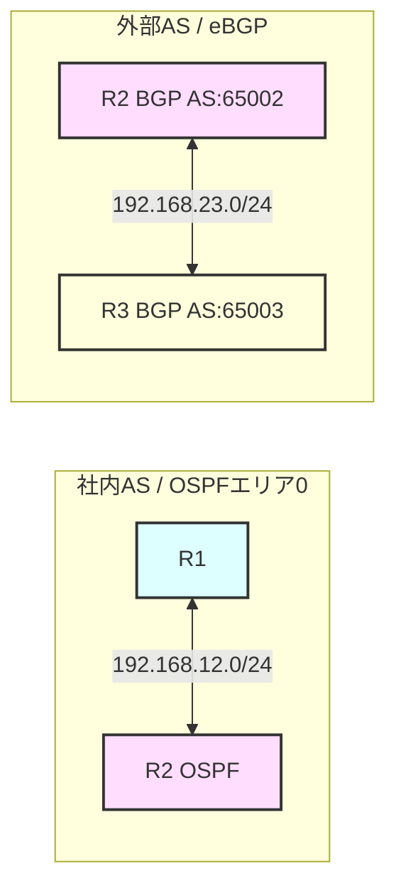

# 🚀 Challenge 05: OSPF ＆ BGP のルート再配送（Mutual Redistribution）

本ラボは、物理結線のみが完了した「まっさらなルータ3台」を使い、社内ネットワーク（OSPF）と外部ネットワーク（BGP）をAS境界ルータで接続し、双方向でルート情報をやり取りする「ルート再配送」を体験するハンズオン課題です。

異なるルーティングプロトコル間でルートを翻訳して受け渡す仕組みの本質を学びましょう！

---

## 🗺️ トポロジーと設計要件



### 1. インターフェースIP設計

| デバイス | インターフェース | IPアドレス / サブネット | 役割・プロトコル |
|---|---|---|---|
| **R1** | `Ethernet0/1` | `192.168.12.1/24` | 対向R2接続用（OSPF） |
| **R1** | `Loopback0` | `1.1.1.1/32` | 社内ローカル拠点（OSPF広報） |
| **R2** | `Ethernet0/1` | `192.168.12.2/24` | 対向R1接続用（OSPF） |
| **R2** | `Ethernet0/2` | `192.168.23.2/24` | 対向R3接続用（eBGP） |
| **R2** | `Loopback0` | `2.2.2.2/32` | ルータID用 |
| **R3** | `Ethernet0/1` | `192.168.23.3/24` | 対向R2接続用（eBGP） |
| **R3** | `Loopback0` | `3.3.3.3/32` | 外部インターネット拠点（BGP広報） |

### 2. プロトコル設定要件
- **OSPF (R1-R2間):**
  - プロセスID: `1`
  - エリア: `0`
  - R1 の `1.1.1.1/32` は OSPF にアドバタイズする。
- **BGP (R2-R3間):**
  - R2 AS番号: `65002`
  - R3 AS番号: `65003` (eBGPピア)
  - R3 の `3.3.3.3/32` は BGP に `network` コマンドで広告する。

---

## 🎯 4つのミッション

### Mission 1: OSPF と BGP の個別開通
各ルータにIPアドレスとルーティング設定を投入し、それぞれの境界で正しくネイバーを確立します。
この段階では、**「R1には外部ルート（3.3.3.3）が届かず、R3には社内ルート（1.1.1.1）が届かない」**という状態を確認します。

### Mission 2: OSPFルート ➔ BGPへの再配送
R2（境界ルータ）において、OSPFで学習した社内ルートを、BGPの外部ネットワークへ流し込みます。
R3のBGPテーブル（`show ip bgp`）に、`1.1.1.1/32` が届く様子を観測します。

### Mission 3: BGPルート ➔ OSPFへの再配送
R2（境界ルータ）において、BGPで学習した外部ルートを、社内OSPFネットワークへ流し込みます。
R1のルーティングテーブルに `3.3.3.3/32` が **「O E2（OSPF外部ルート）」** として載ってくることを確認します。

### Mission 4: 完全疎通確認
R1からR3の外部拠点への双方向Pingが完璧に通ることを確認します！
`ping 3.3.3.3 source loopback 0`

---

## 🛠️ コマンドリファレンス（設定のヒント）

再配送（Redistribute）の設定は、AS境界ルータ **R2** でのみ行います。

#### OSPFからBGPへの再配送 (R2にて)
```ios
router bgp 65002
 redistribute ospf 1
```

#### BGPからOSPFへの再配送 (R2にて)
```ios
router ospf 1
 redistribute bgp 65002 subnets
```
> [!IMPORTANT]
> Cisco IOS の OSPF へ再配送する際は、必ず末尾に **`subnets`** キーワードをつけてください。これを忘れると、クラスフル（/8, /16, /24等）ではないサブネット化されたネットワーク（/32のLoopback等）がOSPFへ配送されず、ルーティングテーブルに載らない原因になります！
