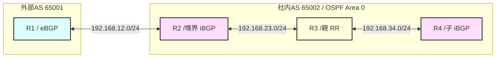

# 🚀 Challenge 05: ルートフィルタリング（Route-map / Prefix-list）＆ ルートリフレクタ（RR）ハンズオン

本ラボは、物理結線のみが完了した「まっさらなルータ4台」を使い、ルートリフレクタ（RR）によるiBGPスプリットホライズンの解決と、Route-map ＆ Prefix-listを用いた高度なルート制御（フィルタリング）を体験する、極上ハンズオン課題です。

---

## 🗺️ トポロジーと設計要件

### 1. インターフェースIP設計

| デバイス | インターフェース | IPアドレス / サブネット | 役割・プロトコル |
|---|---|---|---|
| **R1** | `Ethernet0/1` | `192.168.12.1/24` | 対向R2接続用（eBGP） |
| **R1** | `Loopback0` | `1.1.1.1/32` | 外部インターネット拠点 |
| **R1** | `Loopback10` | `10.1.1.1/24` | テスト用セグメント1 (社内通過許可ルート) |
| **R1** | `Loopback20` | `10.2.2.2/24` | テスト用セグメント2 (境界R2で遮断するルート) |
| **R1** | `Loopback30` | `10.3.3.3/24` | テスト用セグメント3 (境界R2で遮断するルート) |
| **R2** | `Ethernet0/1` | `192.168.12.2/24` | 対向R1接続用（eBGP） |
| **R2** | `Ethernet0/2` | `192.168.23.2/24` | 対向R3接続用（OSPF & iBGP） |
| **R2** | `Loopback0` | `2.2.2.2/32` | OSPF広報 ＆ iBGPピア用 |
| **R3** | `Ethernet0/1` | `192.168.23.3/24` | 対向R2接続用（OSPF & iBGP） |
| **R3** | `Ethernet0/2` | `192.168.34.3/24` | 対向R4接続用（OSPF & iBGP） |
| **R3** | `Loopback0` | `3.3.3.3/32` | OSPF広報 ＆ ルートリフレクタ(RR)親機 |
| **R4** | `Ethernet0/1` | `192.168.34.4/24` | 対向R3接続用（OSPF & iBGP） |
| **R4** | `Loopback0` | `4.4.4.4/32` | OSPF広報 ＆ iBGPピア用（RRクライアント） |

### 2. プロトコル設計
- **OSPF (社内AS 65002内: R2, R3, R4):**
  - プロセスID: `1`
  - エリア: `0`
  - 各ルータの `Loopback0` および物理接続リンク（`192.168.23.0/24`, `192.168.34.0/24`）は OSPF にアドバタイズします。
  - **重要:** eBGP接続用の物理リンク `192.168.12.0/24` を OSPF で広報することにより、`next-hop-self` を使わなくても R3 や R4 が R1（`192.168.12.1`）へ到達できるようにし、ネクストホップの自動解決を試します！
- **BGP (R1-R2-R3-R4間):**
  - **R1:** AS `65001` (eBGPピア: R2 の `192.168.12.2` と接続)
  - **R2, R3, R4:** AS `65002` (iBGPピア)
  - iBGPピアは、OSPFで疎通を確保した `Loopback0`（`2.2.2.2`, `3.3.3.3`, `4.4.4.4`）の間で確立します。
  - **重要:** **R2 と R4 の間には直接BGPピアを張りません！**
    - R2 ➔ R3 間でピアを張る
    - R3 ➔ R4 間でピアを張る

---

## 🎯 3つのミッション

### Mission 1: OSPF と iBGP（スプリットホライズントラップ）の観測
1. AS65002内部（R2, R3, R4）で OSPF を有効化し、`Loopback0` 同士で双方向 Ping が通ることを確認します。
2. R1 と R2 の間で eBGP を確立し、R1 から `1.1.1.1/32`, `10.1.1.0/24`, `10.2.2.0/24`, `10.3.3.0/24` を広報します。
3. R2 ➔ R3 間、R3 ➔ R4 間で Loopback0 を使った iBGP ピアを確立します。
4. **観測ポイント:** 
   - R3 の BGPテーブルには R1 のルートが届きますが、**R4 の BGPテーブルにはルートが一切届かない**ことを確認します。
   - なぜ届かないのか？これが iBGP の大原則である **「スプリットホライズン（iBGPから学習したルートは他のiBGPネイバーに転送しない）」** の挙動です！

### Mission 2: ルートリフレクタ（RR）の有効化 ＆ next-hop-self 無しでの自動解決
1. R3（親ルータ）において、R2 と R4 を **クライアント（`route-reflector-client`）** に指定します。
2. **観測ポイント:**
   - 設定後、R4 の BGPテーブルに R1 のルートが反射されて現れる様子を観測します！
   - さらに、R2で `next-hop-self` を設定しなくても、OSPFで eBGP 境界セグメント（`192.168.12.0/24`）が広報されているため、R4がネクストホップ `192.168.12.1` を自動で解決し、ベストルート（`*>`）として認識されることを確認します。

### Mission 3: Route-map と Prefix-list によるフィルタリング
1. 社内ポリシーに基づき、R2（境界ルータ）で以下のフィルタリングを実装します。
   - **要件:** `10.1.1.0/24` だけを受信許可し、`10.2.2.0/24` と `10.3.3.0/24` をブロックします。
2. `ip prefix-list` を作成し、`10.1.1.0/24` を許可します。
3. `route-map` を作成し、prefix-list をマッチさせます。
4. R2 の BGP ネイバー（R1対向）に `route-map` を `in` で適用します。
5. **観測ポイント:**
   - フィルタリング適用後、BGPソフトクリアを行い、R2, R3, R4 の BGPテーブルから不要なルートが完全に消え去り、`10.1.1.0/24` だけが美しくフィルタされて残っていることを確認します。
