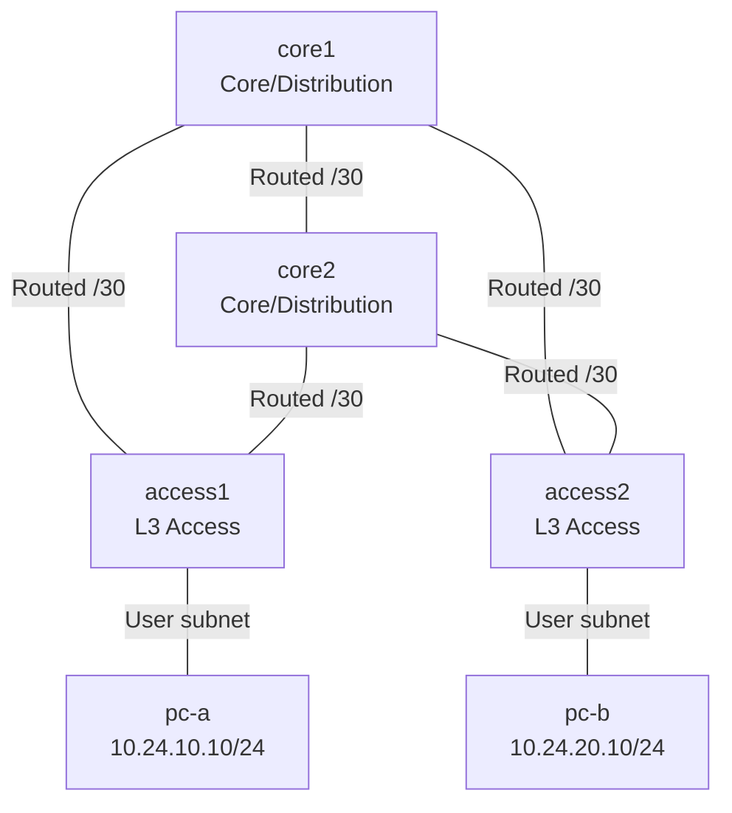

# Theme 24: Campus Pattern B — Routed Access

## 1. このラボで学ぶこと

Routed Accessは、アクセス層までルーティングを伸ばし、上位接続をL2トランクではなくL3リンクにする設計です。ループ回避をSTPに任せず、OSPFとECMPで複数経路を同時利用し、障害時の収束を観察します。

このローカル環境では、実機Catalystの「L3スイッチ」をCisco IOLのL3ルーターモードで模擬します。したがって、Catalyst固有のスイッチポート機能ではなく、Routed Port、OSPF、ECMPという設計の中心を学習対象にします。

> **初期状態**: containerlabは機器、配線、attach可能な起動方式だけを用意します。インフラリンク、Loopback、OSPF、端末のデータプレーンIP・経路は一切自動設定しません。設定はすべて自分で考えて投入してください。

> **完了状態（2026-07-01）**: Routed Port、OSPF、ECMP、双方向疎通、リンク/Core障害、復旧試験まで完了しました。結果と気づきは[試験完了記録](05_試験/試験完了記録_2026-07-01.md)を参照してください。

## 2. トポロジ



> 「全リンクをRouted Portにする」の対象は、Core/DistributionとAccess間のインフラリンクです。端末収容リンクは通常のユーザーサブネットとして扱います。

## 3. ノードとアドレス設計

| ノード | 役割 | Loopback0 | 管理IP |
|---|---|---:|---:|
| core1 | Core/Distribution | 10.24.255.1/32 | 172.24.24.11 |
| core2 | Core/Distribution | 10.24.255.2/32 | 172.24.24.12 |
| access1 | L3 Access | 10.24.255.11/32 | 172.24.24.21 |
| access2 | L3 Access | 10.24.255.12/32 | 172.24.24.22 |
| pc-a | Access1配下端末 | — | 172.24.24.101 |
| pc-b | Access2配下端末 | — | 172.24.24.102 |

| 接続 | サブネット | 左側 | 右側 |
|---|---|---:|---:|
| core1—access1 | 10.24.0.0/30 | .1 | .2 |
| core2—access1 | 10.24.0.4/30 | .5 | .6 |
| core1—access2 | 10.24.0.8/30 | .9 | .10 |
| core2—access2 | 10.24.0.12/30 | .13 | .14 |
| core1—core2 | 10.24.0.16/30 | .17 | .18 |
| access1—pc-a | 10.24.10.0/24 | .1 | .10 |
| access2—pc-b | 10.24.20.0/24 | .1 | .10 |

## 4. Mission

### Mission 1: Routed Portを構築する

- 5本のインフラリンクへ表どおりの`/30`を設定する。
- すべてのインフラ用インターフェースをL3として使用する。
- 各ノードへLoopback0を設定する。

### Mission 2: OSPFとECMPを成立させる

- 全インフラリンクとLoopback0をOSPF area 0へ参加させる。
- Router IDはLoopback0のIPに固定する。
- access1から`10.24.20.0/24`への経路に、core1/core2の2ネクストホップが載るようコストを揃える。

### Mission 3: STP非依存を証明する

- インフラリンクでVLAN、Trunk、STPを設定しない。
- OSPF経路表とCEFのネクストホップで転送経路を確認する。
- pc-aからpc-bへ連続pingを行う。

### Mission 4: 障害試験を行う

- access1—core1リンクをshutdownし、通信断時間を記録する。
- core1全体を停止し、残ったcore2経路で通信が復旧することを確認する。
- 復旧後にOSPF隣接とECMPが元へ戻ることを確認する。

## 5. 起動方法

### 実行場所: OrbStack Linux VM（`ssh clab@orb`）

```bash
cd /Users/shuya/Documents/claude/Mac仮想環境構築/24_campus_routed_access/04_構築
./deploy.sh deploy
```

Cisco IOLへのログイン例:

```bash
sudo docker attach --sig-proxy=false clab-campus-routed-access-core1
```

画面が表示されない場合はEnterを1〜2回押します。機器ごとのコマンド、離脱方法、切り分けは[00_ログイン/ログインコマンド.md](00_ログイン/ログインコマンド.md)を参照してください。

停止・削除:

```bash
./deploy.sh destroy
```

## 6. 達成条件

- すべてのOSPF隣接が`FULL`。
- access1/access2が相互のユーザーサブネットをOSPFで学習。
- 対向ユーザーサブネットに等コストの2経路が存在。
- pc-aとpc-bが相互疎通。
- 単一アップリンク障害後、残存経路で通信が復旧。
- 復旧過程を[試験計画書](05_試験/試験計画書.md)へ記録。

## 7. ローカル環境上の注意

- 使用イメージは`vrnetlab/cisco_iol:15.7.3M2`。`type: l2`は指定しません。
- containerlabのリンク名は`eth1`形式で記述し、IOS内では`Ethernet0/1`等に対応します。
- Linux端末とのリンクでエミュレータ固有のduplex問題が出た場合、まずAccessのLoopback間pingでL3ファブリックを切り分け、その後端末リンクを確認します。
- 既存テーマとは異なるラボ名と管理ネットワーク`172.24.24.0/24`を使用します。

## 8. 設計文書の読み順

1. [機器別ログインコマンド](00_ログイン/ログインコマンド.md)
2. [要件定義書](01_要件定義/要件定義書.md)
3. [基本設計書](02_基本設計/基本設計書.md)
4. [IPアドレス管理表](02_基本設計/IPアドレス管理表.md)
5. [ネットワーク物理構成図](02_基本設計/ネットワーク物理構成図.mermaid)
6. [パラメータシート](03_詳細設計/パラメータシート.md)
7. [環境起動ログ（2026-06-30）](04_構築/構築ログ_2026-06-30.md)
8. [構築ログテンプレート](04_構築/構築ログ_テンプレート.md)
9. [試験計画書](05_試験/試験計画書.md)
10. [試験完了記録（2026-07-01）](05_試験/試験完了記録_2026-07-01.md)
11. [障害経路シミュレーター](05_試験/障害試験_想定経路図.html)
