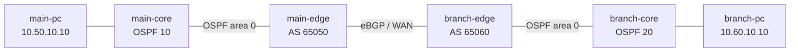

# Theme 25: Campus Pattern C — Multi-Campus

## 1. このラボで学ぶこと

Multi-Campusは、キャンパス内部のIGPと、拠点間のBGPを役割分担させて複数拠点を接続する設計です。このラボでは、Main CampusとBranch Campusを別々のOSPFドメインとして構築し、境界ルーター間をeBGPで接続します。

主眼は「すべての細かい経路を相手へ漏らさない集約」と、「経路ループを作らない制御付き再配信」です。IPsecは既存Theme 14で学習済みのため、まず単純なL3 WANでルーティング設計を完成させ、追加Missionとして重ねます。

> **初期状態**: containerlabは機器、配線、attach可能な起動方式、PC側のIP/経路だけを用意します。Cisco IOLのインフラリンクIP、Loopback、OSPF、BGP、prefix-list、route-map、集約・再配信は一切自動設定しません。設定はすべて自分で考えて投入してください。

## 2. トポロジ



> 両キャンパスのOSPFは別プロセス・別ドメインです。両方でarea 0を使っても、BGP境界を越えて同じOSPFドメインになるわけではありません。

## 3. ノードとアドレス設計

| ノード | 役割 | Router ID / Loopback | 管理IP |
|---|---|---:|---:|
| main-core | Main内部ルーター | 10.50.255.1/32 | 172.25.25.11 |
| main-edge | Main境界、AS 65050 | 10.50.255.254/32 | 172.25.25.12 |
| branch-edge | Branch境界、AS 65060 | 10.60.255.254/32 | 172.25.25.21 |
| branch-core | Branch内部ルーター | 10.60.255.1/32 | 172.25.25.22 |
| main-pc | Main端末 | 10.50.10.10/24 | 172.25.25.101 |
| branch-pc | Branch端末 | 10.60.10.10/24 | 172.25.25.102 |

| 接続 | サブネット | 左側 | 右側 |
|---|---|---:|---:|
| main-core—main-edge | 10.255.50.0/30 | .1 | .2 |
| main-edge—branch-edge | 198.51.100.0/30 | .1 | .2 |
| branch-edge—branch-core | 10.255.60.0/30 | .1 | .2 |
| main-core—main-pc | 10.50.10.0/24 | .1 | .10 |
| branch-core—branch-pc | 10.60.10.0/24 | .1 | .10 |

広告する集約経路:

- Main Campus: `10.50.0.0/16`
- Branch Campus: `10.60.0.0/16`

## 4. Mission

### Mission 1: 各キャンパスのOSPFを独立構築する

- MainはOSPF process 10、Branchはprocess 20を使用する。
- 内部リンク、ユーザーサブネット、Loopbackをarea 0で広告する。
- 境界ルーター間のWANリンクはOSPFへ参加させない。

### Mission 2: eBGPで境界を接続する

- main-edgeをAS 65050、branch-edgeをAS 65060とする。
- WANリンク上でeBGPネイバーを確立する。
- BGP Router IDをLoopbackの値へ固定する。

### Mission 3: 集約と再配信を制御する

- OSPFからBGPへ渡す経路をprefix-listとroute-mapで自拠点プレフィックスだけに制限する。
- BGPでは`/16`集約だけを相手拠点へ見せ、配下の`/24`を抑止する。
- BGPからOSPFへは相手拠点の`/16`だけを再配信する。
- 再配信経路へtagを付け、再注入や経路ループを判別できるようにする。

### Mission 4: 通信と経路障害を試験する

- main-pcとbranch-pcの相互疎通を確認する。
- 各キャンパス内部では、相手拠点の`/16`だけが見えることを確認する。
- BGPセッション停止時に相手拠点経路が消え、復旧後に戻ることを確認する。

### 追加Mission: IPsecを重ねる

- 基礎Mission合格後にのみ、Theme 14を参照してEdge間へroute-based IPsecを追加する。
- BGPのネイバー到達性、MTU、暗号化前後の経路を別々に確認する。
- IPsec失敗と経路制御失敗を同時に切り分けない。

## 5. 起動方法

### 実行場所: OrbStack Linux VM（`ssh clab@orb`）

```bash
cd /Users/shuya/Documents/claude/Mac仮想環境構築/25_campus_multi_site/04_構築
./deploy.sh deploy
```

Cisco IOLへのログイン例:

```bash
sudo docker attach --sig-proxy=false clab-campus-multi-site-main-edge
```

画面が表示されない場合はEnterを1〜2回押します。機器ごとのコマンド、離脱方法、切り分けは[00_ログイン/ログインコマンド.md](00_ログイン/ログインコマンド.md)を参照してください。

停止・削除:

```bash
./deploy.sh destroy
```

## 6. 達成条件

- Main側とBranch側でOSPF隣接がそれぞれ`FULL`。
- Edge間eBGPが`Established`。
- Main側には`10.60.0.0/16`、Branch側には`10.50.0.0/16`だけが拠点間経路として存在。
- 相手側の個別`/24`がBGPテーブルへ漏れていない。
- main-pcとbranch-pcが相互疎通。
- BGP停止・復旧に追従して経路が消失・再学習。

## 7. 設計上の禁止事項

- prefix-listなしの相互`redistribute`。
- `10.0.0.0/8`のような実際の拠点範囲より広すぎる集約。
- 基礎ルーティングが未完成のままIPsecを追加すること。
- BGP表、OSPF表、RIBを区別せず「pingが通るから完成」と判定すること。

## 8. ローカル環境上の注意

- 使用イメージは`vrnetlab/cisco_iol:15.7.3M2`。
- containerlabのリンク名は`eth1`形式で記述し、IOS内では`Ethernet0/1`等に対応します。
- IOLをPID1にするentrypointを使用して`docker attach`でIOSへ直接接続します。
- Linux端末とのリンクでエミュレータ固有のduplex問題が出た場合、まずEdge間Loopback pingでL3ファブリックを切り分け、その後端末リンクを確認します。
- 既存テーマとは異なるラボ名と管理ネットワーク`172.25.25.0/24`を使用します。

## 9. 設計文書の読み順

1. [機器別ログインコマンド](00_ログイン/ログインコマンド.md)
2. [要件定義書](01_要件定義/要件定義書.md)
3. [基本設計書](02_基本設計/基本設計書.md)
4. [IPアドレス管理表](02_基本設計/IPアドレス管理表.md)
5. [ネットワーク物理構成図](02_基本設計/ネットワーク物理構成図.mermaid)
6. [パラメータシート](03_詳細設計/パラメータシート.md)
7. [構築ログテンプレート](04_構築/構築ログ_テンプレート.md)
8. [試験計画書](05_試験/試験計画書.md)
