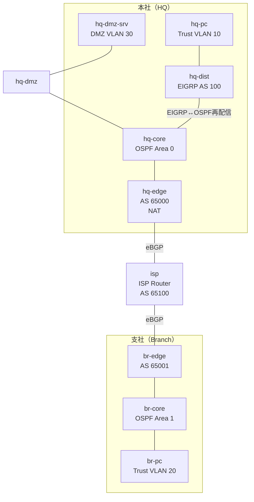

# Theme 26: Dynamic Routing Deep Dive (動的ルーティング深堀り)

## 概要
このテーマでは、中規模企業ネットワーク（本社・支社・インターネット）を模した構成を用いて、OSPF、EIGRP、BGPの使い分けと、それらを連携させる再配信（Redistribution）、経路制御、NATを実践的に学びます。『ネットワーク・デザインパターン』のゾーン設計（Trust/Untrust/DMZ/WAN）に基づき、「なぜこのプロトコルを使うのか」を要件から導き出して設定を行います。

## ネットワークトポロジ



## ラボ開始手順

1. **環境構築**
   ```bash
   cd 04_構築
   ./deploy.sh deploy
   ```
2. **ログイン**
   機器へのログインコマンドは [00_ログイン/ログインコマンド.md](00_ログイン/ログインコマンド.md) を参照してください。

## ミッション（Mission）

以下のミッションを順番にクリアし、段階的にネットワークを構築してください。

### Mission 1: 本社OSPFマルチエリア構築
本社コア（hq-core）、エッジ（hq-edge）、DMZ（hq-dmz）間でOSPF Area 0を構築します。
- Loopback、内部リンク、DMZサブネットをOSPFで広告する
- OSPFのネットワークタイプを確認し、不要なHelloパケットを抑制する（Passive Interface）

### Mission 2: 本社EIGRP化と再配信
本社ディストリビューション（hq-dist）をEIGRPで構成し、コア（hq-core）でOSPFと双方向に再配信します。
- hq-distにEIGRP AS 100を設定
- hq-coreでroute-mapを用い、不要な経路が再配信されないようにフィルタリング
- 再配信のシードメトリックを適切に設定する

### Mission 3: ISP接続＋eBGP＋NAT/PAT
本社のインターネット接続口（hq-edge）を設定します。
- hq-edgeとISPルータ間でeBGPを確立し、デフォルトルートを受信する
- hq-edgeでTrust/DMZ向けにNAT inside/outsideを設定し、インターネット通信用のPAT（NAPT）を構成する

### Mission 4: 支社接続＋WAN経路制御
支社ネットワークを構築し、WANを経由して本社と通信できるようにします。
- 支社内でOSPF Area 1を構築
- br-edgeとISP間でeBGPを確立
- prefix-listを用いて、支社からISPへは支社のプレフィックスのみを広告するよう制御

### Mission 5: ECMP/負荷分散検証
- OSPFの等コストマルチパス（ECMP）を確認
- （オプション）EIGRPの不等コストロードバランシング（variance）の仕組みを確認

### Mission 6: 総合障害試験
- コア・エッジ間のリンク障害を発生させ、ルーティングが迂回経路に切り替わるか確認
- 再配信におけるルーティングループが発生していないか確認

## 禁止事項
- `clab.yml` にルーティングプロトコルやIPアドレスの設定（Linux PCのbootstrap以外）を記述すること（すべて手動でCLIから投入して学びます）
