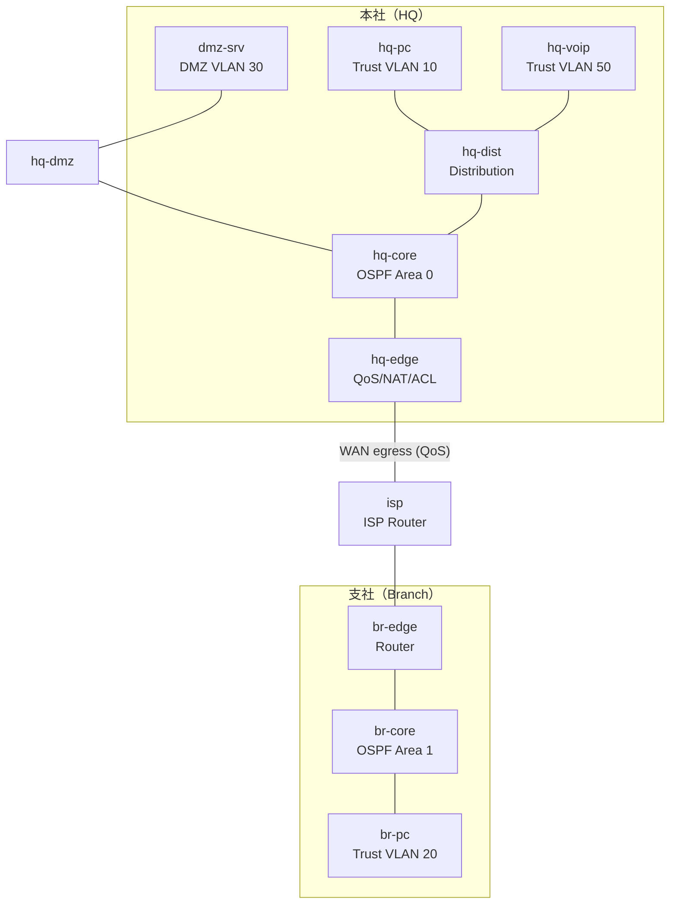

# Theme 27: QoS/ACL/route-map Applied (QoS/ACL/route-map応用)

## 概要
このテーマでは、テーマ26で構築したような動的ルーティング基盤の上に、「どのような通信を許可・拒否するか（ACL）」「どのような経路を通らせるか（PBR）」「どのトラフィックを優先するか（QoS）」というポリシー制御を実装します。中規模企業ネットワークにおいて、セキュリティ要件と通信品質要件を満たすための実践的な設定を学びます。

## ネットワークトポロジ



## ラボ開始手順

1. **環境構築**
   ```bash
   cd 04_構築
   ./deploy.sh deploy
   ```
2. **ログイン**
   機器へのログインコマンドは [00_ログイン/ログインコマンド.md](00_ログイン/ログインコマンド.md) を参照してください。

## ミッション（Mission）

このラボでは、事前に「ルーティングが通っている」状態を自力で作った上で、以下のポリシー制御を追加していきます。

### Mission 1: ベースライン構築＋ゾーン間ACL設計
- OSPFとBGPを用いて全拠点のルーティングを確立する。
- ゾーン間のアクセス制御（ACL）を設計・適用する：
  - Trust → Untrust: 許可
  - Untrust → Trust: 拒否（戻り通信のみ許可 / established等）
  - Trust → DMZ: HTTPS（tcp 443）のみ許可
  - Untrust → DMZ: HTTP/HTTPSのみ許可
  - DMZ → Trust: 全て拒否

### Mission 2: route-mapによるポリシーベースルーティング (PBR)
- hq-voip（10.27.50.0/24）からの通信を、通常のルーティングテーブルに従わず、特定のネクストホップ（例: 専用線や特定ルータ）へ強制的に誘導する。
- route-mapを用いてパケットの送信元IPをマッチさせ、`set ip next-hop` を設定する。

### Mission 3: DiffServ QoSの基礎
- hq-voipからのトラフィックを分類（class-map）し、DSCPフィールドに `EF`（Expedited Forwarding）をマーキング（policy-map）する。
- その他のトラフィックを分類し、`AF21` 等のDSCP値をマーキングする。

### Mission 4: 音声/映像トラフィック優先制御
- hq-edgeのWAN側（ISP向け）インターフェースにて、キューイングと帯域制御を行う。
- EFマーキングされたトラフィックに対して、LLQ（Low Latency Queuing）を用いて最優先で送信・帯域確保する。
- WAN回線の帯域を意図的に絞り（shaping）、QoSの効果を ping や iperf で観測する。

### Mission 5: prefix-list＋route-mapで経路広告制御
- BGPにおいて、特定のコミュニティ（Community）属性が付与された経路のみをISPへ広告する、またはISPから受信する経路を特定のプレフィックスのみに制限する。
- OSPFにおいて `distribute-list` を用い、特定ルートのルーティングテーブルへのインストールを防ぐ。

### Mission 6: 総合シナリオ試験
- 業務要件：「支社からの音声通話を最優先とし、DMZへのアクセスはセキュアにし、不要なインターネット通信はドロップする」
- これらを満たすACL・QoS・route-mapが全て同時に正しく動作しているか、各エンドポイントから通信テストを行って確認する。

## 禁止事項
- `clab.yml` に各種設定を記述すること（すべて手動で設定します）。
