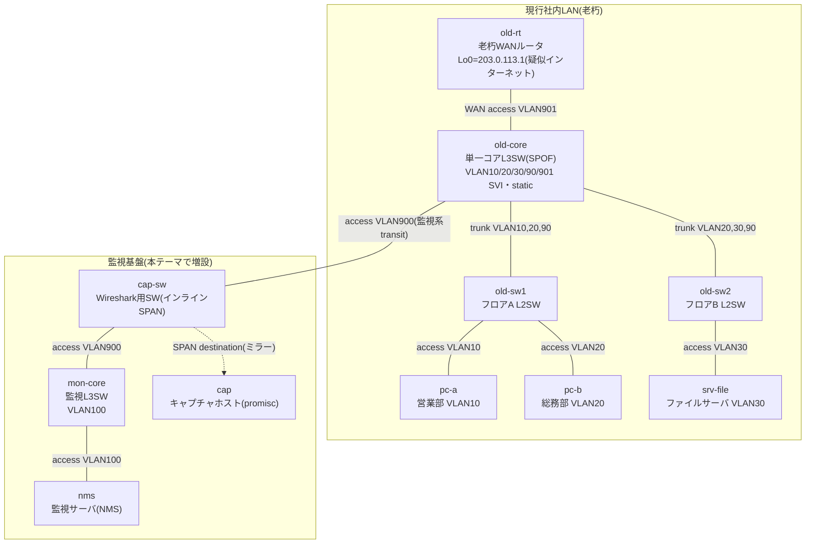

# Theme 28: 監視基盤とSNMP深堀り（SNMP Monitoring Deep Dive）— 老朽社内LANへの監視後付け

## 概要
本テーマは、「監視が一切ない老朽社内LAN」に監視基盤を後付けするラボです。想定シナリオは、単一コアL3SW（old-core）にVLAN10（営業）・VLAN20（総務）・VLAN30（サーバ）のSVIが同居し、しかもVLAN20（総務）は増築の過程でフロアA（old-sw1）とフロアB（old-sw2）の両方にまたがって延伸されてしまっている、ルーティングはstatic一辺倒、IOSも旧バージョン……という、監視も冗長化もされないまま増改築を重ねた典型的な老朽LANです。

このLANに、監視専用のL3SW（mon-core）・監視サーバ（nms）・Wireshark観測用SW（cap-sw、SPANでミラーリング）を後付けし、SNMPを軸に監視の基礎から深堀りします。具体的には v2c → snmpwalk/OID/MIBツリー探索 → IF-MIBによるインタフェースカウンタ監視 → v3（認証・暗号化）への移行 → trap受信、という順に段階を追って学びます。

なお、単一コア（SPOF）・VLAN20のL2延伸・static一辺倒のルーティング・旧IOSといった「老朽ポイント」は、本テーマのために意図的に仕込んだ設計です。このLANはそのままテーマ29「更改・移行・移設」の移行元として引き継がれ、本テーマで監視によって可視化した課題が、次テーマでの更改設計の根拠になります。

## ネットワークトポロジ



※ 管理ネットワーク（mgmt、`172.28.28.0/24`）は図示を省略しています。

## ラボ開始手順

1. **環境構築**
   ```bash
   cd 04_構築
   ./deploy.sh deploy
   ```
2. **ログイン**
   機器へのログインコマンドは [00_ログイン/ログインコマンド.md](00_ログイン/ログインコマンド.md) を参照してください。

## ミッション（Mission）

このラボでは、監視が一切ない老朽LANを自力で作った上で、監視基盤を段階的に後付けしていきます。

### Mission 1: 老朽LANベースライン構築
- old-core・old-sw1・old-sw2にVLAN10/20/30/90を作成し、old-core⇔old-sw1・old-core⇔old-sw2間をtrunkで接続する。
- old-coreに各VLANのSVI（VLAN10=10.28.10.1、VLAN20=10.28.20.1、VLAN30=10.28.30.1、VLAN90=10.28.90.1 等）を設定する。
- old-rt⇔old-core間はVLAN901（10.28.1.0/30）でWAN接続し、static routeのみで社内⇔old-rt間の疎通を確立する（old-rt側: `ip route 10.28.0.0 255.255.0.0 10.28.1.2`、old-core側: defaultを10.28.1.1へ）。
- pc-a・pc-b・srv-fileの全端末から、old-rtのLo0（203.0.113.1、疑似インターネット）へpingが通ることを確認する。
- 構成図（トポロジ図）に、このLANが抱える「老朽ポイント」（単一コアのSPOF性、VLAN20がold-sw1/old-sw2の両方に延伸しているL2構成、static一辺倒のルーティング、旧IOSバージョン等）を自分の言葉で注記すること。

### Mission 2: 監視セグメント増設
- mon-core・cap-swにVLAN900（監視系transit）・VLAN100（監視セグメント）を設定する。
- old-core⇔cap-sw⇔mon-core間をVLAN900（10.28.0.0/29）でインライン接続し、mon-core⇔nms間をVLAN100（10.28.100.0/24）で接続する。
- mon-coreのdefault routeをold-core（10.28.0.1）向けに設定し、old-coreに`ip route 10.28.100.0 255.255.255.0 10.28.0.2`を追加して監視セグメントへの戻り経路を確保する。
- old-sw1・old-sw2・cap-swはL2運用のため`ip default-gateway`で管理疎通を確保する。
- nms（10.28.100.10）から、各機器のポーリング対象IP（old-rt=10.28.1.1、old-core=10.28.90.1、old-sw1=10.28.90.13、old-sw2=10.28.90.14、mon-core=10.28.0.2、cap-sw=10.28.0.3）へpingが通ることを確認する。
- cap-swにSPANを設定する: `monitor session 1 source interface Ethernet0/1 both` ＋ `monitor session 1 destination interface Ethernet0/3`。sourceをE0/1（old-core側）のみにするのは、E0/1とE0/2の両方をsourceにすると、old-core⇔mon-core間を通過する同一フレームが2回ミラーされてしまうため。

### Mission 3: SNMPv2c＋MIBツリー深堀り
- 全IOL 6台に`snmp-server community public RO`を設定する。
- nmsから`snmpwalk`でsysブロック（`.1.3.6.1.2.1.1`配下）をwalkする。
- sysName・sysDescr・sysUpTimeを、名前指定（`sysName.0`等）と数値OID指定（`1.3.6.1.2.1.1.x`系）の両方でGetし、結果が一致することを確認する。
- `snmptranslate -Tp`でMIBツリー構造を辿り、sysブロックがどの階層に位置するか確認する。
- 取得した情報をRFC原文と突き合わせる: `rfc1157.txt`（SNMP）・`rfc1213.txt`（MIB-II）・`rfc2578.txt`（SMIv2）・`rfc3418.txt`（MIB for SNMPv3）（`ネットワーク技術分析/ネットワーク仕様書/rfc/`配下）、および書籍『ネットワーク技術＆設計入門』の`p229.md`・`p230.md`（MIBツリー構造とSNMP Get/Set/Trapの動作解説、`参考資料/`配下）。

### Mission 4: IF-MIBカウンタ監視
- nmsから各IOLに対し、ifDescr（`1.3.6.1.2.1.2.2.1.2`）・ifOperStatus（`1.3.6.1.2.1.2.2.1.8`）・ifInOctets（`1.3.6.1.2.1.2.2.1.10`）・ifHCInOctets（`1.3.6.1.2.1.31.1.1.1.6`）をwalkする。
- pc-aからsrv-fileへiperf3等でトラフィックを流しながら2回ポーリングを行い、その差分でカウンタが増加していることを観測する。
- ifInOctets（32bitカウンタ）とifHCInOctets（64bitカウンタ）の値やラップアラウンドのしやすさの違いを比較し、IF-MIBに64bit版カウンタが追加された理由をRFC2863（`rfc2863.txt`）で確認する。

### Mission 5: 平文の危険性→SNMPv3移行
- cap-swのSPANとWireshark（cap側）でv2cのGetRequest/GetResponseパケットをキャプチャし、community文字列（`public`）がそのまま平文で見えることを確認する。
- 全IOL 6台にSNMPv3を設定する: `snmp-server group NMS-GROUP v3 priv` ＋ `snmp-server user nmsuser NMS-GROUP v3 auth sha SnmpAuth28! priv aes 128 SnmpPriv28!`。
- nmsから`snmpwalk -v3 -l authPriv -u nmsuser ...`（SHA認証／AES暗号化）でwalkできることを確認する。
- 同じ通信を再度キャプチャし、認証・暗号化により内容が読み取れなくなっていることを確認する（USMの仕様はRFC3414 `rfc3414.txt`を参照）。
- 最後に、全IOLからv2cのcommunity設定（`snmp-server community public RO`）を削除し、旧v2cコマンド（`snmpwalk -v2c -c public ...`）が失敗することまで確認する。

### Mission 6: トラップ受信＋総合試験
- nmsで`snmptrapd`を起動し、トラップ受信の受け皿を用意する。
- 全IOL 6台にトラップ送信設定を投入する: `snmp-server enable traps snmp linkdown linkup coldstart` ＋ `snmp-server host 10.28.100.10 version 2c public`。
- old-sw1のE0/2（pc-a向けポート）をshutし、linkDownトラップがnmsに実際に着信することを確認する（確認後は`no shutdown`で復旧）。
- 「ポーリングはSNMPv3化したが、トラップはv2cのまま運用する」という構成が、実務でも現実的な混在パターンであることを確認する（書籍『ネットワーク「動作試験」入門』の`p109.md`を参照）。
- 最後に、Mission 1〜5の全設定が同時に矛盾なく機能していること（老朽LAN内部の疎通、監視セグメントの疎通、SNMPv3ポーリング、v2cトラップ受信）を通しで確認する。

## 禁止事項
- `legacy-lan.clab.yml` に各種設定を記述すること（すべて手動で設定します）。
