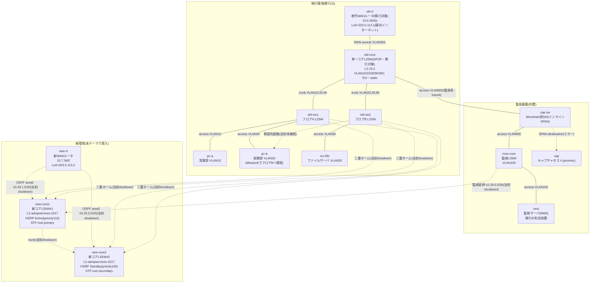

# Theme 29: 社内LAN更改・移行・移設（LAN Refresh & Migration）— 老朽単一コアからの計画移行

## 概要
本テーマは、テーマ28で監視基盤を後付けした老朽社内LANを移行元として、計画的な更改・移行・移設を行うラボです。単一コアL3SW（old-core、SPOF）を冗長コア（new-core1/new-core2、HSRP）へ、老朽WANルータ（old-rt、15.6.3M3a）を新WANルータ（new-rt、15.7.3M2）へ更改し、各VLANのゲートウェイをold-coreのSVIからHSRPの仮想IPへ、ルーティングをstaticからOSPFへ移行します。あわせて、テーマ28で意図的に仕込んだ「VLAN20がold-sw1（フロアA）とold-sw2（フロアB）の両方に延伸している」老朽ポイントを、pc-bの物理移設によって解消します。

移行はいきなり本番を切り替えるのではなく、移行計画書・カットオーバーMOP（Method of Procedure）・切り戻し手順書という3点セットに基づき、VLAN単位で段階的に実施します。そして、テーマ28で構築した監視基盤（NMS・SNMP・SPAN）が、そのまま本テーマの**移行の判定装置**になります。断時間はnmsの連続pingで実測し、old-core側の状態変化はlinkDownトラップの着信で裏付ける、という形で、監視なしに移行の成否は語れないことを体感します。

## ネットワークトポロジ



※ 管理ネットワーク（mgmt、`172.29.29.0/24`）は図示を省略しています。
※ 点線（`-.-`）は「配線済みだが当初は管理上shutdown、またはIP未設定で使われていない」リンクを表します。カットオーバーMOPの手順に従って段階的に有効化していきます。

## ラボ開始手順

1. **環境構築**
   ```bash
   cd 04_構築
   ./deploy.sh deploy
   ```
2. **ログイン**
   機器へのログインコマンドは [00_ログイン/ログインコマンド.md](00_ログイン/ログインコマンド.md) を参照してください。

## ミッション（Mission）

このラボでは、テーマ28完了時点の老朽LANをまず自力で再現し、移行計画に基づいて新環境を段階的にカットオーバーしていきます。

### Mission 1: 現行環境as-is再現
- [04_構築/現行機コンフィグ集.md](04_構築/現行機コンフィグ集.md)の設定を6台（old-rt / old-core / old-sw1 / old-sw2 / mon-core / cap-sw）へ手動投入し、テーマ28完了時と同じ状態（全端末→203.0.113.1疎通・SNMPv3ポーリング・v2cトラップ・SPAN）を再現する。
- 全端末（pc-a・pc-b・srv-file）からold-rtのLo0（203.0.113.1、疑似インターネット）へpingが通ることを確認する。
- nmsからのSNMPv3ポーリング（`snmpwalk -v3 -l authPriv -u nmsuser ...`）と、旧v2cでのpolling（`snmpwalk -v2c -c public ...`）が失敗することの両方を確認する。
- IF棚卸し（各機器のインタフェース一覧・VLAN割当）、経路表（`show ip route`）、ARPテーブル、ping疎通マトリクス（送信元pc-a/pc-b/srv-file/nms×宛先203.0.113.1・各GW・相互）を取得し、**移行前ベースライン**として構築ログに記録する。このベースラインが、後続Missionでの断時間測定・移行後総合試験の比較対象になる。

### Mission 2: 移行計画策定（文書ミッション）
- [02_基本設計/移行計画書.md](02_基本設計/移行計画書.md)の移行方式比較（一括切替／段階移行／並行稼働）を読み、本ラボが「段階移行」を採用する理由を自分の言葉で整理する。
- [03_詳細設計/カットオーバーMOP.md](03_詳細設計/カットオーバーMOP.md)の空欄（実施時刻・期待値・チェック内容）と、[03_詳細設計/切り戻し手順書.md](03_詳細設計/切り戻し手順書.md)の空欄（切り戻し判断基準・復旧手順の期待値）を、移行計画書の内容と整合する形で完成させる。
- この2文書はMission 4以降の全カットオーバー作業の拠り所になるため、Mission 3に進む前に完成させておくこと。

### Mission 3: 新環境事前構築
- new-core1・new-core2にVLAN10/20/30/90を作成し、new-core1⇔new-core2間をtrunkで接続する。
- 各VLANにSVIを設定し、HSRP（`standby <VLAN番号> ip <VIP=.1>`）を構成する。new-core1側SVIは`.2`・priority 110・preempt（Active）、new-core2側SVIは`.3`・priority 100・preempt（Standby）とする。
- VLAN10,20,30,90について、new-core1をSTP root primary、new-core2をroot secondaryに設定する。
- **フロアSW向けポート（new-core1/new-core2のold-sw1・old-sw2向けポート）とVLAN SVIはshutdownのまま維持し**、ユーザートラフィックに一切影響しないようにする。
- new-rtにOSPF（プロセス1・area 0）を設定し、new-core1・new-core2との間（10.29.1.0/30、10.29.2.0/30）でネイバーを確立する。new-rtにLoopback0=203.0.113.2/32（新・疑似インターネット）を設定し、`default-information originate`で社内へデフォルトルートを広告する。
- new-core1⇔new-core2間のトランクとHSRPを使い、**新環境内で完結する形で**HSRPフェイルオーバー単体試験（Active側shutdown→Standbyへの切替→`no shutdown`によるPreempt復帰）を実施する。
- 試験の間もnmsから既存端末（pc-a・pc-b・srv-file）への連続pingが途切れないことを確認し、新環境構築がユーザー通信に無影響であることを証明する。

### Mission 4: カットオーバー第1弾（VLAN10）＋断時間測定
- カットオーバーMOPどおりに実施する。
- 新旧トランク（old-sw1/old-sw2⇔new-core1/new-core2）を開通させ（`no shutdown`）、STPが収束するまで待つ。
- nmsから`ping -i 0.2 10.28.10.1`を連続実行しながら、old-coreのVLAN10 SVIを`shutdown`し、new-core1/new-core2のVLAN10 SVI（HSRP）を`no shutdown`する。
- ping結果のロストパケット数×0.2秒で断時間を算出し、許容値60秒以内に収まっていることを確認する。
- old-coreからのlinkDown／構成変更に伴うトラップがnmsで受信できていることを確認し、証跡として保存する。
- カットオーバーMOPの該当欄に実施時刻・実測断時間を記入する。

### Mission 5: 切り戻し訓練→再カットオーバー（VLAN20/30＋WAN）
- VLAN20の切替を一度実施したのち、**意図的に切り戻し判断基準に抵触した状況を想定**し、切り戻し手順書どおりに復旧する（old-core側SVIを`no shutdown`、new-core側SVIを`shutdown`）。
- 復旧後、旧経路での疎通が戻っていることを確認したうえで、VLAN20のカットオーバーを再実行し成功させる。
- 続けてVLAN30も同様の手順でカットオーバーする。
- 最後にold-coreのdefault route依存を解消し、社内からのインターネット向け通信をnew-rt系統へ切り替える。pc-aから新・疑似インターネット（203.0.113.2）への到達を確認する。

### Mission 6: 移設・撤去・移行後総合試験
- pc-b移設によりVLAN20のL2延伸を解消する: old-sw1のpc-b向けポートを`shutdown`→pc-b内でeth1からeth2へIPを付替え→old-sw2のpc-b受け入れポートをaccess VLAN20化する。
- 新機器3台（new-core1・new-core2・new-rt）をSNMP監視対象へ追加する（SNMPv3）。
- mon-coreのdefault routeをnew-core1（10.29.0.2）へ切り替える。
- old-core・old-rtをIOS上で`shutdown`したのち、`docker stop`で停止し、旧機器の撤去を模擬する。
- 全点疎通マトリクスとSNMP監視が正常であることをMission 1のベースラインと突き合わせて確認し、移行完了を宣言する。

## 禁止事項
- `refresh.clab.yml` に各種設定を記述すること（すべて手動で設定します）。
- カットオーバーMOP・切り戻し手順書に定めた順序以外で切替作業を行うこと（移行プロジェクトの規律として、必ずMOPどおりに実施してください）。
