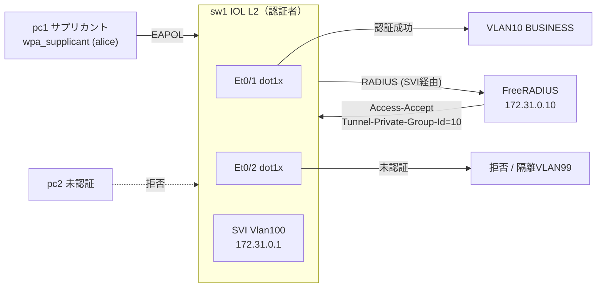

# テーマ31 NAC / 802.1X（NW-ZT N1 実装）

ゼロトラストの「ネットワークへの参加を認証で制御する」入口。Cisco IOL L2 スイッチを認証者、FreeRADIUS を認証サーバにして、802.1X で認証された端末だけを業務 VLAN に動的に入れる。テーマZERO の [NW-ZT トラック N1](../ZERO_zero_trust/02_基本設計/NW-ZT_トラックロードマップ.md) の実装先。

商用対応: **Cisco ISE / Aruba ClearPass → FreeRADIUS + IOL L2**（[教材: NAC/802.1X](../ZERO_zero_trust/教材/06_NAC_802.1X_MAB_CoA_動的VLAN.md)）。

## 構成

## 前提環境

- OrbStack VM `clab`（arm64）、`ssh clab@orb`。
- イメージ: `vrnetlab/cisco_iol:L2-15.2`、自作 `nac-freeradius:local`・`nac-client:local`（arm64、apt 導入）。
- **重要**: IOL のデータプレーンは **iouyap** 起動が必須（`deploy.sh` が自動起動）。未起動だと一切通信しない。

## 手順（04_構築/）

1. イメージビルド: `docker build -t nac-freeradius:local freeradius/` / `... nac-client:local client/`
2. `./deploy.sh deploy`（clab deploy → iouyap 起動 → データプレーン補正）
3. `sudo expect run_nac.exp clab-nac-sw1 sw1_dot1x.cfg`（スイッチ設定投入）
4. pc1 でサプリカント起動 → 認証成功 → VLAN10
5. `sudo expect verify_final.exp clab-nac-sw1`（`show authentication sessions` 確認）
6. 片付け: `./deploy.sh destroy`

## 到達点

802.1X 認証成功 → 動的 VLAN 割当まで実機で実証済み（[試験結果](05_試験/試験結果_2026-07-05.md)）。詰まりどころ（iouyap・SVI 経由到達・コンソール自動化）は [構築ログ](04_構築/構築ログ_2026-07-05.md)。

## 学べること

802.1X（EAP）/MAB/動的VLAN、RADIUS 属性（Tunnel-Private-Group-Id）、IP に依存しない入口制御、商用 NAC（ISE/ClearPass）の内部構造。

## 参照

- [NW-ZT トラックロードマップ N1](../ZERO_zero_trust/02_基本設計/NW-ZT_トラックロードマップ.md)
- [NW-ZT 論理構成設計](../ZERO_zero_trust/02_基本設計/NW-ZT_論理構成設計.md)
- [教材: NAC/802.1X](../ZERO_zero_trust/教材/06_NAC_802.1X_MAB_CoA_動的VLAN.md)
