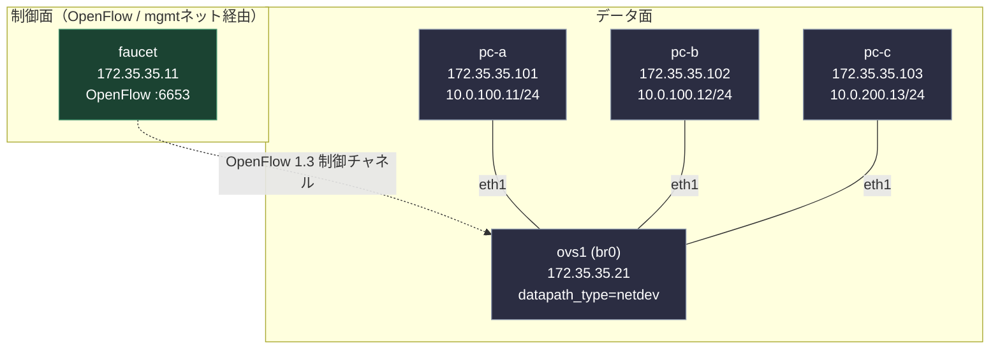

# テーマ35 Faucet SDN（OpenFlow宣言的ネットワーク制御）

## 概要

これまでのテーマ（IOS/EOS等の機器ごとの個別CLI投入）とは異なり、本テーマでは**コントローラに書いた宣言的な設定ファイル1つでネットワーク全体のポリシー（VLAN・ACL）が決まる SDN（Software Defined Networking）**を学ぶ。OpenFlowコントローラ `Faucet` と、OpenFlowスイッチとして動作する `Open vSwitch (OVS)` を組み合わせ、「制御面（コントローラ）」と「データ面（スイッチ）」が分離された構成を体験する。

『ネットワーク・デザインパターン』でいう Trust ゾーン内のL2セグメンテーション（VLAN分離）を、個々のスイッチへのCLI投入ではなく、コントローラ側の宣言的設定として実現する点が本テーマの学習の核心。

## 前提環境

- OrbStack の Linux VM（Ubuntu 24.04 arm64）上に containerlab で構築する。
- **設計方針（データパス）**: OVS は **userspace データパス（`datapath_type=netdev`）** で動作させる。カーネルモジュール（`openvswitch.ko`）に依存せず、TUN/TAPとAF_PACKET経由の netdev-linux provider で veth を収容するため、ホストのカーネル構成に左右されず再現性が高い（性能コストはあるが学習用途では許容）。
  - ※ 検証環境（このOrbStack VM）では実測すると `openvswitch` モジュールが読み込まれており `datapath_type=system`（カーネルデータパス）も選択可能。ただしOrbStackのバージョン差でモジュール有無は変わり得るため、環境非依存で再現できる netdev を既定とする（2026-07-07 実機で netdev 構成の疎通を確認済み）。
- イメージ: `faucet` コントローラは `faucet/faucet:latest`（arm64対応）。OVSは公式arm64イメージが無いため `04_構築/ovs/Dockerfile` で自前ビルドする。エンドポイントは `wbitt/network-multitool`。

## トポロジ



- 制御チャネル（OpenFlow）は mgmt ネットワーク経由で `faucet` ↔ `ovs1` 間を流れる（点線）。
- データ面（実際のトラフィック）は `ovs1` の各ポートに接続された `pc-a` / `pc-b` / `pc-c` の間を流れる（実線）。
- `pc-a` と `pc-b` は同一サブネット（10.0.100.0/24）想定、`pc-c` は別サブネット（10.0.200.0/24）想定。どちらがどのVLANに属し、疎通できる／できないかは `faucet.yaml`（学習者が編集）で決まる。

## 開始手順

1. **faucet.yaml を用意する（deploy前に必須）**
   `faucet.yaml` は `faucet` コンテナへbindマウントされるため、deploy前に**ファイルとして**存在させておく（存在しないとdockerが空ディレクトリを作り、Faucetが起動しない）。まず雛形をコピーする。中身はこの時点では未完成でよい（Missionで自分で埋める）。
   ```bash
   cd 04_構築
   cp faucet/faucet.yaml.example faucet/faucet.yaml
   ```
2. **環境構築**（初回は `ovs/Dockerfile` から `local/ovs:arm64` を自動ビルドする）
   ```bash
   ./deploy.sh deploy
   ```
3. **ログイン・稼働確認**
   機器へのログインコマンドは [00_ログイン/ログインコマンド.md](00_ログイン/ログインコマンド.md) を参照。`sudo docker exec clab-faucet-sdn-ovs1 ovs-vsctl show` でコントローラ接続（`is_connected: true`）を確認する。
4. **faucet.yaml の編集**
   `04_構築/faucet/faucet.yaml` を Missionの要件に沿って編集し、Faucetに再読込させる（狙いは [パラメータシート](03_詳細設計/パラメータシート.md) 参照）。

## Mission

<!-- 段階課題。設定コマンドの答えは書かない。達成すべき要件とゲート条件のみ提示する。 -->

### Mission 1: VLANによるL2セグメンテーション

`faucet.yaml` に datapath（`ovs1` に対応）と各ポートのインターフェース定義を書き、`pc-a` と `pc-b` を同一VLAN、`pc-c` を別VLANに割り当てる。

- 考えどころ: Faucetの `dps` の下にどんなキーが必要か。ポート番号とVLAN名の対応づけはどう書くか。`ovs-vsctl show` の `ofport` 表示と `faucet.yaml` のポート番号がどう対応するか確認する。

**ゲート条件**: `pc-a` ↔ `pc-b` が ping 疎通し、`pc-a`（または`pc-b`）↔ `pc-c` が疎通しないことを確認できたら次へ進む。

### Mission 2: ACLによるプロトコル制御

同一VLAN内（`pc-a` ↔ `pc-b`）に対して、特定プロトコル（例: ICMPは許可、それ以外は遮断）を制限するACLを宣言する。

- 考えどころ: Faucetの `acls` セクションはどう定義し、VLANやポートにどう紐づけるか。ACLの適用順序（ルール評価順）が結果にどう影響するか。

**ゲート条件**: ACLで許可したプロトコルは通り、遮断対象は通らないことを確認し、かつ `faucet.yaml` の変更保存→ Faucet再読込後に新しいACLが反映されることを確認できたら次へ進む。

### Mission 3（任意）: VLAN間L3ルーティング

Faucetの `faucet_vips` を使い、Mission 1で分離した2つのVLAN間でL3ルーティングを有効化する。

- 考えどころ: VLANに仮想IP（VIP）を持たせるとはどういうことか。エンドポイント側のデフォルトゲートウェイはどこに向けるべきか。

**ゲート条件**: 別VLAN間（`pc-a`/`pc-b` 側 ↔ `pc-c`）が faucet_vips 経由でルーティングされ、疎通することを確認できたら完了。

## 禁止事項

- `faucet.yaml` の完成形をAIに聞いてそのまま貼る行為（本テーマの学習目的そのものを失う）。まずは自分で `dps`/`vlans`/`acls` のキー構造を調べ、`ovs-vsctl show` や Faucetログで結果を確認しながら組み立てること。
- `ovs1` の `bootstrap.sh`（br0のプラミング・controller指定までの部材）を書き換えてVLAN/ACLフローを直接注入すること（学習対象はあくまでFaucet側の宣言的設定）。
- ラボの外側（Macホスト）で直接 `containerlab` や `ovs-vsctl` を実行すること（[clab運用規約.md](../規約/clab運用規約.md) §3のとおり、必ずOrbStack VM経由）。

## 将来拡張（Phase B・参考情報のみ）

N3(NDR)連携：2026-07-07 実機検証済（Faucetミラーでsensorが東西複製受信・gauge Prometheusでポート統計供給。検証記録: [試験結果_2026-07-07](05_試験/試験結果_2026-07-07.md)）。NW-ZTトラック N3 の一部（[N3_NDRスタブ](../ZERO_zero_trust/04_構築/nwzt_track/N3_NDR/README.md)、[ゼロトラスト統合マップ](../ZERO_zero_trust/02_基本設計/ゼロトラスト統合マップ.md)）。詳細な検知・可視化は NDR 基盤本体（[42_ndr_flow](../42_ndr_flow/README_Lab_Challenge.md)）側で行う。

## 参照

- [00_ログイン/ログインコマンド.md](00_ログイン/ログインコマンド.md)
- [01_要件定義/要件定義書.md](01_要件定義/要件定義書.md)
- [02_基本設計/基本設計書.md](02_基本設計/基本設計書.md)
- [03_詳細設計/パラメータシート.md](03_詳細設計/パラメータシート.md)
- [../規約/clab運用規約.md](../規約/clab運用規約.md)
- [../mentor_guidelines.md](../mentor_guidelines.md)
