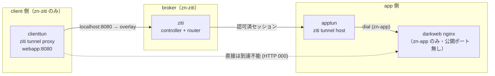

# テーマ36 SDP型ZTNA（OpenZiti）— NW-ZT N2 実装

Zscaler ZPA / Cisco Secure Access の「**内向きポートを一切開けず、外向きの張り出しでのみ到達させる**」SDP 型 ZTNA を、OSS の OpenZiti で再現する。テーマZERO [NW-ZT トラック N2](../ZERO_zero_trust/02_基本設計/NW-ZT_トラックロードマップ.md) の実装先。

> 本テーマは OSS ZTNA の実装。ロードマップのテーマ36「Cisco Secure Access（クラウド ZTNA・DevNet）」に対応する **OSS 版**として位置づける。仕組みの解説は [教材: Zscaler ZIA/ZPA](../ZERO_zero_trust/教材/03_Zscaler_ZIA_ZPA.md)。

## 構成（ダークサービス）

- **darkweb** は `zn-app` のみに存在し、ホスト公開ポートを持たない。client の居る `zn-ziti` からは見えない。
- **apptun** だけが `zn-app` に足を持ち、`webapp` サービスとして darkweb を overlay に公開（外向き接続のみ）。
- **client** は overlay 経由（`localhost:8080`）でのみ到達。直接 `darkweb:80` は到達不能。

## 前提環境

- OrbStack VM `clab`（arm64）、`ssh clab@orb`。docker（compose 不要）。
- イメージ: `openziti/ziti-cli:latest`（arm64 実測済み）、`nginx:alpine`。

## 手順（04_構築/）

1. `./deploy.sh deploy` — ネットワーク作成＋4 コンテナ起動
2. `./deploy.sh setup` — サービス/ポリシー/enrollment/tunneler 起動＋実証（[setup_ziti.sh](04_構築/setup_ziti.sh)）
3. 片付け: `./deploy.sh destroy`

## 到達点

SDP の核心（内向き非開放＋認可済みのみ overlay 到達）を実証済み（[試験結果](05_試験/試験結果_2026-07-05.md)）。詰まりどころ（quickstart の home 権限、JWT の chmod）は [構築ログ](04_構築/構築ログ_2026-07-05.md)。

## 学べること

SDP vs IAP の実装差、broker/connector モデル、「なぜインバウンドを開けなくて済むのか」、identity/service/policy による認可、OpenZiti の enrollment。商用 ZPA/Secure Access の内部構造理解。

## 参照

- [NW-ZT トラックロードマップ N2](../ZERO_zero_trust/02_基本設計/NW-ZT_トラックロードマップ.md)
- [教材: Zscaler ZIA/ZPA](../ZERO_zero_trust/教材/03_Zscaler_ZIA_ZPA.md)
- [教材: SASE/SSE と SDP vs IAP](../ZERO_zero_trust/教材/02_SASE_SSE_と_SDP_vs_IAP.md)
- [解説: N2 SDP型ZTNA](../ZERO_zero_trust/解説/nwzt_N2_解説.md)
