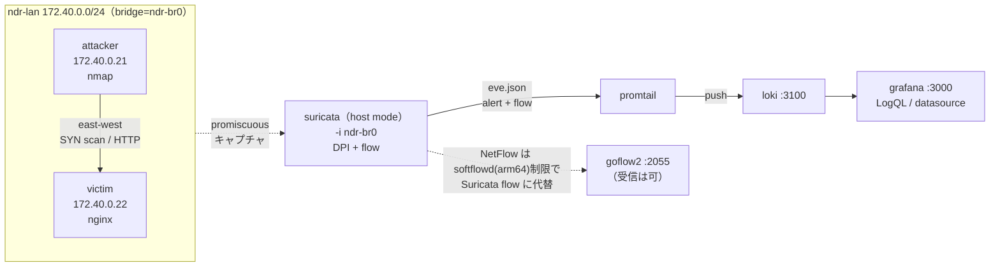

# テーマ42 NDR（east-west 可視化）— NW-ZT N3 実装

Darktrace / Cisco Secure Network Analytics（Stealthwatch）が担う NDR の核心「**同一セグメントの端末同士（east-west）の通信を経路に割り込まず観測し、横方向の偵察・スキャンを検知してフローで可視化する**」を、OSS の Suricata + Loki/Grafana で再現する。テーマZERO [NW-ZT トラック N3](../ZERO_zero_trust/02_基本設計/NW-ZT_トラックロードマップ.md) の実装先。仕組みの解説は [解説: N3 NDR](../ZERO_zero_trust/解説/nwzt_N3_解説.md)。

## 構成（east-west 監視）

- **attacker / victim は同一サブネット**（L2 隣接）＝ east-west。両者間フレームは bridge `ndr-br0` を横方向に流れる。
- **Suricata は host mode で ndr-br0 を promiscuous 監視**。SPAN 配線なしに east-west を複製なしで直接観測（経路に割り込まない＝遅延・切断なし）。
- **eve.json（alert + flow）を Promtail → Loki → Grafana** に集約。Phase 3 の Loki/Grafana 相当を N3 の集約先として再利用する思想。

## 前提環境

- OrbStack VM `clab`（arm64）、`ssh clab@orb`。docker（compose 不要、`docker run` オーケストレーション）。
- イメージ（全て arm64 実測済み）: `jasonish/suricata:latest`（8.0.5）、`grafana/loki`、`grafana/promtail`、`grafana/grafana`（13.1.0）、`netsampler/goflow2`、`wbitt/network-multitool`、`nginx:alpine`。

## 手順（04_構築/）

1. `./deploy.sh deploy` — ndr-lan 作成＋attacker/victim/suricata 起動（G1）
2. `./deploy.sh scan` — attacker→victim へ SYN スキャン（G2 トリガ）
3. `./deploy.sh eve` — eve.json の alert / flow を抜粋（G2/G3 確認）
4. `./deploy.sh monitoring` — Loki+Promtail+Grafana 起動（G4 集約）
5. `./deploy.sh netflow` — goflow2+softflowd で NetFlow を試す（G5 ボーナス、制限あり）
6. 片付け: `./deploy.sh destroy`

カスタム検知ルールは [suricata/local.rules](04_構築/suricata/local.rules)（sid:1000001 = east-west SYN scan、sid:1000002 = HTTP to victim）。

## 到達点

east-west 可視化の核心を実証済み（[試験結果](05_試験/試験結果_2026-07-05.md)）。SYN スキャンが **DPI（sid:1000001 alert）とフロー（5-tuple flow 300 件超）の両面**で捉えられ、Loki/Grafana で LogQL 抽出できる。詰まりどころ（bridge 名固定、Grafana↔Loki の host mode、softflowd の arm64 制限）は [構築ログ](04_構築/構築ログ_2026-07-05.md)。

## 学べること

east-west と north-south の観測配置の違い、bridge を L2 セグメントとみなす monitoring、Suricata の DPI（シグネチャ）とフロー統計の 2 系統、threshold ルールによる誤爆抑制、eve.json の Loki 集約と LogQL、NetFlow エクスポータ/コレクタの役割分担。商用 NDR（Darktrace/Stealthwatch）の内部構造理解。

## 商用製品との対応

| 商用製品 | アプローチ | 本ラボの OSS 対応 |
|---|---|---|
| Darktrace | DPI + 教師なし学習（平常時からのズレ） | Suricata の DPI シグネチャ（sid:1000001）＝「既知の悪性パターン」側を追体験。ML ベースライン学習は簡略化（固定閾値 threshold で代替） |
| Cisco Secure Network Analytics（Stealthwatch） | NetFlow ベース挙動分析（5-tuple 統計から異常） | Suricata の flow イベント（5-tuple/pkts/bytes）＝「関係だけを見る」フロー側を追体験。goflow2 は NetFlow コレクタとして受信能力を確認済み |

north-south の IDS（[N4 解説](../ZERO_zero_trust/解説/nwzt_N4_解説.md) や L7 Phase4 の境界 Suricata）が「境界で外向きを止める」のに対し、N3 は「内部の横移動に気づく」。同じ Suricata でも**どこに置き何を見るか**が侵入検知と侵害検知を分ける。

## 参照

- [NW-ZT トラックロードマップ N3](../ZERO_zero_trust/02_基本設計/NW-ZT_トラックロードマップ.md)
- [解説: N3 NDR（Zeek/Suricata + goflow2 + ntopng）](../ZERO_zero_trust/解説/nwzt_N3_解説.md)
- [構築ログ](04_構築/構築ログ_2026-07-05.md) / [試験結果](05_試験/試験結果_2026-07-05.md)
