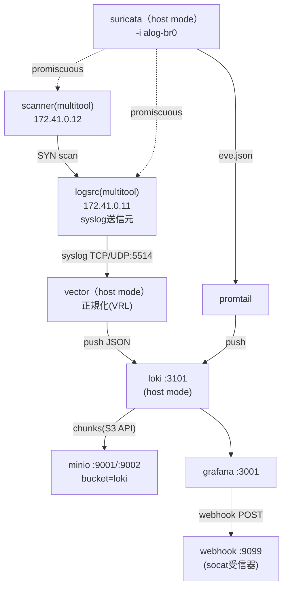

# 基本設計書: ALog再現

## 1. 設計方針

本テーマは[要件定義書](../01_要件定義/要件定義書.md)が定義したALogの機能ギャップ（翻訳変換・3観点検知・アラート通知・S3オフロード）を、[テーマ42 NDR](../../42_ndr_flow/README_Lab_Challenge.md)で確立済みのLoki/Promtail/Grafana/Suricata構成に、Vector（syslog正規化）とMinIO（S3互換オフロード）を追加する形で実現する。既存パターンの再利用を優先し（deploy.shのサブコマンド方式・host mode・bind mount規約）、新規に追加する要素（Vector・MinIO・Grafana Alerting・ダッシュボード）に設計の重心を置く。

## 2. 全体構成

| ノード名 | 役割 | ネットワーク |
|---|---|---|
| logsrc | AD/サーバ/NW機器の代表syslogを送信 | alog-lan (172.41.0.11) |
| scanner | attack時にlogsrcへSYNスキャン | alog-lan (172.41.0.12) |
| vector | syslog受信・VRL正規化・Loki push・メトリクス公開 | host mode |
| loki | ログ集約・S3オフロード・retention | host mode |
| minio | S3互換オブジェクトストレージ（Loki chunks保管先） | host mode |
| suricata | alog-br0監視・DPI/フロー検知 | host mode |
| promtail | eve.json tail・Loki push | host mode |
| grafana | 可視化・3観点アラート評価・Webhook通知 | host mode |
| webhook | アラート受信確認用の簡易socatリスナー | host mode |

## 3. データフロー

1. **syslog系統**: logsrc → (TCP/UDP 5514) → vector（VRL正規化: event/user/src_ip/message_ja付与）→ (JSON push) → loki(3101)
2. **DPI系統**: alog-lan上のパケット → suricata（host mode, -i alog-br0）→ eve.json → promtail(tail) → loki(3101)
3. **可視化・検知系統**: loki(3101) → grafana(3001)（datasource） → ダッシュボード描画 / Alertingルール評価(1分間隔) → 閾値超過時 → webhook(9099)へPOST
4. **長期保管系統**: loki → S3 API(PUT/GET Object) → minio(9001) bucket=loki。compactorがretention_period(2h)超過チャンクを定期的に削除。

## 4. OSS選定理由

| ALogの機能 | 選定OSS | 選定理由 |
|---|---|---|
| ログ収集・正規化（翻訳変換） | Vector（VRL） | syslogソースを標準サポートし、VRLで正規表現ベースの構造化変換が記述できる。timberio/vector:latest-alpineでarm64実測済み |
| ログ集約・検索 | Loki | 42_ndr_flowで確立済みのLogQL集約基盤を再利用でき、structured metadataやS3バックエンドを標準サポート |
| 3観点検知・通知 | Grafana Unified Alerting | LogQLクエリを直接アラート条件に使え、Webhook contact pointを標準サポートするため追加コンポーネント不要 |
| 長期保管オフロード | MinIO | S3互換APIをセルフホストで提供し、Lokiの`storage.s3`設定にそのまま接続できる。arm64イメージが実測済み |
| DPI/フロー | Suricata | 42_ndr_flowで確立済みのhost mode監視パターンをそのまま再利用できる |

## 5. アドレス設計方針

`alog-lan`は42_ndr_flowの`ndr-lan`(172.40.0.0/24)と衝突しないよう172.41.0.0/24を採用する（他ラボと衝突回避のための固定割当）。第4オクテットは `.1`=bridge gateway（docker自動割当）、`.11`〜=コンテナの規則とする。ホスト公開ポートは全ラボ横断で使用中の範囲（42が3100/3000系、ゼロトラスト_ネットワーク特化がその他）を避け、3001/3101/9001/9002/5514/9598/9099を採用する。詳細は[03_詳細設計/パラメータシート.md](../03_詳細設計/パラメータシート.md)を参照。

## 6. 冗長性・拡張性

- 本テーマは学習用の単一構成であり、冗長化しない（Loki/MinIOともに単一プロセス、可用性は対象外）。
- 拡張点: logsrcを複数コンテナに分割すれば、より実物に近いマルチホスト構成に発展できる（D-1参照、本テーマではKISSを優先し見送り）。
- 3観点検知のしきい値・時間窓はGrafana Alertingのprovisioning YAMLに集約しているため、実運用相当の値へのチューニングは設定変更のみで対応可能。

## 7. セキュリティ方針

| 項目 | 実装 | 対応するALog機能 |
|---|---|---|
| ログ正規化 | Vector VRLでuser/src_ip/command等を構造化抽出し、生ログとあわせて保管 | 翻訳変換 |
| 3観点検知 | Grafana AlertingのLogQLルール（count_over_time / unless集合演算） | AI異常検知(件数変化/値変化/新規出現) |
| アラート通知 | Webhook contact point → 簡易socat受信器 | メール/Webhook通知 |
| 長期保管 | LokiのchunksをMinIO(S3互換)へオフロード、retention_period=2h（学習用短縮） | アクセスログのオフロード機能 |
| DPI検知 | Suricata sid:2000001（SYNスキャン閾値検知） | ネットワーク機器ログの代替（多様なログソース） |

## 8. 設計判断の記録（考えどころ）

| # | 判断 | 選択 | 理由 |
|---|---|---|---|
| D-1 | AD/サーバ/NW機器を別々のコンテナで用意するか単一コンテナで模擬するか | 単一コンテナ(`logsrc`)がhostname/tagを切り替えて送信 | KISS優先。ログ内容の多様性が学習目的であり、コンテナ数を増やしても正規化ロジックの学習効果は変わらない |
| D-2 | 「新規出現」をどう実装するか（ALogは行動学習ベース） | LogQLの`unless`集合演算で直近窓と比較窓の差分src_ipを検出 | Loki/Grafanaの標準機能のみで実装でき、学習教材として「集合演算による新規性検知」という汎用的な考え方を示せる |
| D-3 | Lokiのchunks保存先をfilesystemのままにするかS3(MinIO)化するか | MinIO(S3互換)化 | 要件定義書の「長期保管（S3オフロード再現）」を満たすために必須。42_ndr_flowとの差別化点でもある |
| D-4 | MinIOバケット作成手段 | `curl --aws-sigv4`によるS3 API直叩き | `minio/minio`イメージに`mc`が同梱されず、`minio/mc`はarm64実測済みイメージ一覧に含まれないため、追加イメージなしで実現できる方法を選択 |
| D-5 | Vectorの正規化結果をLokiのラベルにするか構造化メタデータ/JSON本文にするか | 低カーディナリティ項目(job/event/source_type)のみラベル化し、user/src_ip等はJSON本文に格納してLogQL側で`\| json`展開 | Lokiのラベルカーディナリティ肥大化を避ける標準プラクティス。Vector側の`structured_metadata`機能に依存せず、より広くサポートされた安全な実装を選ぶ |
| D-6 | アラート通知の受信確認手段 | `wbitt/network-multitool`の`socat`でPOST内容をファイル追記 | 専用のWebhook受信サーバ用イメージがarm64実測済み一覧にないため、既存確認済みイメージの標準ツールで代替。当初`ncat -lk -c`を想定したが、arm64実機で`wbitt/network-multitool`に`ncat`が同梱されないことが判明し（`nc`/`nmap`/`curl`/`socat`は同梱）、`socat`の`TCP-LISTEN:...,fork OPEN:...,creat,append`へ変更した（[構築ログ_2026-07-21.md](../04_構築/構築ログ_2026-07-21.md)） |

## 参照

- [01_要件定義/要件定義書.md](../01_要件定義/要件定義書.md)
- [網屋ALog_OSS対応表.md](網屋ALog_OSS対応表.md)
- [03_詳細設計/パラメータシート.md](../03_詳細設計/パラメータシート.md)
- [05_試験/試験計画書.md](../05_試験/試験計画書.md)
- [42_ndr_flow/README_Lab_Challenge.md](../../42_ndr_flow/README_Lab_Challenge.md)
