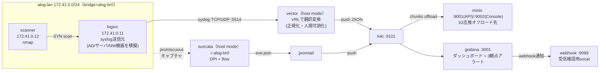

# ALog再現 — 商用SIEM「ALog」のOSS学習再現

網屋（AMIYA）の国産SIEM「ALog」がサービス概要資料で謳う中核機能——**①多様なログソースの収集 ②翻訳変換（特許第6501159号）による人間可読化 ③件数変化・値変化・新規出現の3観点によるAI異常検知 ④メール/Webhookでのアラート通知 ⑤S3オフロードによる長期保管 ⑥可視化ダッシュボード**——を、arm64のOSSで学習用に再現するラボ。[テーマ42 NDR](../42_ndr_flow/README_Lab_Challenge.md)がLoki+Promtail+Grafana+Suricataで「NDR＋ログ集約」まで実証済みだったのに対し、本ラボはそれをベースに**ALog固有の機能ギャップ**（syslog正規化・3観点検知・アラート通知・S3長期保管）を埋める。

事実の正確性は網屋公式のALogサービス概要資料（Document Ver.2.1）に基づく。本ラボはAIそのものを実装するのではなく、**「3観点という検知の考え方」をLogQLのルール/統計で近似する学習再現**であり、商用ALogの検知精度・スケール・AI学習能力を再現するものではない（過大評価しない。詳細は[網屋ALog_OSS対応表](02_基本設計/網屋ALog_OSS対応表.md)）。

## 構成

- **logsrc**: AD/サーバ/NW機器の代表ログ（SSH認証失敗・sudo実行・AD風ログオン失敗・NW機器インターフェース変化）を模擬したsyslogを送信する単一コンテナ。
- **vector**: syslog(5514)を受信し、VRL(remap)でALogの「翻訳変換」思想を再現——生ログから `event`/`user`/`src_ip` 等を抽出し `message_ja`（人間可読文）を付与してLokiへpush。
- **suricata + promtail**: scanner→logsrcのSYNスキャンをDPI検知し、eve.json経由でLokiに集約する2系統目のログソース（多様なログソースの再現を補完）。
- **loki + minio**: chunksをMinIO(S3互換)へオフロードし、retentionを短縮設定して「アクセスログのオフロード機能」を学習可能な時間スケールで再現。
- **grafana**: Loki datasourceに加え、3観点（件数変化/新規出現/値変化）のアラートルールとALog風ダッシュボードを自動プロビジョン。発報時はWebhookへ通知。

## 前提環境

- OrbStack VM `clab`（arm64）、`ssh clab@orb`。docker（compose不要、`docker run`オーケストレーション）。sudo NOPASSWD。
- イメージ（全て arm64 実測済み）: `grafana/loki:latest`、`grafana/promtail:latest`、`grafana/grafana:latest`、`jasonish/suricata:latest`、`timberio/vector:latest-alpine`、`minio/minio:latest`、`wbitt/network-multitool:latest`、`nginx:alpine`。
- ホスト公開ポート（他ラボと衝突回避のため固定）: Grafana=3001、Loki=3101、MinIO API=9001/Console=9002、Vector syslog受信=5514(TCP/UDP)、Vector metrics=9598、Webhook受信器=9099。

## 手順（04_構築/）

1. `./deploy.sh deploy` — alog-lan作成＋logsrc/scanner/minio/loki/vector/suricata/promtail/grafana/webhook起動
2. `./deploy.sh logs` — ベースライン（正常系）ログを注入し、既知の送信元IP群の履歴を作る
3. （5分以上待つ。新規出現検知の比較窓を成立させるため）
4. `./deploy.sh attack` — 異常トリガ（認証失敗連打・新規IP出現・イベント件数急増・SYNスキャン）
5. `./deploy.sh query` — LogQLで3観点（件数変化/新規出現/値変化）を確認
6. `./deploy.sh alert` — Grafana Alertingの発報状況 + Webhook受信ログを確認
7. 片付け: `./deploy.sh destroy`

3観点検知ルールは [grafana/provisioning/alerting/rules.yaml](04_構築/grafana/provisioning/alerting/rules.yaml)（件数変化=`alog-count-change-auth-fail`、新規出現=`alog-new-appearance-src-ip`、値変化=`alog-value-change-event-volume`）。正規化ロジックは [vector/vector.yaml](04_構築/vector/vector.yaml)。

## 学べること

syslog正規化（生ログ→構造化ラベル）とその限界、LogQLの `unless` によるベクトル集合演算を使った「新規出現」の近似実装、Grafana Unified Alertingのマルチステージ評価（Query→Reduce→Threshold）とWebhook通知、Loki chunksのS3(MinIO)オフロードとretention設計、DPI(Suricata)とsyslog集約を1つのLoki/Grafanaへ統合する構成。商用SIEM（ALog）が「AIで自動化している部分」と「OSSでルールベースに近似できる部分」の境界の理解。

## ALogとの対応

| ALogの機能 | 本ラボのOSS対応 | 再現度 |
|---|---|---|
| 多様なログソース収集 | syslog(Vector) + eve.json(Suricata/Promtail)の2系統をLokiへ集約 | ✅ |
| 翻訳変換（特許第6501159号） | Vector VRLによる正規化（SSH認証失敗/sudo実行/AD風ログオン失敗/NW機器状態変化の4パターン） | △ |
| AI異常検知（件数変化・値変化・新規出現） | LogQLのcount_over_time/unlessによるルール/統計近似 | △ |
| アラート通知（メール/Webhook） | Grafana AlertingのWebhook contact pointのみ（メールは対象外） | △ |
| 長期保管（オフロード機能） | LokiのchunksをMinIO(S3互換)へ配置し、短縮retentionで動作確認 | ✅ |
| ダッシュボード | Grafana provisioningによるALog風パネル（未確認アラート数/Top送信元IP/event種別時系列） | ✅ |

詳細な機能対応・簡略化ポイントは [02_基本設計/網屋ALog_OSS対応表.md](02_基本設計/網屋ALog_OSS対応表.md) を参照。

## 禁止事項

- 本ラボは学習用の閉域構成である。`logsrc`/`scanner` が模擬送信するsyslog本文中のIPアドレス・ユーザー名は全て架空（RFC5737予約アドレス`203.0.113.0/24`・`198.51.100.0/24`を使用）であり、実在するホストへの攻撃を目的としない。
- 3観点検知ルールのしきい値・時間窓は学習セッション内で観測できるよう意図的に短縮している。本番相当の運用値ではない。

## 参照

- [42_ndr_flow/README_Lab_Challenge.md](../42_ndr_flow/README_Lab_Challenge.md)（Loki/Promtail/Grafana/Suricataの集約基盤の出自）
- [01_要件定義/要件定義書.md](01_要件定義/要件定義書.md)
- [02_基本設計/基本設計書.md](02_基本設計/基本設計書.md)
- [02_基本設計/網屋ALog_OSS対応表.md](02_基本設計/網屋ALog_OSS対応表.md)
- [03_詳細設計/パラメータシート.md](03_詳細設計/パラメータシート.md)
- [05_試験/試験計画書.md](05_試験/試験計画書.md)
