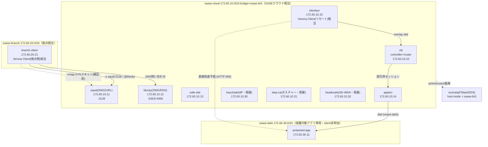

# 基本設計書: Verona再現

## 1. 設計方針

Verona SASEの3層構成（p6: Verona SASE＝クラウド基盤／Verona Edge＝拠点ルータ／Verona Client＝
リモート端末）を Docker network 3種（`vsase-cloud` / `vsase-branch` / `vsase-dark`）に写像し、
「コア（確実に動く）」と「発展（config・docのみ、単独起動可）」の2段階でOSSを組み合わせる。
[01_要件定義/要件定義書.md](../01_要件定義/要件定義書.md) の非目標に沿い、CASB・アンチウイルス・
アンチスパム・91カテゴリDB等の再現困難な要素は明示的にスコープ外とする。

## 2. 全体構成

| ノード名 | 役割 | ゾーン | 区分 |
|---|---|---|---|
| ziti | OpenZitiコントローラ+ルータ（quickstart一体） | vsase-cloud | コア |
| protected-app | 保護対象アプリ（nginx）。ダークサービス | vsase-dark | コア |
| apptun | ZTNAアプリ側tunneler（host） | vsase-cloud + vsase-dark | コア |
| clienttun | ZTNAクライアント側tunneler（proxy）。Verona Client(リモート)相当 | vsase-cloud | コア |
| squid | SWG/URLフィルタ（明示プロキシ3128） | vsase-cloud | コア |
| blocky | SWG/DNSフィルタ（5353/4000） | vsase-cloud | コア |
| safe-site | URL/DNSフィルタの許可ケース確認用サイト | vsase-cloud | コア |
| suricata | FWaaS/IDS（vsase-br0をhost modeで監視） | vsase-cloud（監視対象） | コア |
| branch-client | 拠点端末相当。SWG/IDS検証の起点 | vsase-branch + vsase-cloud | コア |
| keycloak | IdP連携（SSO・証明書×IDaaS認証の方針検証） | vsase-cloud | 発展 |
| step-ca | デバイスポスチャー（クライアント証明書発行） | vsase-cloud | 発展 |
| headscale | 拠点間トンネル（SD-WAN相当） | vsase-cloud | 発展 |

## 3. アドレス設計方針

3ネットワークとも `172.60.<セグメント>.0/24` とし、第3オクテットでゾーンを区別する
（`10`=vsase-cloud／`20`=vsase-branch／`30`=vsase-dark）。全コンテナに静的IPを割り当て、
`clab運用規約`の「mgmt-ipv4静的固定」の思想（determinism確保）を純dockerネットワークにも
適用する。詳細値は [03_詳細設計/パラメータシート.md](../03_詳細設計/パラメータシート.md) に
集約する（本書は方針のみ）。

## 4. 冗長性・拡張性

- 本テーマは機能実証を目的とした単一構成であり、**冗長化しない**（各コンポーネントは単一コンテナ）。
- 拡張点: Suricataの検知結果を42_ndr_flowのLoki/Grafanaパターンで集約すれば、Verona Cloud
  Consoleの「ログをしっかり記録」（p31）に相当する可視化基盤へ発展できる（本ラボでは未実装）。
- Keycloak/Headscale/step-caは「発展」として単独起動できる形にしてあり、将来的にOpenZitiの
  external-jwt-signer・SquidのIdP連携等を追加実装すれば統合度を上げられる
  （[keycloak/README.md](../04_構築/keycloak/README.md) に方針記載）。

## 5. セキュリティ方針

| 項目 | 実装 | Verona対応機能 |
|---|---|---|
| ダイナミックポートコントロール | protected-appはvsase-darkのみに存在し公開ポート無し。apptunのdialのみが橋渡し | ZTNA（p25） |
| URL層フィルタ | Squid dstdomain ACLで共有ブロックリストを拒否（403） | SWG URLフィルタリング（p40） |
| DNS層フィルタ | Blocky denylistでブロックドメインに0.0.0.0を返す | SWG DNSセキュリティ（p41-42） |
| 通信監視 | SuricataがSASEクラウド結節点(vsase-br0)をhost modeで監視、SYNスキャンをsid:2000001で検知 | FWaaS IPS/IDS（p43。IDSモードのみ） |
| デバイスポスチャー | step-ca発行のクライアント証明書の有無＋擬似EDRバージョンをcheck_posture.shで判定 | ZTNA デバイスポスチャー（p34） |

各機能の再現度（✅/△/❌）は [網屋Verona_OSS対応表.md](網屋Verona_OSS対応表.md) に一覧化する。
検証手順は [05_試験/試験計画書.md](../05_試験/試験計画書.md) を参照。**本書作成時点では実デプロイ
未実施のため、判定は空欄／未実施である。**

## 6. 設計判断の記録（考えどころ）

| # | 判断 | 選択 | 理由 |
|---|---|---|---|
| D-1 | ZTNAダークサービスを新規設計するか36_ztna_openzitiのパターンを流用するか | 36を流用・改変（`darkweb`→`protected-app`、サービス名変更） | 既に実証済みのパターンを再利用し、SWG/FWaaSの実装に注力するため |
| D-2 | SWGのURL/DNSフィルタで別々のブロックリストを持つか共有するか | `squid/blocklist.txt` を両者で共有 | Verona p40-42の「URL層+DNS層の二重防御」を、単一ソースの一貫したポリシーとして体現するため |
| D-3 | SquidのDNS解決をどう扱うか | `--dns` オプションでBlockyへ委譲 | URLフィルタが仮に迂回されても、DNS層で同じブロックリストが効く多層防御を実演するため |
| D-4 | Suricataの監視対象をどこに置くか | vsase-cloudの結節点(vsase-br0)をhost modeで監視 | Verona p7「全通信の制御/監視」はSASEクラウド側で行われる思想のため、42_ndr_flowのeast-west監視とは異なりnorth-south寄りの「クラウド結節点監視」として位置づけた |
| D-5 | デバイスポスチャーをosqueryで実装するか | 簡易モックスクリプト（check_posture.sh）で代替 | osqueryがarm64非対応のため。正直に簡略化である旨を明記した |
| D-6 | IdP/拠点間トンネルをコアに含めるか発展にするか | 発展（単独起動のみ、連携は方針記載） | Keycloak⇔OpenZiti・Headscale⇔tailscaleの完全な疎通実装は工数が大きく、本ラボの主眼（SWG/FWaaS再現）から外れるため |

## 参照

- [01_要件定義/要件定義書.md](../01_要件定義/要件定義書.md)
- [網屋Verona_OSS対応表.md](網屋Verona_OSS対応表.md)
- [03_詳細設計/パラメータシート.md](../03_詳細設計/パラメータシート.md)
- [05_試験/試験計画書.md](../05_試験/試験計画書.md)
- [36_ztna_openziti/README_Lab_Challenge.md](../../36_ztna_openziti/README_Lab_Challenge.md)
- [42_ndr_flow/README_Lab_Challenge.md](../../42_ndr_flow/README_Lab_Challenge.md)
