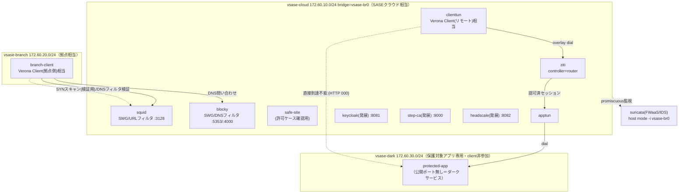

# Verona再現 — 網屋フルマネージドSASEをarm64 OSSで組む

網屋の商用フルマネージドSASE製品「Verona」（ZTNA / SWG / FWaaS / CASB / SD-WANをオールインワン
提供）のうち、[36_ztna_openziti](../36_ztna_openziti/README_Lab_Challenge.md) が未再現だった
SWG（URLフィルタ・DNSセキュリティ）・FWaaS（IPS/IDS）・デバイスポスチャー・IdP連携・拠点間
トンネルを、arm64のOSSで1つずつ組み合わせて再現する。「Verona＝オールインワンSASEを1つずつ
OSSで組む」構成を見せることが目的であり、**コア4機能（ZTNA/SWG-URL/SWG-DNS/FWaaS-IDS）は
確実に動く形**、**発展3機能（デバイスポスチャー/IdP/拠点間トンネル）は単独起動できる形**で
用意する。

## 構成

- **vsase-cloud / vsase-branch / vsase-dark** の3ネットワークで、Verona SASE（クラウド）/
  Verona Edge（拠点）/ Verona Client（リモート）の3層構成を模す。
- **protected-app** は `vsase-dark` のみに存在し公開ポート無し。`apptun` の dial 経由でのみ
  overlay に公開される（[36_ztna_openziti](../36_ztna_openziti/README_Lab_Challenge.md) の
  ダークサービスパターンをそのまま統合）。
- **Squid（URL層）と Blocky（DNS層）は同じブロックリストを共有**し、Verona SWGの「URLフィルタ
  リング＋DNSセキュリティ」の二重防御（p40-42）を体現する。
- **Suricata は SASEクラウドの結節点（vsase-br0）を host mode で監視**し、FWaaS/IDSとして
  偵察行為（SYNスキャン）を検知する（インライン遮断はしないIDSモード）。

## 前提環境

- OrbStack VM `clab`（arm64）、`ssh clab@orb`。docker（compose不要、`docker run` 直列オーケストレーション）。
- イメージ（全てarm64実測済み）: `openziti/ziti-cli:latest` `jasonish/suricata:latest`
  `ubuntu/squid:latest` `ghcr.io/0xerr0r/blocky:latest` `smallstep/step-ca:latest`
  `quay.io/keycloak/keycloak:latest` `headscale/headscale:latest` `nginx:alpine`
  `wbitt/network-multitool:latest`。
- **2026-07-21、メインセッションが `ssh clab@orb` 経由で実機デプロイ・検証を完了**した。
  コア4機能（T-V1〜T-V4）＋発展3機能の基盤動作（T-V5〜T-V7）の全7試験が合格している
  （詳細: [04_構築/構築ログ_2026-07-21.md](04_構築/構築ログ_2026-07-21.md)）。

## 手順（04_構築/）

1. `./deploy.sh deploy-core` — vsase-cloud/branch/dark作成＋コア9コンテナ起動（OpenZiti/Squid/Blocky/Suricata一式）
2. `./deploy.sh setup-ziti` — ZTNAダークサービスの構成＋enrollment＋実証（[setup_ziti.sh](04_構築/setup_ziti.sh)）
3. `./deploy.sh test-swg` — URL/DNSフィルタのブロック/許可をcurl/digで検証
4. `./deploy.sh test-ids` — branch-client→squidへSYNスキャンを送りSuricata検知(sid:2000001)を確認
5. 発展（任意・単独起動可）: `./deploy.sh deploy-posture`（step-ca） / `./deploy.sh deploy-idp`（Keycloak） / `./deploy.sh deploy-tunnel`（Headscale）
6. 状態確認: `./deploy.sh ps` ／ 片付け: `./deploy.sh destroy`

## 到達点

**コア4機能**: ZTNAダークサービス（36の流用）、SWG URLフィルタ（Squid dstdomain）、SWG DNS
フィルタ（Blocky denylist）、FWaaS/IDS（Suricata sid:2000001）は、**2026-07-21の実機デプロイ
で初回から全て成功**した（修正不要。T-V1〜T-V4合格。[05_試験/試験計画書.md](05_試験/試験計画書.md)、
[04_構築/構築ログ_2026-07-21.md](04_構築/構築ログ_2026-07-21.md)参照）。

**発展3機能**: step-ca（デバイスポスチャー）・Keycloak（IdP連携）は修正不要で起動確認済み。
Headscale（拠点間トンネル）はentrypoint・DNS・埋め込みDERPの3点調整（v0.29.2固有の要件）を
要したが、調整後にコーディネータ起動＋user/preauthkey発行までを確認した（T-V5〜T-V7、いずれも
「単独起動＋基本動作の確認」の範囲。詳細は[構築ログ_2026-07-21.md](04_構築/構築ログ_2026-07-21.md)）。
完全な相互連携（証明書×IDaaS 2要素認証、拠点間の実データプレーン疎通等）までは実装していない
（[網屋Verona_OSS対応表](02_基本設計/網屋Verona_OSS対応表.md)で△評価として正直に明記）。

## 学べること

SASEの3層構成（クラウド/Edge/Client）をどうOSSで分解して組み合わせるか、URLフィルタと
DNSフィルタの「二層防御」の考え方、SDP型ZTNAとSWG/FWaaSの役割分担、IDSモードとIPSモードの
違い（インライン遮断の有無）、商用オールインワンSASE製品が内部でどんなOSS相当の機能を束ねて
いるかの分解的理解。

## 商用製品との対応

| Verona機能 | 本ラボのOSS対応 | 再現度 |
|---|---|---|
| ZTNA（ダイナミックポートコントロール） | OpenZiti | ✅ |
| SWG（URLフィルタリング） | Squid | △ |
| SWG（DNSセキュリティ） | Blocky | △ |
| FWaaS（IPS/IDS） | Suricata（IDSモードのみ） | △ |
| デバイスポスチャー | step-ca + check_posture.sh | △ |
| IDaaS連携（証明書×IDaaS認証・SSO） | Keycloak | △ |
| SD-WAN（拠点間トンネル） | Headscale + tailscale | △ |
| CASB（アプリケーションコントロール） | ― | ❌ |

詳細な機能別の再現度・簡略化ポイントは
[02_基本設計/網屋Verona_OSS対応表.md](02_基本設計/網屋Verona_OSS対応表.md) を参照。

## 参照

- [01_要件定義/要件定義書.md](01_要件定義/要件定義書.md)
- [02_基本設計/基本設計書.md](02_基本設計/基本設計書.md)
- [02_基本設計/網屋Verona_OSS対応表.md](02_基本設計/網屋Verona_OSS対応表.md)
- [03_詳細設計/パラメータシート.md](03_詳細設計/パラメータシート.md)
- [05_試験/試験計画書.md](05_試験/試験計画書.md)
- [04_構築/構築ログ_2026-07-21.md](04_構築/構築ログ_2026-07-21.md)（実機検証・Headscale調整の記録）
- [36_ztna_openziti/README_Lab_Challenge.md](../36_ztna_openziti/README_Lab_Challenge.md)（ZTNAダークサービスの出自パターン）
- [42_ndr_flow/README_Lab_Challenge.md](../42_ndr_flow/README_Lab_Challenge.md)（Suricata運用パターン）
