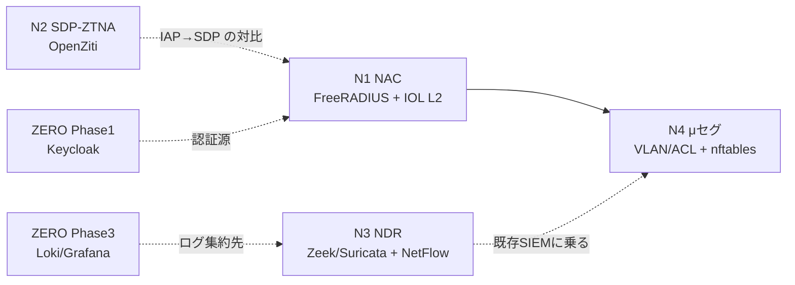

# テーマZERO｜NW-ZT トラックロードマップ（N1-N4）

ネットワーク側ゼロトラストを **N1 NAC → N2 SDP-ZTNA → N3 NDR → N4 μセグ** の4フェーズに分ける。
本テーマ ZERO は**設計ハブ（司令塔）**として設計・教材・arm64 検証までを持ち、実装の実体は既存の番号テーマへ委譲する（[ロードマップ PHASE2](../../ロードマップ/PHASE2_MODERN_ENTERPRISE.md)）。今回スコープは設計・教材・arm64 検証まで。

## トラック方針

- **L7 トラックとの関係**: L7 トラック（Phase 0-6、docker 完結、D-1）とは独立。NW-ZT は IOL 連携を解禁する別トラック（D-7）。Phase 番号と N 番号は混同しない。
- **委譲構造**: 「スタブは ZERO 内・実装は番号テーマ・繋ぎはロードマップ経由」の三層。ZERO 内の各 N スタブ（[04_構築/nwzt_track](../04_構築/nwzt_track/README_nwzt_トラック.md)）が実装着手起点で、実装先の番号テーマを指す。
- **学習担保**: 各 N に解説（なぜこの構成か／自分で触る手順）を付け、後からユーザー自身がハンズオンで構築できる形にする（[解説/nwzt_N1〜N4](../解説/nwzt_N1_解説.md)）。

## N フェーズ一覧

順序は「できそうな順」＝ arm64 確度が高い・イメージ取得済み・依存が少ないものを優先。

| N | 観点 | 主 OSS | arm64（2026-07-04 実測） | 依存 | ゲート条件 | 想定作業量 |
|---|---|---|---|---|---|---|
| **N1** | NAC / 802.1X | FreeRADIUS + Cisco IOL L2 + client | FreeRADIUS=**arm64 apt導入で可**（公式イメージはamd64のみ）/ IOL は実機検証 | ZERO Phase 1（Keycloak）任意連携 | 未認証端末が隔離VLANへ、認証成功で業務VLANへ動的割当。CoA で強制再認証 | 中〜大 |
| **N2** | SDP型ZTNA | OpenZiti（発展: Headscale / Netbird） | ✅ 実測確定（全て arm64） | ZERO Phase 2（IAP）概念前提 | 内向きポート非開放のまま、app-connector 経由でのみ `app` に到達 | 中 |
| **N3** | NDR | Zeek/Suricata + goflow2 + ntopng | Zeek/Suricata/goflow2/Faucet=✅ / ntopng=**arm64 apt導入で可** / ElastiFlow=不要 | ZERO Phase 3（Loki/Grafana）、OVS(Faucet, mirror/gauge) 実機連携済 | ミラー/NetFlow から異常フローを検知し、Loki/Grafana で可視化 | 中〜大 |
| **N4** | μセグメンテーション | IOL VLAN/ACL + ホスト nftables | nftables ✅ / IOL は実機検証 | N1（VLAN 基盤）、テーマ22 参照 | ゾーン内 east-west 通信をタグ/ACL で最小権限化し、横移動を遮断 | 中 |

> **arm64 実測（2026-07-04）**: N1-N4 すべて実装見込みが立った（[軽量検証結果_nwzt](../03_詳細設計/軽量検証結果_nwzt_2026-07-04.md)）。要注意は FreeRADIUS・ntopng が公式 Docker イメージ amd64-only のため **arm64 OS ベースの Dockerfile 自作（apt 導入）** で入れる点のみ。前回の osquery/clamav（apt にも無い真の非対応）とは異なり、arm64 パッケージは存在する。

依存関係の骨子:

- **N1 が土台**。認証で入口を締め、動的 VLAN でセグメントを割り当てる。N4 の μセグはこの VLAN 基盤に乗る。
- **N2 は概念的に ZERO Phase 2（IAP）の発展**。IAP型（アプリ前関所）と SDP型（内向き非開放）の実装差を体験する。
- **N3 は既存 SIEM（Phase 3）に乗る**。フロー/DPI ログの集約先として Loki/Grafana を再利用する。
- **N4 は最後**。N1 の VLAN 基盤とテーマ22 の既存 VLAN/ACL 資産を前提にする。

## N ↔ 番号テーマ 対応表（委譲構造）

| N | 主実装先（番号テーマ） | 補助 / 参照 | 委譲方式 | 席の状態 |
|---|---|---|---|---|
| N1 NAC | テーマ31（NAC/802.1X） | — | [ロードマップ PHASE2](../../ロードマップ/PHASE2_MODERN_ENTERPRISE.md) 経由で参照 | 実装済・検証済 2026-07-05 |
| N2 SDP-ZTNA | テーマ36（OpenZiti） | ZERO Phase 2 発展系と連続 | [ロードマップ PHASE2](../../ロードマップ/PHASE2_MODERN_ENTERPRISE.md) 経由で参照 | 実装済・検証済 2026-07-05 |
| N3 NDR | テーマ42（フロー可視化＆NDR） | テーマ35（Faucet）：Phase A+B を N3 に実機連携（2026-07-07検証済） | ロードマップ PHASE2 経由で参照 | 実装済・検証済 2026-07-05（42） |
| N4 μセグ | microseg_cilium／microseg_nftables（テーマ22資産を参照） | テーマ22（既存 VLAN/ACL 資産）参照 | 独立テーマ2種＋テーマ22 参照 | 実装済（2実装） |

> 31/35/36/42・microseg_* は実在するため直リンク可（build.mjsがリンク解決を検証）。PHASE2 ロードマップは番号・工程の参照として併記する。

## N1 — NAC / 802.1X

- **目的**: 認証されない端末を LAN に参加させない。802.1X/MAB で入口を締め、認証結果に応じて動的に VLAN を割り当てる。
- **コンポーネント**: FreeRADIUS（認証サーバ）／ Cisco IOL L2 スイッチ（認証者・Authenticator）／ client（サプリカント）。任意で Keycloak を LDAP/OIDC バックエンドに。
- **依存**: なし（単独で成立）。ZERO Phase 1 の Keycloak を認証源に使う発展あり。
- **ゲート条件**: 未認証端末が隔離 VLAN に落ち、認証成功端末が業務 VLAN に入る。RADIUS CoA で稼働中セッションを強制再認証できる。
- **想定作業量**: 中〜大（IOL L2 の起動に時間、dot1x/MAB/CoA の設定、FreeRADIUS の clients.conf/users）。
- **学べること**: 802.1X（EAP）/MAB/CoA/動的VLAN、RADIUS 属性（Tunnel-Private-Group-ID 等）、IP に依存しない入口制御。商用 ISE/ClearPass の中身。

## N2 — SDP型ZTNA

- **目的**: IAP型（アプリ前関所）に対し、SDP型（内向きポートを一切開けず、外向きの張り出しでのみ到達）を体験し、Zscaler ZPA の仕組みを理解する。
- **コンポーネント**: OpenZiti（controller / router / tunneler）。発展: Headscale / Netbird（メッシュ VPN 型）。
- **依存**: ZERO Phase 2（IAP）の概念を前提に、その対比として実装。
- **ゲート条件**: `app` 側は内向きポートを開けないまま、app-connector（外向き接続）経由でのみ認可済みクライアントが到達できる。未認可は名前解決すらできない（暗黙拒否）。
- **想定作業量**: 中（Ziti の enrollment、service/policy 定義、identity 発行）。
- **学べること**: SDP vs IAP の実装差、「内向きを開けない」モデル、broker/connector アーキテクチャ、アプリ埋め込み型 ZTNA。

## N3 — NDR

- **目的**: east-west を含む通信を可視化し、フロー統計と DPI 振る舞いから異常を検知して SIEM に集約する。「侵害前提」を成立させる。
- **コンポーネント**: Zeek / Suricata（ミラーからの DPI・振る舞い検知）／ goflow2（NetFlow/IPFIX 収集）／ ntopng / ElastiFlow（フロー可視化）→ 既存 Loki/Grafana。テーマ35（Faucet）の OVS ミラー/SPAN と gauge（Prometheus:9303）を東西トラフィック複製・ポート統計の実機供給源として正式連携（2026-07-07検証済）。
- **依存**: ZERO Phase 3（Loki/Grafana）。ミラー/NetFlow の出力源として IOL または OVS(Faucet, mirror/gauge) 実機連携済。
- **ゲート条件**: ミラーポートまたは NetFlow エクスポートから異常フロー（例: 想定外の east-west、スキャン挙動）を検知し、Loki/Grafana のダッシュボードで可視化できる。
- **想定作業量**: 中〜大（対象イメージ数が多く実測依存、ミラー設定、パーサ/ダッシュボード）。
- **学べること**: フロー可視化、DPI 振る舞い検知、SIEM 連携、Palo Content-ID / Darktrace 系の中身、NetFlow/IPFIX の実務。

## N4 — μセグメンテーション

- **目的**: ゾーン内の east-west 通信を最小権限化し、侵害端末からの横移動（ラテラルムーブメント）を物理的に困難にする。
- **コンポーネント**: Cisco IOL の VLAN/ACL（L2/L3 セグメント）＋ ホスト側 nftables（分散 FW の中央管理思想）。
- **依存**: N1（VLAN 基盤）、テーマ22（既存の VLAN/ACL/HSRP 資産）を参照。
- **ゲート条件**: 同一ゾーン内でも許可しない端末間通信を ACL/タグで遮断し、横移動が止まることを確認できる。
- **想定作業量**: 中（VLAN/ACL 設計、nftables ルール、検証シナリオ）。
- **学べること**: TrustSec/SGT の思想、east-west 制御、L2/L3 とホストの二層μセグ、Illumio 的な分散FW 中央管理。

## 今回スコープと次段階

- **今回**: N1-N4 の設計・教材・arm64 軽量検証（コンテナ OSS の見込み確定）まで。
- **次段階**: N1 から実機実装（IOL L2 の dot1x/CoA 実機検証を含む）。実装は委譲先の番号テーマで行う。

## 参照

- [NW-ZT_ギャップ分析](NW-ZT_ギャップ分析.md)
- [NW-ZT_論理構成設計](NW-ZT_論理構成設計.md)
- [軽量検証計画_nwzt](../03_詳細設計/軽量検証計画_nwzt.md)
- [構築スタブ（nwzt_track）](../04_構築/nwzt_track/README_nwzt_トラック.md)
- [教材ガイド](../教材/README_教材ガイド.md)
- [基本設計書 D-7](基本設計書.md)
