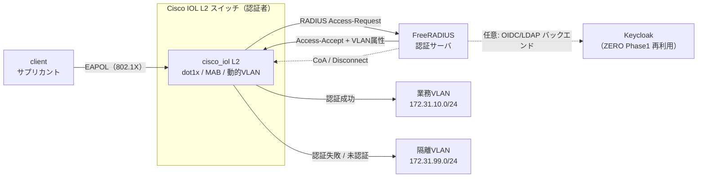
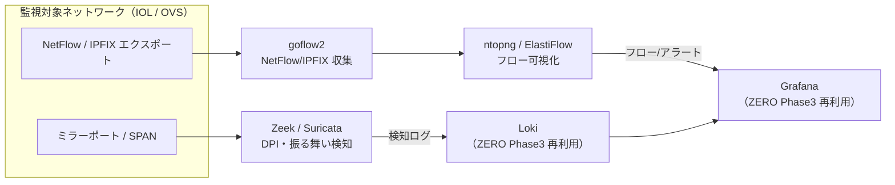

# テーマZERO｜NW-ZT 論理構成設計（N1/N3 骨子）

NW-ZT トラックの論理構成を、実装上の要となる N1（NAC）と N3（NDR）を中心に設計する。
L7 トラックが docker bridge だけで完結したのに対し、NW-ZT トラックは **Cisco IOL（L2/L3）を解禁**する（D-7）。IOL の実機機能（dot1x/CoA 等）の可否は [軽量検証計画_nwzt](../03_詳細設計/軽量検証計画_nwzt.md) の切り分けに従い、N1 実装時に実機検証する。

## 設計の前提

- **実行基盤**: OrbStack VM `clab`（arm64）。IOL は x86 エミュで1ノード約2分（[clab運用規約](../../規約/clab運用規約.md)）。
- **アドレス**: L7 トラックの `172.30.0.0/16` とは別に、NW-ZT は `172.31.0.0/16` を割り当て、両トラックのアドレス衝突を避ける（実 IP は各 N 実装時に [番号テーマ側](../../ロードマップ/PHASE2_MODERN_ENTERPRISE.md) の IP 管理表で確定）。
- **ログ集約先**: N3 の検知/フローは L7 トラックの可観測ゾーン（Loki/Grafana）を再利用する。

## N1 — NAC / 802.1X の論理構成

FreeRADIUS を認証サーバ、Cisco IOL L2 スイッチを認証者（Authenticator）、client をサプリカントに置く。認証結果で動的に VLAN を割り当てる。

### 通信フロー（認証シーケンス）

1. client がポートにリンクアップ → スイッチが 802.1X（EAPOL）を要求。
2. 802.1X 未対応端末は MAB（MAC 認証バイパス）へフォールバック。
3. スイッチが RADIUS Access-Request を FreeRADIUS に送信。
4. FreeRADIUS が認証し、Access-Accept に VLAN 属性（`Tunnel-Type` / `Tunnel-Medium-Type` / `Tunnel-Private-Group-ID`）を載せて返す。
5. スイッチがそのポートを業務 VLAN に動的割当。失敗/未認証は隔離 VLAN。
6. 運用中に CoA（Change of Authorization）でセッションを強制再認証・切断できる。

### 設計の要点

- **入口制御は IP 非依存**。認証は L2 で完結し、IP 付与（DHCP）は VLAN 割当後。「ネットワークに参加させるか」を最初に決める。
- **FreeRADIUS の users/clients.conf** が認可ポリシーの実体。商用 ISE のポリシーセットに相当。
- **CoA** が動的性の肝。侵害端末を稼働中に隔離 VLAN へ落とす＝SOAR 連携（N3 検知→CoA）の下地になる。

## N3 — NDR の論理構成

ミラーポート（または NetFlow エクスポート）から通信を取り出し、フロー統計（goflow2→ntopng）と DPI 振る舞い（Zeek/Suricata）で分析して既存 SIEM に集約する。

### 通信フロー（可視化パイプライン）

1. IOL または OVS のミラー/SPAN で east-west を含むトラフィックを複製、または NetFlow/IPFIX でフロー統計をエクスポート。
2. ミラーは Zeek/Suricata が DPI・振る舞い検知（スキャン挙動、想定外 east-west 等）。
3. NetFlow は goflow2 が収集し、ntopng/ElastiFlow で可視化。
4. 検知ログは Loki、フロー/アラートは Grafana に集約。既存の可観測ゾーンをそのまま流用。

### 設計の要点

- **east-west 可視化が主眼**。L7 トラックの Suricata が SWG 経路（north-south）の IDS だったのに対し、N3 は横方向を見る。
- **既存 SIEM に乗せる**（D-3 の思想の延長）。追加は収集・検知エンジンのみで、可視化基盤は再利用。
- **N1 と連携で SOAR 化**（任意）: N3 が異常検知 → webhook → N1 の CoA で当該端末を隔離 VLAN へ。API-first の自動封じ込めを体験できる。

## N2 / N4 の論理構成（概略）

- **N2（SDP-ZTNA）**: OpenZiti の controller/router を DMZ 相当に、tunneler を client と app に置く。`app` は内向きポートを開けず、app-connector の外向き接続でのみ到達させる。詳細トポロジは N2 実装時に確定。
- **N4（μセグ）**: N1 の VLAN 基盤上で、IOL の VLAN 間 ACL とホスト nftables を組み合わせ、同一セグメント内の端末間通信を許可リスト方式に絞る。テーマ22 の既存 VLAN/ACL 設計を参照。

## アドレス設計（NW-ZT トラック）

| セグメント | サブネット（予定） | 用途 |
|---|---|---|
| 業務 VLAN | 172.31.10.0/24 | N1 認証成功端末 |
| 隔離 VLAN | 172.31.99.0/24 | N1 未認証/失敗端末 |
| 認証/管理 | 172.31.0.0/24 | FreeRADIUS・管理 |
| 監視 | 172.31.30.0/24 | N3 収集・可視化（Loki/Grafana は L7 側を再利用） |

> 実 IP・インターフェース割当は各 N 実装時に委譲先の番号テーマの IP 管理表で確定する（本書は論理設計の骨子）。

## 参照

- [NW-ZT_トラックロードマップ](NW-ZT_トラックロードマップ.md)
- [NW-ZT_ギャップ分析](NW-ZT_ギャップ分析.md)
- [軽量検証計画_nwzt](../03_詳細設計/軽量検証計画_nwzt.md)
- [基本設計書 D-7](基本設計書.md)
- [教材: NAC/802.1X](../教材/06_NAC_802.1X_MAB_CoA_動的VLAN.md)
