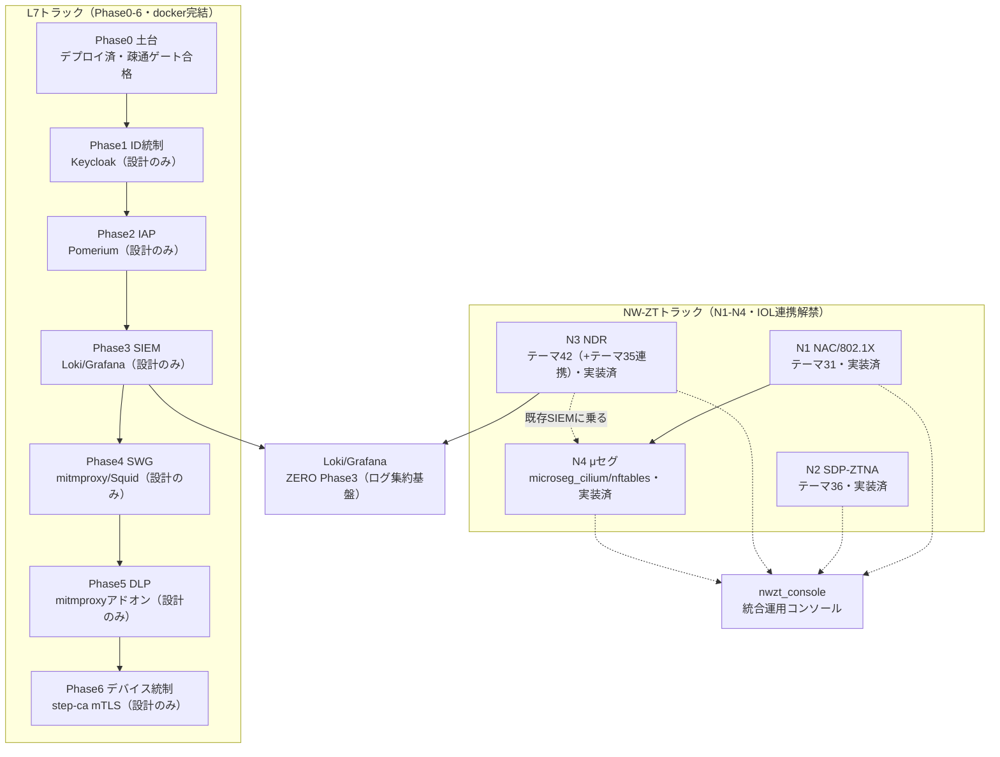

# テーマZERO｜ゼロトラスト統合マップ（全体ナビ）

## 概要

このマップは**全ゼロトラスト資産の唯一の入口**である。L7トラック（Phase0-6）・NW-ZTトラック（N1-N4）・実装テーマ（31/35/36/42・microseg_cilium/microseg_nftables）・統合ツール（nwzt_console）が散在しているため、1枚で俯瞰し、各詳細ドキュメントへ往復できる索引として機能する。

- **N1-N4 設計の正**は [NW-ZT_トラックロードマップ](NW-ZT_トラックロードマップ.md)。
- **L7（Phase0-6）設計の正**は [README_Lab_Challenge](../README_Lab_Challenge.md)。
- 本マップはこれらの内容を**重複させず**、参照リンクで繋ぐナビゲーションに徹する。

## 全体像

L7トラックとNW-ZTトラックは独立した別トラックだが、両者とも可観測性（Phase3 Loki/Grafana）にログを集約する点で合流する。NW-ZTトラック側は42_ndr_flowが直接Loki/Grafanaへ集約し、L7側はPhase3自体がその基盤を成立させる（設計段階）。

## NW-ZT 資産一覧

| N | 観点 | 主OSS | 実装先テーマ | 状態 | 検証日 | 根拠 |
|---|---|---|---|---|---|---|
| N1 | NAC/802.1X | FreeRADIUS + Cisco IOL L2 + supplicant | [31_nac_dot1x](../../31_nac_dot1x/README_Lab_Challenge.md) | 実装済・実機検証済 | 2026-07-05 | [試験結果](../../31_nac_dot1x/05_試験/試験結果_2026-07-05.md) |
| N2 | SDP-ZTNA | OpenZiti + nginx | [36_ztna_openziti](../../36_ztna_openziti/README_Lab_Challenge.md) | 実装済・実機検証済（clab.ymlなし・docker run方式） | 2026-07-05 | [試験結果](../../36_ztna_openziti/05_試験/試験結果_2026-07-05.md) |
| N3 | NDR | Suricata/Loki/Promtail/Grafana | [42_ndr_flow](../../42_ndr_flow/README_Lab_Challenge.md) | 実装済・実機検証済（east-west SYNスキャンをSuricata検知→Loki/Grafana） | 2026-07-05 | [試験結果](../../42_ndr_flow/05_試験/試験結果_2026-07-05.md) |
| N3補助→正式連携 | SDN基礎(Phase A)＋mirror/SPAN・gauge統計→NDR(Phase B) | Faucet(arm64)+OVS(netdev自作)+gauge | [35_faucet_sdn](../../35_faucet_sdn/README_Lab_Challenge.md) | Phase A+B 実機検証済（is_connected/Faucet 25フロー/同VLAN疎通/mirrorでsensorが東西複製受信/gauge Prometheus:9303が統計公開） | 2026-07-07 | [試験結果](../../35_faucet_sdn/05_試験/試験結果_2026-07-07.md) |
| N4 | μセグ（Identity版） | Cilium/eBPF | [microseg_cilium](../../microseg_cilium/README_Lab_Challenge.md) | 実装済 | 2026-07-05 | [試験結果](../../microseg_cilium/05_試験/試験結果_2026-07-05.md) |
| N4 | μセグ（当初設計版） | nftables + Cisco IOL VLAN/ACL | [microseg_nftables](../../microseg_nftables/README_Lab_Challenge.md) | 実装済 | 2026-07-05 | [試験結果](../../microseg_nftables/05_試験/試験結果_2026-07-05.md) |

N1-N4の設計詳細（目的・依存・ゲート条件）は [NW-ZT_トラックロードマップ](NW-ZT_トラックロードマップ.md) と [04_構築/nwzt_track](../04_構築/nwzt_track/README_nwzt_トラック.md) を参照。N3の詳細は [N3_NDR構築スタブ](../04_構築/nwzt_track/N3_NDR/README.md) にFaucet連携の経緯を記載。

## L7 資産一覧

| Phase | 観点 | 主OSS | 状態 |
|---|---|---|---|
| Phase0 | 土台（docker network + multitool） | wbitt/network-multitool | デプロイ済・疎通ゲート合格（2026-07-04・撤収済み） |
| Phase1 | ID統制 | Keycloak | 設計のみ（見込みが立てば十分） |
| Phase2 | IAP | Pomerium / oauth2-proxy | 設計のみ |
| Phase3 | SIEM | Loki + Promtail + Grafana | 設計のみ |
| Phase4 | SWG | mitmproxy / Squid + Suricata | 設計のみ |
| Phase5 | DLP | mitmproxyアドオン | 設計のみ |
| Phase6 | デバイス統制 | step-ca mTLS | 設計のみ |

詳細は各 `04_構築/phaseN_*/README.md` と `解説/phaseN_解説.md`（[phase0](../解説/phase0_解説.md)〜[phase6](../解説/phase6_解説.md)）を参照。

## 横断ゲート/検証マトリクス

| 資産 | ゲート条件 | 合否 | 検証日 | 証拠 |
|---|---|---|---|---|
| Phase0 | `client` から `app` へ疎通できること | 合格 | 2026-07-04 | [phase0_base/README.md](../04_構築/phase0_base/README.md) |
| N1（31） | 未認証端末が隔離VLANへ、認証成功で業務VLANへ動的割当 | 合格 | 2026-07-05 | [試験結果](../../31_nac_dot1x/05_試験/試験結果_2026-07-05.md) |
| N2（36） | 内向きポート非開放のまま、app-connector経由でのみ到達 | 合格 | 2026-07-05 | [試験結果](../../36_ztna_openziti/05_試験/試験結果_2026-07-05.md) |
| N3（42） | east-west異常フローをSuricata検知→Loki/Grafana可視化 | 合格 | 2026-07-05 | [試験結果](../../42_ndr_flow/05_試験/試験結果_2026-07-05.md) |
| N3補助（35 Phase A+B） | is_connected true・Faucetフロー投入・同VLAN疎通・mirrorでsensorが東西複製受信・gauge統計公開 | 合格 | 2026-07-07 | [試験結果](../../35_faucet_sdn/05_試験/試験結果_2026-07-07.md) |
| N4（microseg_cilium） | east-west通信をdefault-denyにし許可経路のみ通す | 合格 | 2026-07-05 | [試験結果](../../microseg_cilium/05_試験/試験結果_2026-07-05.md) |
| N4（microseg_nftables） | 同一VLAN内でも許可しない端末間通信をACL/タグで遮断 | 合格 | 2026-07-05 | [試験結果](../../microseg_nftables/05_試験/試験結果_2026-07-05.md) |

## 統合ツール

N1-N4の状態を1画面で見るには [nwzt_console](../../nwzt_console/README_console.md) を使う。

## 参照

- [NW-ZT_トラックロードマップ](NW-ZT_トラックロードマップ.md)
- [README_Lab_Challenge（L7トラック）](../README_Lab_Challenge.md)
- [04_構築/nwzt_track/README_nwzt_トラック](../04_構築/nwzt_track/README_nwzt_トラック.md)
- [04_構築/nwzt_track/N3_NDR/README](../04_構築/nwzt_track/N3_NDR/README.md)
