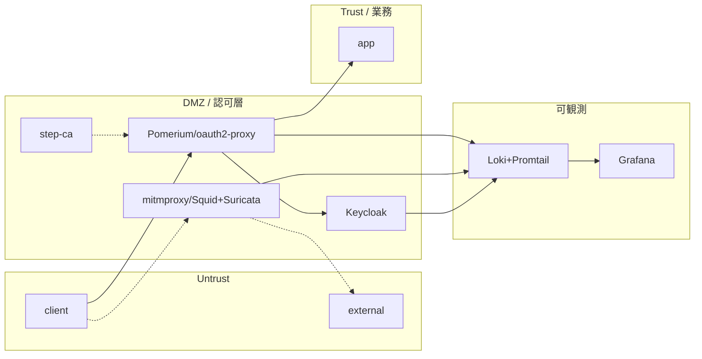

# テーマZERO｜基本設計書

## 設計方針

ゼロトラストの3原則を、本ラボの docker + OSS 構成でどう実現するかを対応づける。

| ZT原則 | 意味 | 本ラボでの対応 |
|---|---|---|
| 明示的検証 | すべてのアクセスを毎回検証する | DMZ の IAP（Pomerium）が全リクエストを IdP（Keycloak）に照会。mTLS（step-ca）で端末も検証 |
| 最小権限 | 必要な範囲だけを許可する | ゾーン分離＋認可ポリシーで `app` への到達を認証済みかつ posture 合格の主体に限定 |
| 侵害前提 | 内部も信頼せず監視する | 全ゾーンのログを可観測ゾーンへ集約（Loki+Grafana）。SWG/IDS/DLP で横方向・外向きを検査 |

補助方針:

- **KISS**: 商用 ZT の全機能を再現しない。各観点が「OSS で代替可能か」を最小構成で示す。
- **共通基盤集約**: 1コンポーネントに複数観点を兼務させ、arm64 VM のリソースを節約する（mitmproxy=SWG+DLP、Pomerium=IAP+認可ポリシー）。
- **段階投入**: 依存順に Phase 化し、各段でゲート条件を確認してから進む。

## 全体構成

- 基盤: OrbStack VM `clab`（Ubuntu 24.04 / arm64）上の Docker。
- 分離: docker bridge を4ゾーン分作成し、コンポーネントを所属させる。
- データ面の流れは3本: **認証フロー**（client→IAP→IdP）、**プロキシフロー**（client→SWG→外部）、**ログフロー**（各所→Loki→Grafana）。詳細は [論理構成設計](論理構成設計.md)。

## ゾーン・ネットワーク設計

docker bridge を4本作る。ゾーン間の通信は設計した経路のみを許容する（Untrust→Trust の直通は禁止）。

| ゾーン | bridge 名（予定） | サブネット | GW | 用途 |
|---|---|---|---|---|
| Untrust | `zt-untrust` | 172.30.0.0/24 | 172.30.0.1 | 端末側。信頼しない |
| DMZ（認可層） | `zt-dmz` | 172.30.10.0/24 | 172.30.10.1 | 認証・認可・検査の関所 |
| Trust（業務） | `zt-trust` | 172.30.20.0/24 | 172.30.20.1 | 保護対象サービス |
| 可観測 | `zt-obs` | 172.30.30.0/24 | 172.30.30.1 | ログ集約・可視化 |

- DMZ の関所ノード（Pomerium 等）は Untrust と Trust の両方に足を持ち、橋渡しする（マルチホーム）。
- 可観測ゾーンには全ゾーンから片方向でログが流入する。
- アドレス割当の詳細は [IPアドレス管理表](IPアドレス管理表.md)。

## コンポーネント設計

各 OSS の役割と連携。確度・arm64 可用性は [実装可能性マトリクス](実装可能性マトリクス.md) を参照。

| コンポーネント | 観点 | 役割 | 主な連携先 |
|---|---|---|---|
| Keycloak | ID統制 | OIDC IdP。トークン発行・ユーザー/ロール管理 | Pomerium（OIDC 委譲先） |
| oauth2-proxy → Pomerium | NWセキュリティ | IAP。未認証拒否・認可ポリシー適用 | Keycloak, app, step-ca |
| mitmproxy（or Squid+Suricata） | WEB / DLP | SWG（TLS 復号・検査）＋ DLP（内容検査・ブロック） | external, Loki |
| step-ca | デバイス統制 | 端末 mTLS 証明書発行・posture claim モック | Pomerium |
| Loki + Promtail | SIEM | ログ集約・保存 | 全コンポーネント |
| Grafana | SIEM | ダッシュボード可視化 | Loki |
| client / app / external | 土台 | 利用者端末 / 保護対象 / 外部端末（multitool 流用） | 各ゾーン |

連携の要点:

- IAP は認証を Keycloak に委譲し、端末検証を step-ca（mTLS）に委ねる。判断結果で `app` への転送可否を決める。
- SWG は client の外向き通信を横取りし、DLP アドオンで内容を検査してから `external` へ流す。
- すべての判断ログは Loki に集約し、Grafana で「拒否・許可・検知」の件数を可視化する。

## アドレス設計方針

- プライベート `172.30.0.0/16` をラボ専用に確保し、ゾーンごとに `/24` を切る（10 の位でゾーンを識別）。
- ノードアドレスは末尾で役割を識別する（例: `.10` 番台=IdP、`.20` 番台=IAP など）。割当は [IPアドレス管理表](IPアドレス管理表.md) に集約。
- 名前解決は docker の組み込み DNS（サービス名）を基本とする。

## 冗長性・拡張性

- 本ラボは PoC のため**冗長化しない**（単一インスタンス）。可用性は検証対象外。
- 拡張点:
  - IdP: Keycloak 内蔵 DB → OpenLDAP へ差し替え可能な構成にする。
  - IAP: oauth2-proxy → Pomerium → OpenZiti と段階的に高度化できるよう、認可の入口を1つに固定する。
  - SIEM: Loki 先行 → Wazuh へ拡張（統合 SIEM/EDR、4GB 級、要検証）。
  - IOL 連携: L2/L3 を絡めた検証は発展課題として別テーマで扱う。

## セキュリティ方針

- **関所集中**: 認証・認可・検査を DMZ に集約し、Trust への到達点を1つに絞る。
- **復号可視化の範囲限定**: SWG の SSL bump はラボ内通信に限定し、実運用の盗聴と混同しない前提を明記する。
- **秘密情報の非埋め込み**: 初期パスワード・鍵は設定ファイルに直書きせず、Phase 実装時に環境変数/シークレットで注入する（設計段階では値を書かない）。
- **ログの改ざん耐性**: ログは生成元から可観測ゾーンへ片方向で送り、端末側で消せない構成を志向する。

## 設計判断の記録（考えどころ）

| # | 判断 | 選択 | 理由 | 却下案 |
|---|---|---|---|---|
| D-1 | IOL 連携するか | しない（docker network で完結） | ZT の主眼は L7 認可。IOL は x86 で重く（1ノード約2分）再現性を下げる | IOL で L2/L3 込みの完全再現（発展課題へ回す） |
| D-2 | SWG/DLP を分けるか | mitmproxy に集約（兼務） | arm64 VM のリソース節約。DLP は SWG の通信を検査する同一経路上にある | Squid+c-icap+ClamAV で分離（arm64 可用性リスクと重量） |
| D-3 | SIEM をいつ入れるか | Phase 3（SWG/DLP より前） | 以降の「効いている証拠」を可視化するため早期投入 | 最後に SIEM（効果が観測できないまま構築が進むリスク） |
| D-4 | SIEM の実体 | Loki+Grafana 先行、Wazuh は後回し | Loki は軽量で arm64 確度高。Wazuh は 4GB 級で要検証 | 最初から Wazuh（重量・検証未済でブロッカー化リスク） |
| D-5 | IAP の起点 | oauth2-proxy から | 最小で「未認証拒否」を示せる。Pomerium は認可ポリシーで段階的に高度化 | いきなり Pomerium/OpenZiti（初手の複雑度が高い） |
| D-6 | エンドポイント | multitool 流用 | 既存イメージで ping/curl/dig が揃い、疎通・プロキシ確認に十分 | 専用アプリを自作（YAGNI） |
