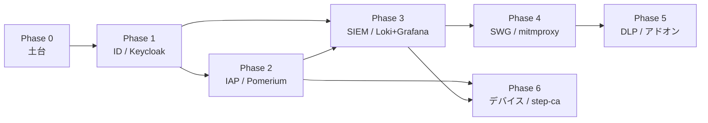

# テーマZERO｜段階ロードマップ

ゼロトラスト6観点を **依存順** に Phase 化する。各 Phase は前 Phase のゲート条件を満たしてから着手する。
今回スコープは Phase 0 土台と arm64 軽量検証まで。Phase 1-6 はデプロイせず、設計・ゲート条件・作業リストのみを確定する（[要件定義書](../01_要件定義/要件定義書.md) のユーザー決定）。

## Phase 一覧

| Phase | 観点 | 主コンポーネント | 依存 | ゲート条件（次へ進む条件） | 今回スコープ |
|---|---|---|---|---|---|
| 0 | 土台 | client / app / external（multitool） | なし | `client` → `app` 疎通。規約（frontmatter / HTML ビルド / git）が回る | デプロイ対象 |
| 1 | ID統制 | Keycloak | Phase 0 | OIDC トークンを `curl` / ブラウザで取得できる | 設計のみ |
| 2 | NWセキュリティ | oauth2-proxy → Pomerium | Phase 1 | 未認証拒否・Keycloak ログイン後のみ `app` 到達 | 設計のみ |
| 3 | SIEM | Loki + Promtail + Grafana | Phase 1, 2 | Phase 1/2 ログが Grafana で表示できる | 設計のみ |
| 4 | WEBセキュリティ | mitmproxy（or Squid + Suricata） | Phase 3 | proxy 経由強制・SSL bump 可視化・IDS 発報→Loki | 設計のみ |
| 5 | DLP | mitmproxy Python アドオン | Phase 4 | キーワード含むアップロード検知・ブロック・SIEM 記録 | 設計のみ |
| 6 | デバイス統制 | step-ca（mTLS）→ Pomerium 連携 | Phase 2, 3 | 証明書なし端末拒否・posture claim で条件分岐 | 設計のみ |

依存関係の骨子:

- **ID（P1）が全ての起点**。IAP（P2）は認証を Keycloak に委譲するため、P1 が先。
- **SIEM（P3）を早期投入**（D-3）。P4 以降の「効いている証拠」を可視化するため、SWG/DLP より前に置く。
- **DLP（P5）は SWG（P4）の同一経路上**。mitmproxy に兼務させる（D-2）ため P4 の後。
- **デバイス統制（P6）は IAP（P2）に posture を渡す**構成。P2 と P3（ログ確認）が前提。

## Phase 0 — 土台

- **目的**: docker ネットワーク4ゾーンとエンドポイント3台で疎通の骨格を作り、規約一式（frontmatter / HTML ビルド / git）を回す。
- **コンポーネント**: `client`（Untrust）/ `app`（Trust）/ `external`（Untrust）。いずれも `wbitt/network-multitool` を流用。
- **依存**: なし。
- **ゲート条件**: `client` → `app` の ping / curl が通る。`node 規約/ビルド/build.mjs --check` が pass する。
- **想定作業量**: 小（既存イメージ流用のため。clab.yml + deploy.sh の記述が中心）。
- **学べること**: docker bridge によるゾーン分離、containerlab のノード命名規約、Untrust→Trust 直通禁止の効き方。

## Phase 1 — ID統制（Keycloak）

- **目的**: OIDC IdP を立て、認可コードフローで ID/アクセストークンを発行できる状態を作る。以降の認可の土台。
- **コンポーネント**: Keycloak（DMZ）。内蔵 DB でユーザー・ロールを管理（発展: OpenLDAP）。
- **依存**: Phase 0（ネットワーク・DNS）。
- **ゲート条件**: 管理画面で realm/client を作成し、token endpoint から `curl` またはブラウザで OIDC トークンを取得できる。
- **想定作業量**: 中（realm/client/ユーザー設定、初期 PW の環境変数注入）。
- **学べること**: OIDC 認可コードフロー、realm/client/scope の役割、IdP をアプリから分離する意味。

## Phase 2 — NWセキュリティ（IAP）

- **目的**: `app` の手前に関所を置き、未認証アクセスを拒否。認証を Keycloak に委譲し、認可済みのみ転送する。
- **コンポーネント**: oauth2-proxy（最小の未認証拒否）→ Pomerium（認可ポリシーへ段階的に高度化）。DMZ 配置でマルチホーム。
- **依存**: Phase 1（OIDC トークン取得が前提）。
- **ゲート条件**: 未認証で `app` にアクセスすると拒否され、Keycloak ログイン後のみ到達できる。
- **想定作業量**: 中（IdP 連携設定、リダイレクト URL、Trust への転送経路）。
- **学べること**: IAP/ZTNA の「アプリ手前で毎回検証」の実装、認証委譲、認可ポリシーの入口を1点に集約する設計。

## Phase 3 — SIEM（Loki + Grafana）

- **目的**: 各観点のログを集約・可視化する基盤を早期に確保し、以降の「効いている証拠」を見えるようにする。
- **コンポーネント**: Loki（保存）+ Promtail（収集）+ Grafana（可視化）。可観測ゾーン。
- **依存**: Phase 1, 2（集約対象のログ源）。
- **ゲート条件**: Phase 1/2 の認証・認可ログが Grafana のダッシュボードで表示できる。
- **想定作業量**: 中（Promtail のログ収集設定、Loki データソース、基本ダッシュボード）。
- **学べること**: ログ集約パイプライン、可観測ゾーンへの片方向流入、SIEM を効果測定の道具として使う考え方。

## Phase 4 — WEBセキュリティ（SWG）

- **目的**: 外向き Web 通信を proxy に強制経由させ、SSL bump で可視化し、不審通信を IDS で検知して SIEM に発報する。
- **コンポーネント**: mitmproxy（第一候補、SSL bump）。代替: Squid + Suricata（arm64 可用性次第、[軽量検証計画](../03_詳細設計/軽量検証計画.md) の代替ルール）。DMZ 配置。
- **依存**: Phase 3（発報先の SIEM）。
- **ゲート条件**: `client` の外向き通信が proxy 経由に強制され、SSL bump で内容が可視化でき、IDS 発報が Loki に届く。
- **想定作業量**: 中〜大（proxy 強制経路、CA 証明書の端末信頼、SSL bump、IDS ルール）。
- **学べること**: SWG の透過／明示プロキシ、TLS 復号の仕組みとリスク、IDS 発報から SIEM までの導線。

## Phase 5 — DLP

- **目的**: アップロード内容を検査し、機密キーワードを含むデータの持ち出しを検知・ブロックし、SIEM に記録する。
- **コンポーネント**: mitmproxy Python アドオン（SWG と兼務、D-2）。代替: c-icap + ClamAV 不可なら mitmproxy DLP に一本化。
- **依存**: Phase 4（SWG の同一プロキシ経路上）。
- **ゲート条件**: キーワードを含むアップロードを検知・ブロックし、検知イベントを SIEM に記録できる。
- **想定作業量**: 中（アドオン実装、キーワード定義、ブロック応答、ログ出力）。
- **学べること**: DLP の内容検査、プロキシ経路への処理差し込み、検知と遮断の分離。

## Phase 6 — デバイス統制

- **目的**: 端末証明書（mTLS）で「管理された端末か」を検証し、posture claim を認可判断の入力にして条件分岐する。
- **コンポーネント**: step-ca（mTLS 証明書発行・posture claim モック）→ Pomerium 連携。osquery 補助。発展: Wazuh エージェント。DMZ 配置。
- **依存**: Phase 2（posture を渡す先の IAP）、Phase 3（判定ログの確認）。
- **ゲート条件**: 証明書を持たない端末を拒否し、posture claim（例: 準拠/非準拠）で到達可否を条件分岐できる。
- **想定作業量**: 中〜大（CA 発行フロー、mTLS 検証、posture claim のモックと Pomerium ポリシー連携）。
- **学べること**: デバイス識別の mTLS、posture ベース認可、ID＋デバイスの二軸で「明示的検証」を成立させる設計。

## 発展課題（今回スコープ外）

- IdP: Keycloak 内蔵 DB → OpenLDAP 連携。
- IAP: Pomerium → OpenZiti へ高度化。
- SIEM: Loki 先行 → Wazuh（統合 SIEM/EDR、2-4GB 級、要検証、D-4）。
- IOL（L2/L3）連携（D-1、別テーマ）。

## 参照

- [基本設計書](基本設計書.md)
- [実装可能性マトリクス](実装可能性マトリクス.md)
- [論理構成設計](論理構成設計.md)
- [IPアドレス管理表](IPアドレス管理表.md)
- [軽量検証計画](../03_詳細設計/軽量検証計画.md)
- [試験計画書](../05_試験/試験計画書.md)
