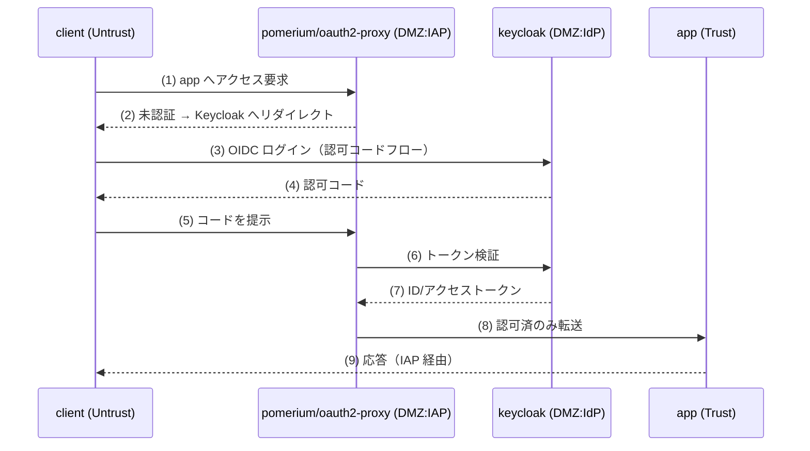
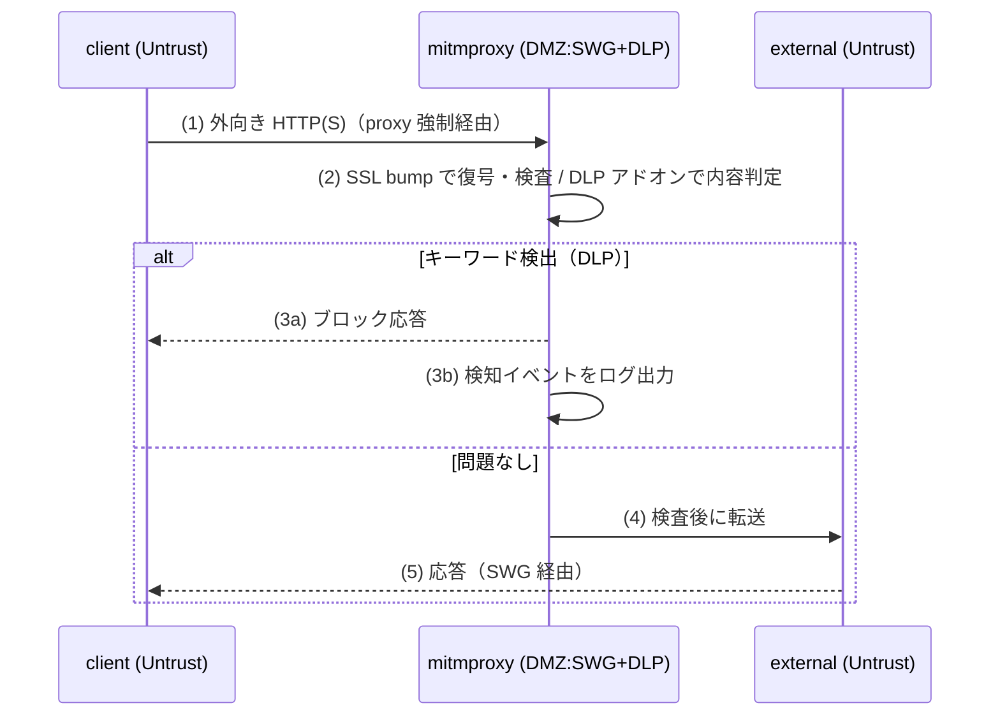
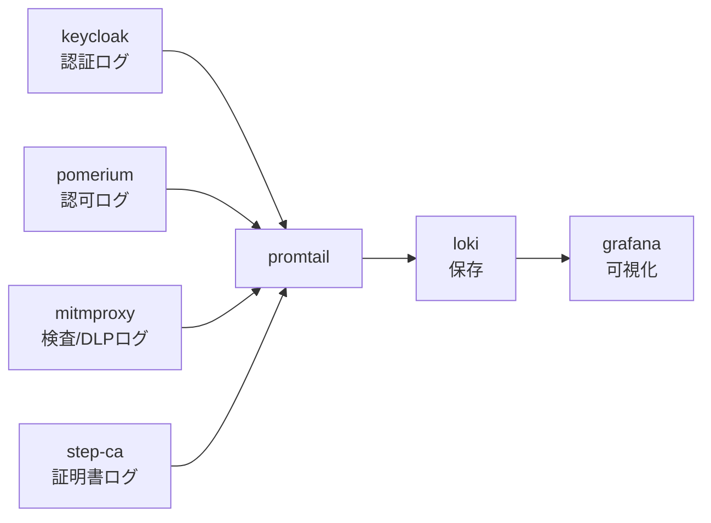

# テーマZERO｜論理構成設計

[基本設計書](基本設計書.md) のゾーン方針を、ノード・ネットワーク・ポート・通信フローのレベルに落とす。
アドレスの正は [IPアドレス管理表](IPアドレス管理表.md)。ここでは「何が何とどう通信するか」を確定する。

## ノード一覧（論理）

| ノード | 観点 | ゾーン | 役割 | Phase |
|---|---|---|---|---|
| client | 土台 | Untrust | 利用者端末（認証してアプリを使う） | 0 |
| external | 土台 | Untrust | 外部/未管理端末（SWG 検査の外部先） | 0 |
| app | 土台 | Trust | 保護対象サービス | 0 |
| keycloak | ID統制 | DMZ | OIDC IdP。トークン発行 | 1 |
| oauth2-proxy → pomerium | NWセキュリティ | DMZ | IAP。未認証拒否・認可 | 2 |
| mitmproxy | WEB+DLP | DMZ | SWG（SSL bump）＋ DLP アドオン | 4/5 |
| squid + suricata | WEB 代替 | DMZ | SSL bump ＋ IDS（arm64 次第） | 4 |
| step-ca | デバイス統制 | DMZ | mTLS 発行・posture claim モック | 6 |
| loki + promtail | SIEM | 可観測 | ログ集約・保存・収集 | 3 |
| grafana | SIEM | 可観測 | 可視化 | 3 |

## docker bridge / サブネット設計

4本の docker bridge でゾーンを分離する。ゾーン間の通信は**設計した経路のみ**を許容し、Untrust→Trust の直通は禁止する。

| bridge 名 | サブネット | GW | 所属ノード |
|---|---|---|---|
| `zt-untrust` | 172.30.0.0/24 | 172.30.0.1 | client, external ／（足）pomerium, oauth2-proxy, mitmproxy, squid |
| `zt-dmz` | 172.30.10.0/24 | 172.30.10.1 | keycloak, pomerium, oauth2-proxy, mitmproxy, squid, suricata, step-ca |
| `zt-trust` | 172.30.20.0/24 | 172.30.20.1 | app ／（足）pomerium, oauth2-proxy |
| `zt-obs` | 172.30.30.0/24 | 172.30.30.1 | loki, promtail, grafana |

分離の要点:

- **関所のマルチホーム**: Pomerium / oauth2-proxy は Untrust（受信）・DMZ（IdP 照会）・Trust（`app` 転送）に足を持つ。これにより Untrust から Trust へ「関所経由でしか」到達できない。
- **SWG のマルチホーム**: mitmproxy / squid は Untrust に足を持ち、`client` の外向き通信を横取りして `external` へ流す。
- **可観測の片方向**: 全ゾーンから `zt-obs` へログが片方向で流入する。`zt-obs` からの戻り通信は Grafana 参照のみ。
- **Phase 0 の最小構成**: Phase 0 では `client`/`external`（Untrust）と `app`（Trust）のみ。関所が無いため、Untrust→Trust の直通禁止を確認する土台として使う（`client`→`app` 疎通はゲート確認のための設計上の許可経路）。

## ポート設計

コンテナ間はサービス名 + 標準ポートで通信する。VM ホストへの公開は [IPアドレス管理表](IPアドレス管理表.md) のホストポート表に集約。

| ノード | 待受ポート（コンテナ内） | プロトコル | 呼び出し元 | 用途 |
|---|---|---|---|---|
| app | 80 | HTTP | pomerium（認可後）, client（Phase 0 疎通） | 保護対象サービス |
| keycloak | 8080 | HTTP | pomerium/oauth2-proxy, ホスト（管理） | OIDC / 管理画面 |
| pomerium | 443 / 80 | HTTPS/HTTP | client | IAP 入口 |
| oauth2-proxy | 4180 | HTTP | client | IAP 入口（先行） |
| mitmproxy | 8080（proxy）/ 8081（web UI） | HTTP proxy | client（外向き） | SWG / DLP |
| squid | 3128 | HTTP proxy | client（外向き） | SWG 代替 |
| step-ca | 9000 | HTTPS | pomerium, client（証明書取得） | ACME / mTLS 発行 |
| loki | 3100 | HTTP | promtail, grafana | ログ受信 / クエリ |
| promtail | −（送信のみ） | HTTP | − | 各ノードのログを Loki へ push |
| grafana | 3000 | HTTP | ホスト（閲覧） | ダッシュボード |

> ポート番号は各 OSS の既定値に基づく設計値。Phase 実装時に確定・調整する。

## 通信フロー

データ面の流れは3本。基本設計書の全体構成を、経路とプロトコル付きで詳細化する。

### フロー1: 認証フロー（client → IAP → IdP → app）

未認証アクセスは関所で止め、認証済みのみ Trust へ転送する。

- ゲート: Phase 1 は (3)(4) のトークン取得まで。Phase 2 は (2) の未認証拒否と (8) の認可済転送。

### フロー2: プロキシフロー（client → SWG → external）

外向き Web 通信は SWG を強制経由し、SSL bump で可視化・DLP 検査してから外部へ流す。

- ゲート: Phase 4 は (1)(2)(4) の強制経由と SSL bump 可視化。Phase 5 は (2)(3a)(3b) の検知・ブロック・記録。

### フロー3: ログフロー（各ノード → Promtail → Loki → Grafana）

全ゾーンのログを可観測ゾーンへ片方向で集約し、Grafana で可視化する。

- 片方向: 生成元 → 可観測ゾーンへのみ流入し、端末側から消せない構成を志向する（改ざん耐性、基本設計書 セキュリティ方針）。
- ゲート: Phase 3 は Phase 1/2 のログが Grafana で表示できること。以降の Phase では「拒否・許可・検知」の件数を可視化する。

## 名前解決・経路の前提

- コンテナ間は docker 組み込み DNS（サービス名）で解決する。IP は補助。
- ゾーン間は各ノードの multi-home（足の有無）で経路を制御する。ルーティングの作り込みは行わない（docker network で完結、D-1）。
- Phase 0 では関所・SWG が未配置のため、Untrust↔Trust の疎通は `client`→`app` の土台確認に限定する。Phase 2 以降は関所経由に置き換える。

## 参照

- [基本設計書](基本設計書.md)
- [IPアドレス管理表](IPアドレス管理表.md)
- [段階ロードマップ](段階ロードマップ.md)
- [ネットワーク物理構成図（Mermaid）](ネットワーク物理構成図.mermaid)
- [ネットワーク構成図（HTML）](ネットワーク構成図.html)
