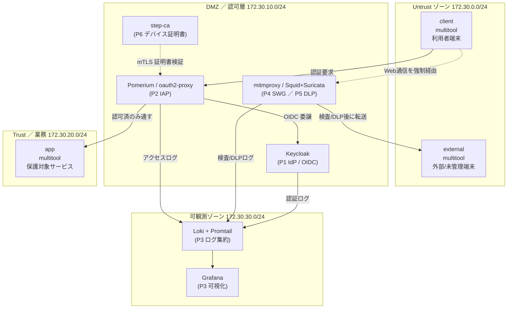

# テーマZERO｜ゼロトラストラボ Lab Challenge

商用ゼロトラスト製品（Cisco Secure Access / Palo Alto Prisma / Zscaler 等）はライセンス上、個人環境で検証できない。
本ラボは **OSS × arm64** だけでゼロトラストの6観点（ID統制・デバイス統制・NWセキュリティ・WEBセキュリティ・DLP・SIEM）が成立するかを先行検証する土台である。
ロードマップ PHASE2（テーマ28-44）の前哨に位置づく。

## 概要

**ゼロトラスト全体の入口は [ゼロトラスト統合マップ](02_基本設計/ゼロトラスト統合マップ.md)**（L7・NW-ZT・実装テーマを1枚で俯瞰）。

- 目的: 商用ZT製品を **OSSで代替**できるかを、6観点それぞれで実装可能性まで確かめる。
- 到達点（今回スコープ）: 設計書一式 ＋ Phase 0 土台（docker network + multitool）＋ arm64 可用性の軽量検証まで。Phase 1-6 はデプロイしない（見込みが立てば十分、というユーザー決定）。
- 実行基盤: OrbStack VM `clab`（Ubuntu 24.04 / arm64、containerlab 0.76.1）。
- 完結範囲: **docker ネットワークのみで完結**。IOL（IOS-XE エミュレータ）とは連携しない。理由は [設計判断](#設計判断の要旨) を参照。

## トラック構成

本テーマ ZERO は2つのトラックで構成する。**この README とトポロジ以下は L7 トラックの説明**であり、NW-ZT トラックは別ドキュメント群で扱う。

| トラック | 対象 | 単位 | 完結範囲 | 主なドキュメント |
|---|---|---|---|---|
| **L7 トラック**（既存） | ID統制・IAP・SWG/DLP・SIEM・デバイス統制 | Phase 0-6 | docker 完結（IOL 非連携、D-1） | 本 README、[段階ロードマップ](02_基本設計/段階ロードマップ.md)、[解説/phase0-6](解説/) |
| **NW-ZT トラック**（新規） | NAC/802.1X・SDP型ZTNA・NDR・μセグ | N1-N4 | IOL 連携を解禁（D-7） | [NW-ZT_トラックロードマップ](02_基本設計/NW-ZT_トラックロードマップ.md)、[NW-ZT_ギャップ分析](02_基本設計/NW-ZT_ギャップ分析.md)、[教材/](教材/README_教材ガイド.md) |

NW-ZT トラックは「ネットワーク側のゼロトラスト」（NWエンジニア本業領域）を扱う。設計・教材・arm64 検証を本テーマ ZERO に集約し（設計ハブ）、実装は既存の番号テーマ（[ロードマップ PHASE2](../ロードマップ/PHASE2_MODERN_ENTERPRISE.md) のテーマ31/35/36/42、および microseg_cilium／microseg_nftables）へ委譲する。31/35/36/42 は実装済・実機検証済（2026-07-05、35は2026-07-07）、microseg_cilium／microseg_nftables も実装済。商用製品（Zscaler / Palo Alto / Cisco ISE 等）の仕組みは [教材/](教材/README_教材ガイド.md) で解説する。Phase 番号（L7）と N 番号（NW-ZT）は別系列で、混同しない。

## トポロジ

4ゾーン（Untrust / DMZ=認可層 / Trust=業務 / 可観測）にコンポーネントを配置する。
下図は Phase 6 まで実装したときの目標像。今回デプロイするのは Phase 0（`client` / `app` / `external`）のみ。

## 前提環境

| 項目 | 値 |
|---|---|
| ホスト | macOS（Apple Silicon / arm64） |
| VM | OrbStack VM `clab`（`ssh clab@orb`） |
| OS | Ubuntu 24.04 LTS / arm64 |
| containerlab | 0.76.1 |
| コンテナランタイム | Docker（OrbStack 提供） |
| ネットワーク | docker bridge のみ（IOL 非連携） |
| イメージ制約 | **arm64 マニフェスト必須**。x86 アプライアンスは不可 |
| エンドポイント | `wbitt/network-multitool` を `client` / `app` / `external` に流用 |

## 開始手順

1. VM に接続する。詳細は [00_ログイン/ログインコマンド.md](00_ログイン/ログインコマンド.md)。
2. 設計書を読む順序: [要件定義書](01_要件定義/要件定義書.md) → [基本設計書](02_基本設計/基本設計書.md) → [段階ロードマップ](02_基本設計/段階ロードマップ.md) → [論理構成設計](02_基本設計/論理構成設計.md)。
3. arm64 可用性を確認する。[軽量検証計画](03_詳細設計/軽量検証計画.md) と [軽量検証結果_2026-07-04](03_詳細設計/軽量検証結果_2026-07-04.md)（17イメージ中15がarm64対応と実測確定）。
4. Phase 0 の土台を起動する。[04_構築/phase0_base/README.md](04_構築/phase0_base/README.md) を参照（2026-07-04 デプロイ・疎通ゲート合格・撤収済み）。
5. Phase 1 以降に進む場合は該当 Phase の `04_構築/phaseN_*/README.md` のゲート条件を満たしながら実装する。

## Mission

各 Phase を段階課題とする。**次の Phase に進む条件（ゲート条件）を満たしてから前に進む**。ゲート条件を満たせない場合は [切り分けシート](05_試験/切り分けシート.md) で層別に切り分ける。

### Phase 0 ゲート — 土台疎通

`client` から `app` へ疎通できること。規約（frontmatter / HTML ビルド / git 一式）が回ること。

### Phase 1 ゲート — ID統制（Keycloak）

Keycloak が起動し、OIDC トークンを `curl` またはブラウザで取得できること。

### Phase 2 ゲート — IAP（oauth2-proxy → Pomerium）

未認証アクセスが拒否され、Keycloak ログイン後のみ `app` に到達できること。

### Phase 3 ゲート — SIEM（Loki + Grafana）

Phase 1 / Phase 2 のログが Grafana で表示できること。以降の「効いている証拠」を可視化する基盤。

### Phase 4 ゲート — SWG（mitmproxy / Squid + Suricata）

Web 通信が proxy 経由に強制され、SSL bump による可視化ができ、IDS 発報が Loki に届くこと。

### Phase 5 ゲート — DLP（mitmproxy アドオン）

キーワードを含むアップロードを検知・ブロックし、SIEM に記録できること。

### Phase 6 ゲート — デバイス統制（step-ca mTLS → Pomerium 連携）

証明書を持たない端末を拒否し、posture claim で条件分岐できること。

## 禁止事項

- **`ZERO_zero_trust/` 以外への書き込み禁止**（本ラボの成果物はこのフォルダに閉じる）。
- **絶対パス（`/Users/…`）の埋め込み禁止**（GitHub 移植性のため相対リンクのみ）。
- **x86 専用イメージの使用禁止**（arm64 マニフェストを持つものだけ）。
- **設定値の答えを最終的に手で埋めない**（各 Phase のゲート条件を満たす実装で確認する）。
- ファイル名は **NFC 正規化必須**（NFD 混入は検索・ビルドの偽陰性を生む）。

## 参照

- [要件定義書](01_要件定義/要件定義書.md)
- [基本設計書](02_基本設計/基本設計書.md)
- [実装可能性マトリクス](02_基本設計/実装可能性マトリクス.md)
- [段階ロードマップ](02_基本設計/段階ロードマップ.md)
- [論理構成設計](02_基本設計/論理構成設計.md)
- [IPアドレス管理表](02_基本設計/IPアドレス管理表.md)
- [ネットワーク構成図（HTML）](02_基本設計/ネットワーク構成図.html)
- [軽量検証計画](03_詳細設計/軽量検証計画.md)
- [試験計画書](05_試験/試験計画書.md)
- [切り分けシート](05_試験/切り分けシート.md)

## 設計判断の要旨

- **IOL 非連携**: ZT の主眼は L7 認可であり L2/L3 ではない。IOL は x86 エミュで重い（1ノード起動 約2分）。arm64 OSS だけで閉じる方が再現性が高い。IOL 連携は発展課題として明記。
- **共通基盤の集約**: mitmproxy（SWG/DLP 兼務）・Keycloak・Pomerium に機能を集約し、arm64 VM のリソースを圧縮する。
- **SIEM を早期投入（Phase 3）**: Phase 4 以降で「セキュリティ機構が効いている証拠」を可視化するため、SWG/DLP より前に Loki+Grafana を入れる。
