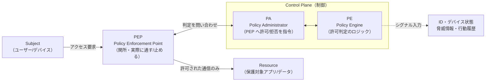

# ゼロトラスト原論 — NIST SP 800-207

すべての商用 ZT 製品が引用する共通の下敷きが **NIST SP 800-207（Zero Trust Architecture, 2020）** である。Zscaler も Palo Alto も Cisco も、営業資料で「NIST 準拠」と言う。この教材はその原典を読み、以降の教材で製品を解剖するときの共通言語を作る。

## 1. 問題：暗黙の信頼ゾーンが破られている

従来の境界防御（ペリメータモデル）は「社内 LAN の中は信頼、外は非信頼」という**暗黙の信頼ゾーン**を前提にしていた。この前提は次の理由で成り立たなくなった。

- **境界の消失**: クラウド・SaaS・リモートワークで「社内」の物理的な線が引けない。
- **横移動（ラテラルムーブメント）**: 一度内部に侵入されると、境界の内側は素通しなので被害が全社に広がる。VPN で LAN に参加させる方式はこの弱点を引き継ぐ。

**Cisco 実務からの接続**: これは「ASA で境界を守り、AnyConnect で VPN 接続すれば LAN の一員になる」という発想の限界そのものである。VPN 接続後は ACL で絞るとしても、"ネットワークに参加させた後で絞る"モデルであり、参加自体を前提にしている。ゼロトラストはこの前提を捨てる。

## 2. 仕組みの核心：7 tenets と PE/PA/PEP

NIST SP 800-207 の中身は大きく「7つの基本原則（tenets）」と「論理コンポーネント（PE/PA/PEP）」の2つ。

### 7 tenets（要約）

| # | 原則 | 意味 |
|---|---|---|
| 1 | 全リソースをリソースとみなす | データもサービスもデバイスも保護対象 |
| 2 | 全通信を保護する（場所を問わず） | 社内 LAN でも暗号化・検証する |
| 3 | アクセスはセッション単位で許可 | 一度の認証で永続許可しない |
| 4 | 動的ポリシーで認可 | ID・デバイス状態・属性・行動を総合判断 |
| 5 | 資産の整合性を監視・測定 | デバイスの状態（posture）を継続評価 |
| 6 | 認証・認可は動的かつ厳格に強制 | アクセスのたびに検証（一回きりにしない） |
| 7 | 状態・通信を収集し改善に使う | ログ・テレメトリで継続的に姿勢を上げる |

### 論理コンポーネント：PE / PA / PEP

ZT アーキテクチャの制御は3つの役割に分かれる。**この3語がすべての商用製品を読み解く鍵**になる。

- **PE（Policy Engine）**: 「このアクセスを許可するか」を**判断する頭脳**。ID・デバイス posture・脅威情報などのシグナルを入力に、許可/拒否を決める。
- **PA（Policy Administrator）**: PE の判断を受けて、**PEP に対して具体的に指令を出す**（セッションを確立せよ/切れ）。PE と PA を合わせて **PDP（Policy Decision Point）** と呼ぶこともある。
- **PEP（Policy Enforcement Point）**: 実際にトラフィックの通過を**強制する関所**。データ経路上に置かれ、許可された通信だけを通す。

## 3. 商用製品 × 本ラボ OSS の対応

PE/PA/PEP は抽象概念だが、製品では次のように実体化する。本ラボでは L7 トラックの Keycloak + Pomerium がこの3役を最小構成で担う。

| NIST の役割 | 商用製品での実体 | 本ラボ OSS | 対応トラック |
|---|---|---|---|
| PE（判定ロジック） | Zscaler / Palo / ISE のポリシーエンジン | Pomerium の authorize（ポリシー評価） | ZERO L7 Phase 2 |
| PA（指令） | 上記のコントロールプレーン | Pomerium の proxy 制御 | ZERO L7 Phase 2 |
| PEP（関所） | ZPA connector / NGFW / ISE+スイッチ | Pomerium（IAP）/ mitmproxy（SWG） | ZERO L7 Phase 2/4 |
| シグナル: ID | Okta / Entra ID | Keycloak（OIDC） | ZERO L7 Phase 1 |
| シグナル: posture | osquery/EDR 連携 | posture claim モック（osquery は arm64 非対応） | ZERO L7 Phase 6 |

## 4. ZERO 既存3原則との接続

本ラボ ZERO は設計時に「明示的検証 / 最小権限 / 侵害前提」の3原則を掲げている。これは NIST の7 tenets を実務的に圧縮したものと理解するとよい。

| ZERO 3原則 | 対応する NIST tenet | ラボでの現れ方 |
|---|---|---|
| 明示的検証 | tenet 4・6（動的・厳格な認可） | Phase 2 で未認証を必ず拒否、毎回検証 |
| 最小権限 | tenet 3（セッション単位許可） | Pomerium の認可ポリシーで許可範囲を絞る |
| 侵害前提 | tenet 2・5・7（全通信保護・監視） | Phase 3 SIEM・NW-ZT N3 NDR で「侵害後」を可視化 |

## 実務でこの知識がどこで効くか

商用 ZT 製品の設計書・RFP は必ず PE/PA/PEP の語彙で書かれる。「PDP はクラウド、PEP はオンプレのコネクタ」といった記述の意味が、この教材を読めば図として頭に入る。**NW エンジニアとして製品選定や設計レビューの席に着いたとき、"どこが判定でどこが強制か"を切り分けられることが、ベンダーの説明を鵜呑みにしないための最低ラインになる**。特に「PEP をどこに置くか」はネットワーク設計そのもの（経路上に強制点を挿入する）であり、ここは NW エンジニアの本業と直結する。

## 5. 簡略化ポイント（本ラボが省いていること）

- **posture シグナルは実測でなくモック**: osquery が arm64 非対応のため、デバイス状態は claim で模擬する。本番の PE はデバイスの実状態を継続評価する（tenet 5）。
- **PE の入力シグナルが少ない**: 本ラボは ID 中心。本番は脅威情報・地理・時間帯・行動異常など多数のシグナルを PE に入れる。
- **単一 PEP**: 本ラボは PEP が事実上1点。本番は経路上の複数箇所（クラウド PoP・オンプレ・エンドポイント）に PEP が分散する。

## 6. つまずきポイント

- **「ゼロトラスト＝製品」と誤解する**: ZT はアーキテクチャの考え方であり、単一製品で買えるものではない。SP 800-207 も「これを買えば ZT」とは書いていない。
- **PDP と PEP の混同**: 判定（PDP=PE+PA）と強制（PEP）は役割が別。1製品が両方を兼ねることはあるが、概念上は分けて捉えると製品比較が楽になる。
- **VPN との違いが腑に落ちない**: VPN は「ネットワークに参加させる」、ZT は「参加させずリソース単位でセッション許可」。この差は [02_SASE_SSE_と_SDP_vs_IAP.md](02_SASE_SSE_と_SDP_vs_IAP.md) で SDP を読むと明確になる。

## 参照

- [教材ガイド](README_教材ガイド.md)
- [02 SASE/SSE と SDP vs IAP](02_SASE_SSE_と_SDP_vs_IAP.md)
- [phase2_解説（IAP の実装）](../解説/phase2_解説.md)
- [NW-ZT_ギャップ分析](../02_基本設計/NW-ZT_ギャップ分析.md)
