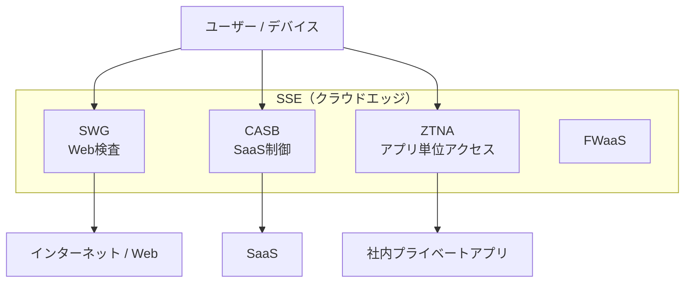
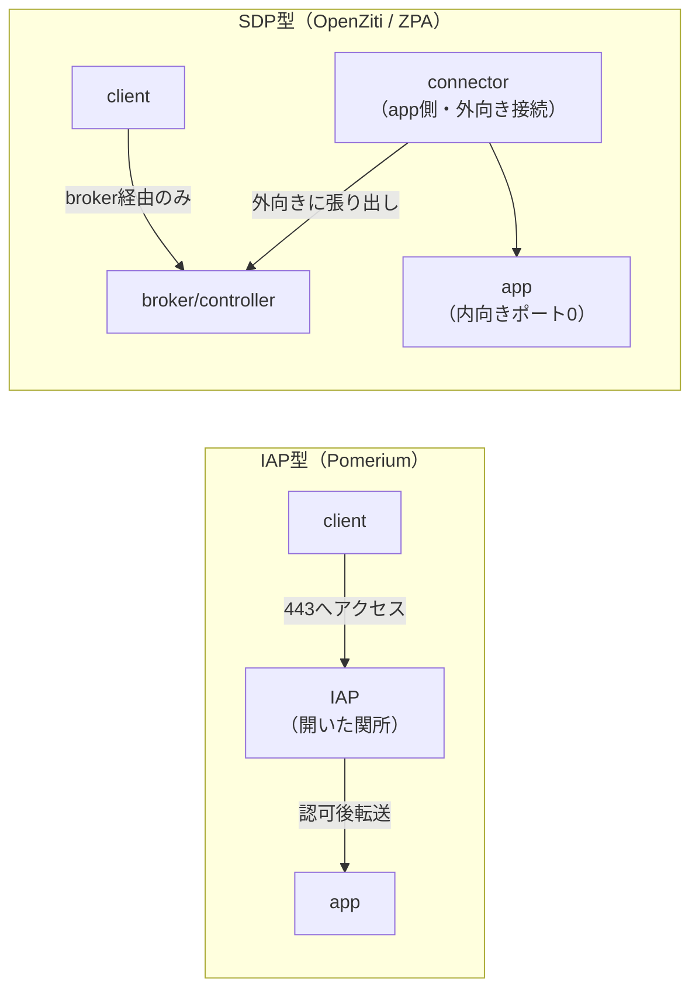

# SASE / SSE と、SDP vs IAP

商用 ZT の分類でまず出てくるのが **SASE / SSE** という枠と、その中の **ZTNA** である。そして ZTNA には技術的に大きく異なる2つの型 —— **SDP 型**と **IAP 型** —— がある。この違いを押さえると、Zscaler ZPA と BeyondCorp 系の設計思想の差が一気に見えてくる。

## 1. 問題：機能がバラバラに存在していた

かつては SWG（Web プロキシ）、CASB（SaaS 可視化）、FW、リモートアクセス VPN が別々の製品・別々の経路だった。ユーザーはオフィスに VPN で戻ってから社外へ出る（ヘアピン）など、経路が非効率で、ポリシーも製品ごとにバラバラだった。**「境界がクラウドに溶けた世界で、これらを一箇所のクラウドサービスに束ねられないか」**が SASE/SSE の出発点である。

## 2. 仕組み：SASE と SSE の構成要素

- **SASE（Secure Access Service Edge）** = ネットワーク（SD-WAN）+ セキュリティをクラウドエッジで統合する枠組み。
- **SSE（Security Service Edge）** = SASE から SD-WAN を除いた**セキュリティ部分だけ**の呼称。実務ではこちらが ZT の議論の中心。

SSE の主な構成要素は次の4つ。

| 構成要素 | 役割 | 本ラボ OSS 対応 |
|---|---|---|
| **SWG**（Secure Web Gateway） | 外向き Web 通信のプロキシ・検査・フィルタ | mitmproxy（ZERO L7 Phase 4） |
| **CASB**（Cloud Access Security Broker） | SaaS 利用の可視化・制御・DLP | mitmproxy で簡易再現（ZERO L7） |
| **ZTNA**（Zero Trust Network Access） | アプリ単位のリモートアクセス（VPN 代替） | Pomerium(IAP) / OpenZiti(SDP) |
| **FWaaS**（Firewall as a Service） | クラウド提供の FW | 本ラボ範囲外（NW-ZT で NGFW 検査を Suricata 代替） |

## 3. 核心：ZTNA の2つの型 — SDP vs IAP

ZTNA は「VPN の代わりにアプリ単位で最小権限アクセスさせる」技術だが、実装の型が2つある。**この差が本教材で最も重要**。

### IAP 型（Identity-Aware Proxy）— アプリの前に関所を置く

- **仕組み**: 保護対象アプリの前に**リバースプロキシ**を置き、そこで認証・認可してから背後のアプリへ転送する。ユーザーはプロキシの URL にアクセスする。
- **代表**: Google BeyondCorp 系、本ラボの **Pomerium**。
- **特徴**: アプリはプロキシの背後にいるが、**プロキシ自身は外から到達可能なポートを開けている**（HTTPS 443 など）。関所が"開いた入口"として存在する。

### SDP 型（Software-Defined Perimeter）— 内向きポートを一切開けない

- **仕組み**: アプリ側に **connector（コネクタ）** を置き、connector が**外向きに** broker（コントローラ）へトンネルを張り出す。アプリ側は**内向きの受信ポートを1つも開けない**。クライアントも broker 経由でしか到達できず、認可されるまで**アプリの存在自体が見えない**（名前解決もできない、暗黙拒否）。
- **代表**: Zscaler ZPA、Cisco Secure Access、本ラボの **OpenZiti**。
- **特徴**: 「開いていないものは攻撃できない」。ポートスキャンに何も映らない。

### 決定的な違い（一覧）

| 観点 | IAP 型 | SDP 型 |
|---|---|---|
| アプリ側の受信ポート | プロキシは開く（443等） | **一切開けない**（外向き接続のみ） |
| 攻撃面 | プロキシが露出 | ポートスキャンに映らない |
| 到達経路 | プロキシへ直接 | broker/connector 経由のみ |
| 未認可時 | 認証画面までは見える | **存在自体が見えない** |
| 本ラボ OSS | Pomerium | OpenZiti |
| 主な対象 | Web アプリ（HTTP/S） | TCP 全般・非 Web も可 |

## 4. 商用製品 × 本ラボ OSS の対応

| 技術 | 商用代表 | 本ラボ OSS | トラック |
|---|---|---|---|
| IAP 型 ZTNA | (BeyondCorp 系) | Pomerium | ZERO L7 Phase 2（既存） |
| SDP 型 ZTNA | Zscaler ZPA / Cisco Secure Access | OpenZiti（発展: Headscale/Netbird） | NW-ZT N2 |
| SWG | Zscaler ZIA / Netskope | mitmproxy | ZERO L7 Phase 4（既存） |
| CASB | Netskope / Zscaler | mitmproxy（簡易） | ZERO L7（既存） |

いずれの OSS も arm64 ネイティブ対応を実測確認済み（pomerium / mitmproxy / openziti、2026-07-04）。

## 実務でこの知識がどこで効くか

RFP や製品比較で「弊社は真のゼロトラスト（VPN と違いポートを開けません）」という主張を見たとき、それが **SDP 型を指している**と即座に翻訳できる。逆に「既存 Web アプリの前に置くだけ」という製品は **IAP 型**であり、非 Web の TCP アプリには効かないと分かる。**NW エンジニアとして「保護対象が Web か / TCP 全般か」「ポートを開けられる DMZ があるか / 完全に閉じたいか」で型を選ぶ**——この判断軸を持てることが、ZTNA 製品選定の議論に技術者として入るための土台になる。本ラボでは Pomerium と OpenZiti を両方触ることで、この差を"手で"理解できる。

## 5. 簡略化ポイント

- **クラウド分散なし**: 商用 SSE はグローバル PoP でユーザー近傍に関所を置く。本ラボは単一ホスト内の再現。
- **CASB は簡易**: mitmproxy で「SaaS 通信を覗く」ところまで。本番 CASB の API 連携・DLP・シャドー IT 検出は範囲外。
- **SDP の enrollment 簡略**: OpenZiti の identity 発行は最小構成。本番 ZPA のデバイス posture 連動は N2 発展扱い。

## 6. つまずきポイント

- **SASE と SSE を混同**: SASE は SD-WAN を含む、SSE は含まない。ZT の文脈で製品を見るときは SSE で足りることが多い。
- **IAP を SDP と誤認**: 「ゼロトラスト＝ポートを開けない」と思い込むと Pomerium(IAP) が ZTNA でないように見えるが、IAP も立派な ZTNA。型が違うだけ。
- **ZTNA が VPN の完全上位互換だと思う**: SDP 型でもレイテンシや対応プロトコルの制約がある。用途で使い分ける前提を忘れない。

## 参照

- [教材ガイド](README_教材ガイド.md)
- [01 NIST SP 800-207](01_ゼロトラスト原論_NIST_SP_800-207.md)
- [03 Zscaler ZIA/ZPA](03_Zscaler_ZIA_ZPA.md)
- [phase2_解説（Pomerium=IAP の実装）](../解説/phase2_解説.md)
- [NW-ZT_トラックロードマップ N2（OpenZiti=SDP）](../02_基本設計/NW-ZT_トラックロードマップ.md)
