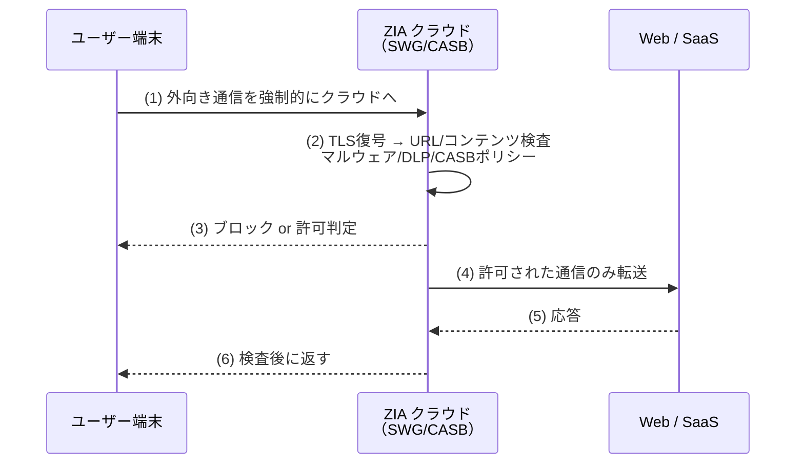

# Zscaler ZIA / ZPA の仕組み

Zscaler は SSE の代表格で、製品が **ZIA** と **ZPA** の2本柱に分かれている。両者は「守る方向」が逆であり、この分け方を理解すると SSE の全体像が具体化する。ベンダー名を離れ、**ZIA＝クラウドプロキシ型 SWG/CASB**、**ZPA＝SDP 型 ZTNA** という技術として読む。

## 1. 問題：出ていく通信と、入ってくるアクセスは別物

- **社員が外の Web/SaaS へ出ていく通信**は、検査・フィルタ・DLP したい（マルウェア・情報漏洩対策）。→ **ZIA が担当**。
- **社員が社内プライベートアプリへ入っていくアクセス**は、VPN を使わず最小権限で通したい。→ **ZPA が担当**。

この2方向を1製品に混ぜると設計が濁る。Zscaler は明確に分けている。

## 2. ZIA（Zscaler Internet Access）— クラウドプロキシ型 SWG/CASB

### 仕組み

**全ての外向き通信をいったん Zscaler クラウドへ送り**、そこで TLS を復号して検査し、ポリシー適用してからインターネットへ出す。ユーザーがどこにいても（オフィス・自宅・出張先）通信は必ずクラウドの検査点を通る。



**本ラボ OSS 対応: ZIA → mitmproxy**。mitmproxy は「クライアントの TLS を復号して中身を覗き、ポリシーで通す/止める」という SWG の核心動作を最小構成で再現する。arm64 対応を実測確認済み（2026-07-04）。

## 3. ZPA（Zscaler Private Access）— SDP 型 ZTNA

### 仕組み（内向きを一切開けない）

ZPA の肝は **app-connector が外向きに Zscaler クラウド（broker）へトンネルを張り出す**点。社内アプリ側は**内向きの受信ポートを1つも開けない**。クライアントも Zscaler クラウド経由でしか到達できず、認可されるまでアプリの存在は見えない。

```mermaid
sequenceDiagram
    participant C as クライアント<br/>（Z-Appエージェント）
    participant B as Zscaler broker<br/>（クラウド仲介）
    participant AC as app-connector<br/>（社内・外向き接続のみ）
    participant A as プライベートアプリ<br/>（内向きポート0）
    AC->>B: (0) 起動時に外向きでトンネル確立
    C->>B: (1) アプリ利用要求 + ID/posture
    B->>B: (2) 認可判定（PE/PA）
    B->>AC: (3) 認可済セッションを connector 経由で確立
    AC->>A: (4) ローカルからアプリへ接続
    A-->>AC-->>B-->>C: (5) 応答（全て broker 経由）
```

ポイント:

- **内向きポート0**: アプリも connector も外部から着信を受けない。ポートスキャンに何も映らず、DDoS/直接攻撃の面が消える。
- **broker が仲介**: クライアントとアプリは直接つながらず、常にクラウドの broker を介す。ここが PE/PA（判定・指令）の座。
- **アプリ単位**: VPN のように「ネットワークに参加」しない。認可されたアプリにだけ、セッション単位で通る。

**本ラボ OSS 対応: ZPA → OpenZiti**。OpenZiti は controller（＝broker）/ router / tunneler の構成で、「内向きポートを開けず、外向きの張り出しでのみ到達」という SDP の本質を再現する。arm64 対応を実測確認済み（2026-07-04）。

## 4. 商用製品 × 本ラボ OSS の対応

| Zscaler 製品 | 技術分類 | 本ラボ OSS | トラック |
|---|---|---|---|
| ZIA | クラウドプロキシ型 SWG/CASB | mitmproxy | ZERO L7 Phase 4（既存） |
| ZPA | SDP 型 ZTNA | OpenZiti | NW-ZT N2 |

### ZIA vs ZPA の対比（方向の違い）

| 観点 | ZIA | ZPA |
|---|---|---|
| 守る方向 | 外向き（社員→Web/SaaS） | 内向き（社員→社内アプリ） |
| 技術 | プロキシ（SWG/CASB） | SDP 型 ZTNA |
| 検査対象 | Web コンテンツ・SaaS 利用 | アプリへのアクセス可否 |
| ポート | クラウド検査点を経由 | アプリ側は内向き0 |
| OSS | mitmproxy | OpenZiti |

## 実務でこの知識がどこで効くか

顧客が「Zscaler 入れたい」と言うとき、それが **ZIA（Web 検査したい）なのか ZPA（VPN を廃止したい）なのか**を最初に切り分けられると、設計の議論が噛み合う。両者は課金も経路設計も別物だからだ。**NW エンジニアとして特に効くのは ZPA 側**：「app-connector を社内のどこに置くか」「connector から見えるアプリのセグメント設計」「外向きトンネルが通る FW ルール（インバウンド不要・アウトバウンド許可）」はすべてネットワーク設計であり、Cisco の ACL/ルーティングの知識がそのまま活きる。本ラボで OpenZiti を触れば、「なぜインバウンドを開けなくて済むのか」を FW ルールのレベルで納得できる。

## 5. 簡略化ポイント

- **グローバルクラウドなし**: 実際の ZIA/ZPA は世界中の PoP を持つ。本ラボは単一ホスト内で経路を再現するだけ。
- **posture 連動が薄い**: ZPA はデバイスコンプライアンスを認可に組み込む。本ラボの OpenZiti は identity 中心（posture はモック）。
- **DLP/サンドボックスなし**: mitmproxy は「復号して覗く」まで。ZIA のマルウェアサンドボックスや高度 DLP は範囲外。

## 6. つまずきポイント

- **ZIA と ZPA を混同**: 名前が似ているが役割が真逆。IA=Internet Access（外向き）、PA=Private Access（内向き）と覚える。
- **mitmproxy の証明書**: SWG 再現では復号のためにクライアントへ mitmproxy の CA を信頼させる必要がある。ここを忘れると TLS エラーで通信が止まる（本番 ZIA も同じく CA 配布が要る）。
- **OpenZiti で「つながらない」**: SDP は"認可されるまで見えない"のが正常動作。疎通しないのを障害と誤認しやすい。まず service/policy と identity の enrollment を確認する。

## 参照

- [教材ガイド](README_教材ガイド.md)
- [02 SASE/SSE と SDP vs IAP](02_SASE_SSE_と_SDP_vs_IAP.md)
- [04 Palo Alto NGFW](04_PaloAlto_Prisma_NGFW.md)
- [NW-ZT_トラックロードマップ N2（OpenZiti）](../02_基本設計/NW-ZT_トラックロードマップ.md)
