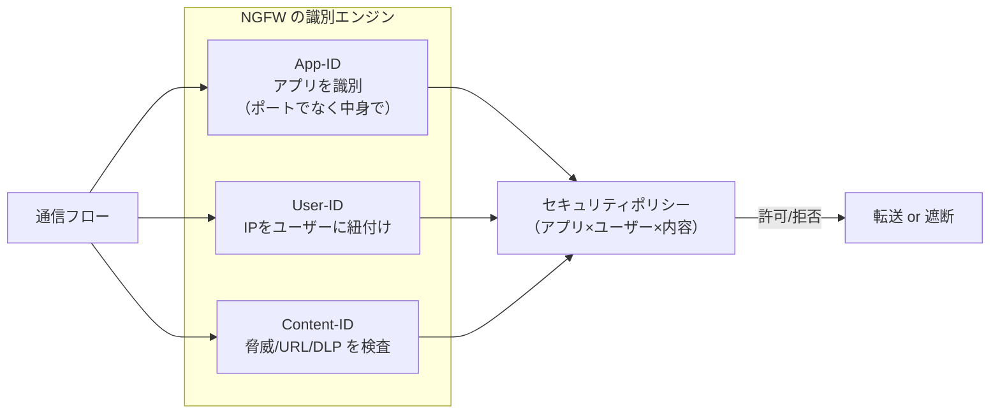

# Palo Alto Prisma / NGFW

Palo Alto は「次世代ファイアウォール（NGFW）」を定義したベンダーで、**App-ID / User-ID / Content-ID** という3つの識別技術が核。これは ZT の文脈では「ポート番号でなくアプリ・ユーザー・中身で制御する」という考え方の実装であり、ゼロトラストの"検査する PEP"の中身そのものである。クラウド版が **Prisma Access（SASE）**。

## 1. 問題：ポート番号ベースの FW は嘘をつかれる

伝統的な FW は「TCP/443 を許可」のようにポート番号で制御した。しかし現代のアプリは大半が 443 に相乗りする。**「443 を開ける＝あらゆる Web アプリ・トンネル・回避通信を許す」**に等しく、ポート番号はもはやアプリの正体を表さない。誰が・何のアプリで・どんな中身を流しているかが見えない。

**Cisco 実務からの接続**: 拡張 ACL で `permit tcp any any eq 443` と書いたときの無力感がこれ。ポートとIPしか見ていない。NGFW はこの ACL を「アプリ名・ユーザー名・脅威内容」の軸に置き換える。

## 2. 仕組み：三本柱

### App-ID — アプリを"中身"で識別

- ポート番号を無視し、**シグネチャ・デコード・ヒューリスティクスでアプリを特定**する。443 上を流れていても「これは Salesforce」「これは BitTorrent」と見分ける。
- 一度アプリが分かれば「Salesforce は許可、BitTorrent は拒否」というポリシーが書ける。

### User-ID — IP をユーザーに紐付け

- FW は本来 IP しか見えないが、**AD/LDAP や認証イベントと連携して「この IP は誰」**を解決する。
- これにより「営業部の田中は Salesforce 可、経理部は不可」のような**ユーザー軸の制御**ができる。ゼロトラストの「ID を認可に使う」の実装。

### Content-ID — 中身を検査

- 許可されたアプリの通信内でも、**脅威（IPS/AV）・URL フィルタ・ファイル種別・DLP** を検査する。
- 「アプリは許可、でも中の攻撃・情報漏洩は止める」という侵害前提の検査点。

## 3. 商用製品 × 本ラボ OSS の対応

三本柱は本ラボの複数 OSS に分解して対応させる。**1製品＝1OSS ではなく、機能を技術ごとにばらして対応させる**のがポイント。

| NGFW の柱 | やっていること | 本ラボ OSS | トラック |
|---|---|---|---|
| **App-ID** | アプリを中身で識別 | Suricata（アプリ層プロトコル検知・シグネチャ） | NW-ZT N3 |
| **Content-ID** | 脅威/URL/DLP 検査 | Suricata（IDS/IPS ルールで脅威検知） | NW-ZT N3 |
| **User-ID** | IP→ユーザー紐付け | Keycloak（ID 源）+ Pomerium（ID を認可に使用） | ZERO L7 Phase 1/2 |
| Prisma Access（SASE） | クラウド SASE 統合 | 本ラボは要素分解で再現（統合クラウドは範囲外） | — |

- **App-ID / Content-ID → Suricata**: Suricata はシグネチャベースでアプリ層プロトコルを識別し、脅威ルール（ET Open 等）で攻撃を検知する。NGFW の"中身を見る"動作を OSS で最小再現する。arm64 対応を実測確認済み（2026-07-04）。
- **User-ID → Keycloak + Pomerium**: 「通信を ID に結びつけて認可する」役割。NGFW は FW 内で User-ID を解決するが、本ラボでは Keycloak（ID 発行）+ Pomerium（ID で認可）という L7 の関所側が担う。

## 実務でこの知識がどこで効くか

NGFW のポリシーは「アプリ×ユーザー×内容」の3軸で書く。この構造が頭に入っていると、**Palo のセキュリティルールベースを見たときに「これは App-ID による制御」「ここは User-ID 連携が要る」と読める**。特に User-ID は **AD/RADIUS/認証基盤との連携設計**が肝で、ここは NW エンジニアが認証チームと橋渡しする場面。「User-ID エージェントをどこに置き、どのログソース（AD セキュリティログ・syslog）から IP-ユーザー対応を取るか」はネットワーク＋認証の複合設計であり、本ラボで Keycloak と Pomerium を触った経験がそのまま設計会話の下地になる。App-ID/Content-ID 側は Suricata でルールを書く体験が、「NGFW が裏でどんなシグネチャ照合をしているか」の解像度を上げる。

## 4. 簡略化ポイント

- **統合ダッシュボードなし**: NGFW は3柱を1画面で相関管理する。本ラボは Suricata と Keycloak/Pomerium が別コンポーネントで、統合ビューは Loki/Grafana（Phase 3）で近似する。
- **App-ID の網羅性**: 商用 App-ID は数千アプリを識別。Suricata のプロトコル検知はそれより粗い。
- **インライン遮断の即時性**: 本ラボは検知（IDS）中心。商用 NGFW のインライン IPS 遮断のスループット/低遅延は範囲外。

## 5. つまずきポイント

- **App-ID と ポート の混同**: 「443 を許可した＝OK」ではない。App-ID は 443 上のアプリを更に見分ける。ここを混ぜると NGFW の価値を見失う。
- **User-ID が空になる**: IP-ユーザー対応が取れないと User-ID ポリシーが効かない。ログソース連携（本ラボなら Keycloak の認証イベント）が前提。
- **Suricata で全部は無理**: Suricata は App-ID/Content-ID の"一部"を再現するもので、NGFW 全機能の代替ではない。教材の目的は「NGFW の中で何が起きているか」を体感すること。

## 参照

- [教材ガイド](README_教材ガイド.md)
- [03 Zscaler ZIA/ZPA](03_Zscaler_ZIA_ZPA.md)
- [05 Cisco ISE / TrustSec / Secure Access](05_Cisco_ISE_TrustSec_SecureAccess.md)
- [NW-ZT_トラックロードマップ N3（Suricata/NDR）](../02_基本設計/NW-ZT_トラックロードマップ.md)
