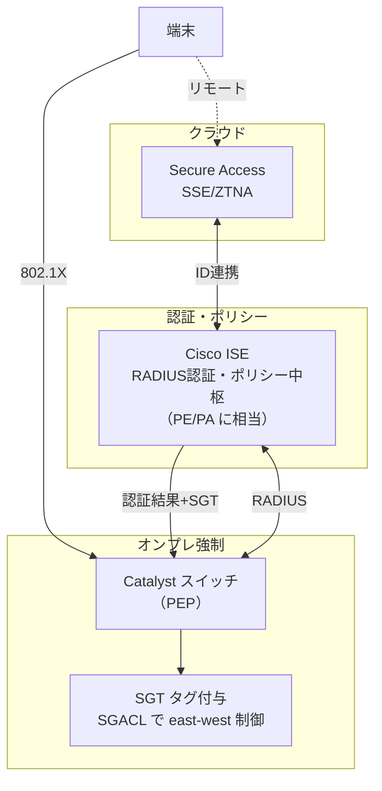

# Cisco ISE / TrustSec / Secure Access

Cisco の ZT は3つの技術で構成される。**ISE（認証・ポリシーの頭脳）**、**TrustSec/SGT（IP でなくタグで制御）**、**Secure Access（クラウド SSE/ZTNA）**。Cisco 実務のある読者にとって最も地続きな教材で、既存のスイッチ知識がそのまま拡張される。

## 1. 問題：IP アドレスは制御の単位に向かない

ACL は送信元/宛先 IP で書く。しかし DHCP・モバイル・仮想化で IP は動的に変わり、「この端末は何者か」を IP から一意に言えない。**ACL を IP で書き続けると、セグメント変更のたびに ACL 改修が発生し、破綻する**。「IP ではなく"役割"で制御したい」がこの3技術の出発点。

## 2. 仕組み：3つの役割

### ISE（Identity Services Engine）— 認証とポリシーの中枢

- **RADIUS サーバ**として 802.1X/MAB の認証を裁く。認証結果に応じて VLAN・SGT・ACL を端末へ動的に割り当てる。
- NIST でいう **PE/PA（判定と指令）** の座。スイッチ（PEP）に「この端末はこの権限」を指令する。

### TrustSec / SGT — IP でなくタグで制御

- 認証時に端末へ **SGT（Security Group Tag）** という"役割の番号"を付与する。以降の制御は IP でなく **SGT 同士の関係**で書く。
- **SGACL（Security Group ACL）** で「SGT=社員 から SGT=サーバ は許可、SGT=ゲスト から SGT=サーバ は拒否」のように、**east-west（横方向）通信を役割ベースで最小権限化**する。IP が変わってもタグが同じなら制御は不変。

### Secure Access — クラウド SSE/ZTNA

- Cisco のクラウド側 SSE。SWG・ZTNA（SDP 型）・CASB をクラウドで提供。リモートユーザーのアクセスを ISE の ID と連携して制御する。
- 技術的には [03 Zscaler の ZPA](03_Zscaler_ZIA_ZPA.md) と同じ **SDP 型 ZTNA** の系列。

## 3. 商用製品 × 本ラボ OSS の対応

Cisco の3技術は、本ラボで**別々の OSS/トラックに対応**する。

| Cisco 技術 | やっていること | 本ラボ OSS | トラック |
|---|---|---|---|
| **ISE** | RADIUS 認証・動的割当・ポリシー中枢 | FreeRADIUS | NW-ZT N1 |
| **TrustSec / SGT** | タグベース east-west 制御 | IOL VLAN/ACL + nftables | NW-ZT N4 |
| **Secure Access** | クラウド SSE/ZTNA（SDP 型） | OpenZiti | NW-ZT N2 |

- **ISE → FreeRADIUS**: FreeRADIUS が 802.1X/MAB を裁き、RADIUS 属性（VLAN 割当等）を返す。ISE の"認証中枢"部分を最小再現。RADIUS イメージは arm64 取得済み（2026-07-04）。IOL L2 スイッチが Authenticator を担う。詳細は [06_NAC_802.1X_MAB_CoA_動的VLAN.md](06_NAC_802.1X_MAB_CoA_動的VLAN.md)。
- **SGT → VLAN/nftables**: 本ラボは SGT そのものは使えないが、「IP でなく所属（VLAN/タグ）で east-west を絞る」思想を IOL の VLAN/ACL とホスト nftables の二層で再現する（N4）。SGT の"役割ベース制御"の考え方を体験する。
- **Secure Access → OpenZiti**: SDP 型 ZTNA として、[03](03_Zscaler_ZIA_ZPA.md) の ZPA と同じ位置づけ。

## 実務でこの知識がどこで効くか

これは NW エンジニアの本業ど真ん中である。**ISE 連携の 802.1X 設計・SGT による east-west 最小権限化は、Cisco 環境の ZT 案件で必ず問われる**。ISE の実機は arm64 で動かないが（Prisma/ISE は x86 アプライアンス）、**FreeRADIUS で「RADIUS が認証結果として VLAN 属性を返し、スイッチがそれを適用する」仕組みを手で体験しておけば、ISE の設定画面が"何を裏でやっているか"が分かる**。SGT についても、「IP で ACL を書く時代の限界」を実感していれば、TrustSec 提案の価値を自分の言葉で説明できる。転職市場でも「802.1X/動的VLAN/RADIUS 属性を理解している」は NW セキュリティ人材の分かりやすい差別化点になる。

## 4. 簡略化ポイント

- **ISE の実機は使わない**: ISE は x86 アプライアンスで arm64 非対応。FreeRADIUS で認証中枢の"核"だけ再現し、ポスチャ・プロファイリング・ゲスト管理等の ISE 固有機能は範囲外。
- **SGT は本物でない**: 本ラボは SGT/SXP/SGACL のプロトコルそのものは扱えない。VLAN/ACL/nftables で"役割ベース制御"の思想を近似する。
- **Secure Access のクラウド機能なし**: OpenZiti で SDP の核だけ。Cisco クラウドの統合管理・グローバル PoP は範囲外。

## 5. つまずきポイント

- **ISE=RADIUS だけではない**: ISE は RADIUS に加えプロファイリング・posture・ゲストを含む統合基盤。FreeRADIUS はその認証部分のみ。「FreeRADIUS で ISE 全部を再現」とは考えない。
- **SGT を VLAN と混同**: VLAN は L2 のブロードキャストドメイン、SGT は役割タグ。似て非なるもの。本ラボは VLAN で SGT の"思想"を近似しているだけと理解する。
- **RADIUS 属性の名前**: 動的 VLAN 割当は `Tunnel-Type` / `Tunnel-Medium-Type` / `Tunnel-Private-Group-ID` の3属性が必要。1つ欠けても効かない（詳細は N1 教材）。

## 参照

- [教材ガイド](README_教材ガイド.md)
- [04 Palo Alto NGFW](04_PaloAlto_Prisma_NGFW.md)
- [06 NAC 802.1X/MAB/CoA/動的VLAN](06_NAC_802.1X_MAB_CoA_動的VLAN.md)
- [NW-ZT_トラックロードマップ N1/N2/N4](../02_基本設計/NW-ZT_トラックロードマップ.md)
