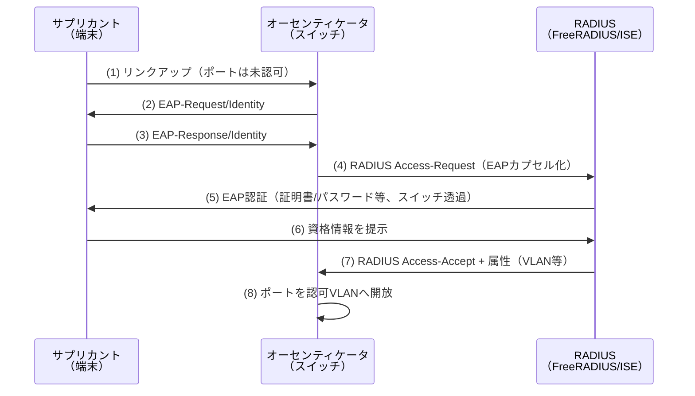
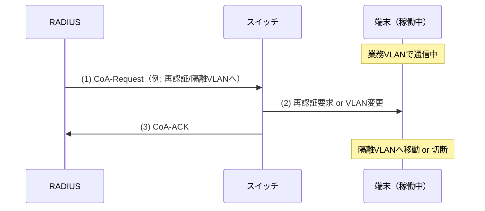

# NAC の機序 — 802.1X / MAB / CoA / 動的VLAN

NAC（Network Access Control）は「認証されない端末を LAN に参加させない」入口制御で、ゼロトラストの「暗黙の信頼ゾーン排除」をネットワーク層で実装するものである。ギャップ分析で **L7 トラックの最大の欠落**とされた領域で、NW-ZT **N1** の理論的下地になる。この教材は 802.1X / MAB / CoA / 動的VLAN の機序をシーケンスで解剖する。

## 1. 問題：LAN ポートに挿せば誰でも通ってしまう

伝統的な LAN は「物理的にポートに挿せた＝信頼」だった。会議室の空きポートに私物 PC を挿せば社内ネットに入れる。**「社内だから安全」という暗黙の信頼**そのものであり、ゼロトラストが最初に排除すべき前提。NAC はスイッチポートを「認証されるまで何も通さない」状態にする。

## 2. 仕組み：4つの機序

### 802.1X — EAP による認証

ポートに繋いだ端末（**サプリカント**）を、スイッチ（**オーセンティケータ/Authenticator**）が仲介し、**RADIUS サーバ**（認証サーバ）が認証する。認証成功までポートは閉じている。

**EAP 種別**（認証方式の中身）:

| EAP 種別 | 認証材料 | 特徴 |
|---|---|---|
| EAP-TLS | クライアント証明書 | 最も堅牢。相互証明書。 |
| PEAP / EAP-TTLS | ユーザー名+パスワード（TLS トンネル内） | 導入容易。AD 連携が多い。 |
| EAP-MD5 | パスワードハッシュ | 弱い。有線の限定用途。 |

### MAB（MAC Authentication Bypass）— 802.1X 非対応端末の救済

プリンタ・IP 電話・IoT など**サプリカントを持たない端末**は 802.1X で認証できない。MAB は**端末の MAC アドレスを ID として RADIUS に問い合わせ**、登録済みなら通す。セキュリティは弱いが（MAC 詐称可能）、現実の LAN には必須の仕組み。

### 動的 VLAN — 認証結果でセグメントを割り当てる

RADIUS が Access-Accept で返す**属性**によって、スイッチは端末を割り当てる VLAN を動的に変える。「社員は業務 VLAN、未認証/失敗は隔離 VLAN、ゲストはゲスト VLAN」を認証結果で自動振り分けする。

**動的 VLAN に必要な RADIUS 属性（3点セット）**:

| 属性 | 値の例 | 意味 |
|---|---|---|
| `Tunnel-Type` | `13`（VLAN） | トンネル種別＝VLAN |
| `Tunnel-Medium-Type` | `6`（802） | メディア＝IEEE 802 |
| `Tunnel-Private-Group-ID` | `100` | 割り当てる VLAN 番号 |

3つ揃って初めて動的 VLAN が効く。1つでも欠けるとスイッチは既定 VLAN のままになる（頻出の落とし穴）。

### CoA（Change of Authorization）— 稼働中セッションを事後変更

一度認証を通した後でも、RADIUS から **CoA** を送ればセッションを**強制的に再認証/切断/VLAN 変更**できる。例：EDR が端末の異常を検知 → RADIUS が CoA を発行 → 該当端末を隔離 VLAN へ即移動。ゼロトラストの「セッション単位・継続的な再評価」をネットワーク層で実現する要。

## 3. 商用製品 × 本ラボ OSS の対応

| 機序 | 商用（ISE/ClearPass）での実装 | 本ラボ OSS | トラック |
|---|---|---|---|
| 802.1X 認証 | ISE/ClearPass が RADIUS 中枢 | FreeRADIUS + Cisco IOL L2 | NW-ZT N1 |
| MAB | ISE のエンドポイント DB | FreeRADIUS の MAC ベース認証 | NW-ZT N1 |
| 動的 VLAN | ISE が VLAN 属性を返却 | FreeRADIUS の users で Tunnel 属性返却 | NW-ZT N1 |
| CoA | ISE が CoA でセッション変更 | FreeRADIUS の CoA（radclient 等） | NW-ZT N1 |

**商用 ISE/ClearPass → FreeRADIUS + IOL L2**。ISE/ClearPass は x86 アプライアンスで arm64 非対応のため、認証中枢を FreeRADIUS で、Authenticator を Cisco IOL L2 スイッチで再現する。RADIUS イメージは arm64 取得済み、IOL L2 は実機検証扱い（2026-07-04）。「認証されるまでポートが開かない」「認証結果で VLAN が変わる」「CoA で事後に隔離できる」という NAC の核心動作を手で確認できる。

## 実務でこの知識がどこで効くか

**802.1X/動的VLAN の設計・トラブルシュートは NW セキュリティ案件の頻出タスク**であり、「認証は通るのに VLAN が変わらない」「MAB に落ちてしまう」といった障害は現場で日常的に起きる。この教材の RADIUS 属性3点セットや EAP 種別を理解していれば、`show authentication sessions` の出力を読んで切り分けられる。特に **CoA** は「感染端末を自動隔離する」ゼロトラスト運用の要で、EDR/NDR と RADIUS を連携させる設計（検知→CoA→隔離VLAN）は ZT 案件の見せ場になる。ISE の実機がなくても、FreeRADIUS + IOL で機序を体で覚えておけば、ISE 案件でも設定の意味が即座に読める——ここが本ラボで N1 を先頭に置く理由である。

## 4. 簡略化ポイント

- **ISE 固有機能なし**: プロファイリング（端末種別自動判定）・posture・ゲストポータルは FreeRADIUS では再現しない。認証と動的VLAN・CoA の核だけ。
- **IOL は実機検証枠**: L2 スイッチ機能（dot1x/mab/CoA）は IOL の実挙動に依存し、コンテナ OSS のように"確定"ではない。N1 実装時に実機確認する。
- **EAP-TLS の PKI 簡略**: 証明書配布・失効の運用は本ラボでは最小限。本番は証明書ライフサイクル管理が重い。

## 5. つまずきポイント

- **動的 VLAN が効かない**: RADIUS 属性3点セット（Tunnel-Type/Medium-Type/Private-Group-ID）の欠落が最頻出。1つでも欠けると既定 VLAN のまま。
- **MAB に落ちる**: サプリカント未設定/EAP タイムアウトで 802.1X が失敗し MAB へフォールバックすると、意図せず弱い認証で通ってしまう。まず端末側サプリカント設定を疑う。
- **CoA が届かない**: CoA は RADIUS→スイッチへの"逆向き"通信（UDP 1700 等）。この経路の到達性・共有鍵不一致で無反応になる。
- **有線と無線で挙動が違う**: 本教材は有線 L2 前提。無線 NAC は SSID/WPA2-Enterprise と絡み、細部が異なる。

## 参照

- [教材ガイド](README_教材ガイド.md)
- [05 Cisco ISE / TrustSec / Secure Access](05_Cisco_ISE_TrustSec_SecureAccess.md)
- [07 商用製品 → OSS 対応表](07_商用製品_OSS対応表.md)
- [NW-ZT_トラックロードマップ N1（FreeRADIUS + IOL L2）](../02_基本設計/NW-ZT_トラックロードマップ.md)
