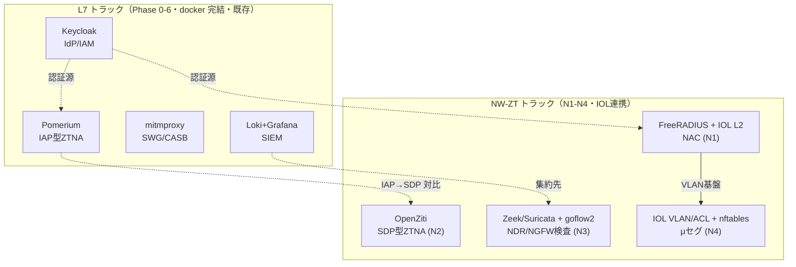

# 商用製品 → 本ラボ OSS 横断対応表

これまでの教材（01-06）で技術ごとに見てきた「商用 → OSS」の対応を、**一枚の横断マトリクス**に集約する。この表は設計・教材の背骨であり、[README_教材ガイド.md](README_教材ガイド.md) と [../02_基本設計/NW-ZT_ギャップ分析.md](../02_基本設計/NW-ZT_ギャップ分析.md) の両方から参照される。

## 1. 中核対応表（レイヤー × 商用 × OSS × トラック）

| レイヤー | 商用代表 | 本ラボOSS | 実装トラック |
|---|---|---|---|
| IdP/IAM | Okta/Entra ID | Keycloak | ZERO L7（既存） |
| IAP型ZTNA | (BeyondCorp系) | Pomerium | ZERO L7（既存） |
| SDP型ZTNA | Zscaler ZPA / Cisco Secure Access | OpenZiti（発展: Headscale/Netbird） | NW-ZT N2 |
| SWG/CASB | Zscaler ZIA / Netskope | mitmproxy | ZERO L7（既存） |
| NGFW検査 | Palo App-ID/Content-ID | Suricata | NW-ZT N3 |
| NAC | Cisco ISE / Aruba ClearPass | FreeRADIUS + IOL L2 | NW-ZT N1 |
| μセグ/タグ | Cisco TrustSec/SGT | IOL VLAN/ACL + nftables | NW-ZT N4 |
| NDR | Darktrace / Cisco Secure Network Analytics | Zeek/Suricata + NetFlow(goflow2)→ntopng | NW-ZT N3 |
| SIEM | Splunk/Sentinel | Loki+Grafana | ZERO L7（既存） |

## 2. 総覧図（どの OSS がどのトラックのどこに座るか）

## 3. 商用製品ごとの分解対応（1製品→複数 OSS）

商用製品は複数機能の束なので、**1製品を機能ごとにばらして OSS に対応させる**。各教材の詳細はリンク先を参照。

| 商用製品 | 機能分解 | 対応 OSS | 教材 |
|---|---|---|---|
| **Zscaler ZIA** | クラウドプロキシ SWG/CASB | mitmproxy | [03](03_Zscaler_ZIA_ZPA.md) |
| **Zscaler ZPA** | SDP 型 ZTNA（内向き非開放） | OpenZiti | [03](03_Zscaler_ZIA_ZPA.md) |
| **Palo Alto NGFW** | App-ID / Content-ID（検査） | Suricata | [04](04_PaloAlto_Prisma_NGFW.md) |
| " | User-ID（IP→ユーザー紐付け） | Keycloak + Pomerium | [04](04_PaloAlto_Prisma_NGFW.md) |
| **Cisco ISE** | RADIUS 認証・動的割当 | FreeRADIUS | [05](05_Cisco_ISE_TrustSec_SecureAccess.md) / [06](06_NAC_802.1X_MAB_CoA_動的VLAN.md) |
| **Cisco TrustSec/SGT** | タグベース east-west 制御 | IOL VLAN/ACL + nftables | [05](05_Cisco_ISE_TrustSec_SecureAccess.md) |
| **Cisco Secure Access** | クラウド SSE/ZTNA（SDP 型） | OpenZiti | [05](05_Cisco_ISE_TrustSec_SecureAccess.md) |
| **Aruba ClearPass** | NAC（802.1X/MAB/CoA） | FreeRADIUS + IOL L2 | [06](06_NAC_802.1X_MAB_CoA_動的VLAN.md) |
| **Darktrace / Cisco SNA** | NDR（フロー/振る舞い検知） | Zeek/Suricata + goflow2 → ntopng | [04](04_PaloAlto_Prisma_NGFW.md) |

## 4. NIST PE/PA/PEP へのマッピング（横串）

全 OSS を [01 の PE/PA/PEP](01_ゼロトラスト原論_NIST_SP_800-207.md) の役割で串刺しにすると、ラボ全体が1つの ZT アーキテクチャに見える。

| NIST 役割 | 本ラボ OSS | 補足 |
|---|---|---|
| PE（判定） | Pomerium(authorize) / FreeRADIUS(認証判定) | ID・属性で許可判定 |
| PA（指令） | Pomerium(proxy) / FreeRADIUS(Access-Accept, CoA) | PEP へ通す/隔離を指令 |
| PEP（強制） | Pomerium(IAP) / mitmproxy(SWG) / IOL スイッチ(802.1X) / OpenZiti(connector) | 経路上で実際に通す/止める |
| シグナル: ID | Keycloak | 全トラックの認証源 |
| 監視・改善 | Loki+Grafana / Zeek/Suricata | ログ・フロー・検知 |

## 5. arm64 実測に基づく OSS 選定の根拠

対応表の OSS は**「arm64 で実際に動く」ことを前提に選んでいる**（2026-07-04 実測）。動かないイメージを選ぶと学習が止まるため、ここは対応表の信頼性の土台。

| 分類 | 対象 OSS | 扱い |
|---|---|---|
| arm64 ネイティブ（確定） | keycloak / pomerium / oauth2-proxy / mitmproxy / suricata / openziti / openldap | そのまま採用 |
| amd64 のみ | osquery | posture はモック claim で代替 |
| amd64 のみ | clamav | NDR の振る舞い検知で補完 |
| 実機検証枠 | Cisco IOL L2（802.1X/MAB/CoA） | コンテナでなく実機挙動に依存。N1/N4 実装時に確認 |

詳細は [../03_詳細設計/軽量検証結果_2026-07-04.md](../03_詳細設計/軽量検証結果_2026-07-04.md)。

## 6. 使い方（この表の読み方）

- **商用製品名から入る**: RFP や案件で出た製品名を §3 で引き、どの OSS/教材で仕組みを追体験できるか辿る。
- **技術レイヤーから入る**: 「NAC を学びたい」なら §1 のレイヤー行 → 対応教材 → 実装トラック（N1）へ。
- **OSS を"商用の一部の再現"と理解する**: OSS は商用機能の核だけを最小構成で再現する。各教材の「簡略化ポイント」で省略範囲を必ず確認する（ベンダー中立・過大評価しない）。

## 参照

- [教材ガイド](README_教材ガイド.md)
- [01 NIST SP 800-207](01_ゼロトラスト原論_NIST_SP_800-207.md)
- [NW-ZT_ギャップ分析](../02_基本設計/NW-ZT_ギャップ分析.md)
- [NW-ZT_トラックロードマップ](../02_基本設計/NW-ZT_トラックロードマップ.md)
- [ロードマップ PHASE2](../../ロードマップ/PHASE2_MODERN_ENTERPRISE.md)
