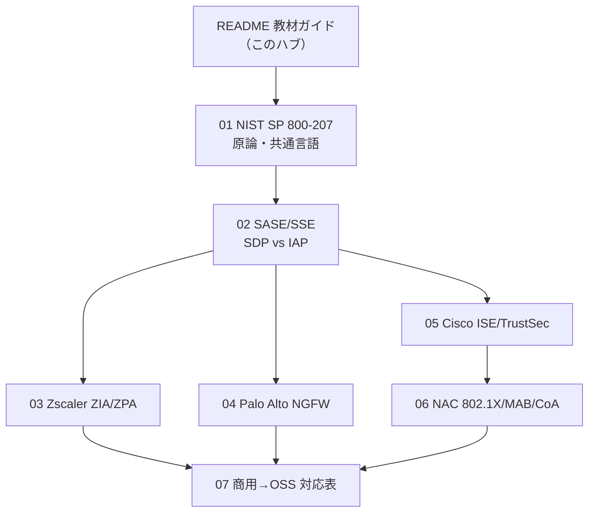

# 商用ゼロトラスト製品を理解する教材ガイド

この教材群は、Zscaler・Palo Alto・Cisco といった**商用ゼロトラスト（ZT）製品の「仕組み」**をベンダー中立・技術軸で解剖し、それぞれを**本ラボの OSS で何に対応させて追体験できるか**を一枚で結ぶための入口である。読者は Cisco 実務経験のある NW エンジニアで、ZT 製品そのものは未経験、という前提で書いている。

**この教材のゴールは、製品名を覚えることではない**。「ZTNA とは技術的に何をしているのか」「SDP と IAP は何が違うのか」「App-ID は Suricata で言うと何なのか」を説明できるようになり、商用製品の営業資料や設計書を読んだときに"中身"が見えるようになることである。

## この教材の位置づけ

- 実装トラックそのものではなく、**実装の前に読む理論の下地**。本ラボの2トラック（L7: Phase 0-6 / NW-ZT: N1-N4）で手を動かす際の「なぜこの OSS でこの商用製品を代替するのか」を支える。
- 各教材は必ず **商用製品 → 本ラボ OSS の対応**を示す。対応の妥当性は arm64 実測（後述）を根拠にする。
- ギャップ分析・ロードマップは実装計画側の文書。本教材はそこへ [../02_基本設計/NW-ZT_ギャップ分析.md](../02_基本設計/NW-ZT_ギャップ分析.md) / [../02_基本設計/NW-ZT_トラックロードマップ.md](../02_基本設計/NW-ZT_トラックロードマップ.md) からリンクされる。

## 読む順

概念の広い順（原論 → 分類 → 個別ベンダー → 横断整理）で並べている。上から順に読むのが基本だが、興味のあるベンダーから入っても各教材は自己完結する。

| 順 | 教材 | 何がわかるか |
|---|---|---|
| 0 | このガイド | 全体像・対応表の総覧 |
| 1 | [01_ゼロトラスト原論_NIST_SP_800-207.md](01_ゼロトラスト原論_NIST_SP_800-207.md) | ZT の定義（7 tenets）と PE/PA/PEP という共通言語 |
| 2 | [02_SASE_SSE_と_SDP_vs_IAP.md](02_SASE_SSE_と_SDP_vs_IAP.md) | SASE/SSE の構成要素、SDP と IAP の技術差 |
| 3 | [03_Zscaler_ZIA_ZPA.md](03_Zscaler_ZIA_ZPA.md) | クラウドプロキシ（ZIA）と SDP（ZPA）の仕組み |
| 4 | [04_PaloAlto_Prisma_NGFW.md](04_PaloAlto_Prisma_NGFW.md) | NGFW の App-ID / User-ID / Content-ID |
| 5 | [05_Cisco_ISE_TrustSec_SecureAccess.md](05_Cisco_ISE_TrustSec_SecureAccess.md) | ISE（RADIUS）・TrustSec/SGT・Secure Access |
| 6 | [06_NAC_802.1X_MAB_CoA_動的VLAN.md](06_NAC_802.1X_MAB_CoA_動的VLAN.md) | 802.1X/MAB/CoA/動的VLAN の機序（N1 の下地） |
| 7 | [07_商用製品_OSS対応表.md](07_商用製品_OSS対応表.md) | 全商用 → OSS の横断マトリクス |

## 中核テーブル：商用製品 → 本ラボ OSS 対応（総覧）

このテーブルが教材群の背骨である。各教材はこの表の1行を深掘りするものと考えてよい。詳細な横断整理は [07_商用製品_OSS対応表.md](07_商用製品_OSS対応表.md) にある。

| レイヤー | 商用代表 | 本ラボOSS | 実装トラック |
|---|---|---|---|
| IdP/IAM | Okta/Entra ID | Keycloak | ZERO L7（既存） |
| IAP型ZTNA | (BeyondCorp系) | Pomerium | ZERO L7（既存） |
| SDP型ZTNA | Zscaler ZPA / Cisco Secure Access | OpenZiti（発展: Headscale/Netbird） | NW-ZT N2 |
| SWG/CASB | Zscaler ZIA / Netskope | mitmproxy | ZERO L7（既存） |
| NGFW検査 | Palo App-ID/Content-ID | Suricata | NW-ZT N3 |
| NAC | Cisco ISE / Aruba ClearPass | FreeRADIUS + IOL L2 | NW-ZT N1 |
| μセグ/タグ | Cisco TrustSec/SGT | IOL VLAN/ACL + nftables | NW-ZT N4 |
| NDR | Darktrace / Cisco Secure Network Analytics | Zeek/Suricata + NetFlow(goflow2)→ntopng | NW-ZT N3 |
| SIEM | Splunk/Sentinel | Loki+Grafana | ZERO L7（既存） |

## 「なぜ OSS で代替できるのか」の根拠（arm64 実測）

このラボは Apple Silicon（arm64）上の Docker で動く。教材で挙げる OSS は**そのまま arm64 で動くことを実測確認済み**のものを選んでいる（2026-07-04 実測）。

- **arm64 ネイティブ対応（確定）**: keycloak / pomerium / oauth2-proxy / mitmproxy / suricata / openziti / openldap
- **amd64 のみ（本ラボでは代替 or モック扱い）**: osquery（→ posture はモック claim で代替）/ clamav（→ NDR の振る舞い検知で補完）

商用製品を「軽量な OSS で追体験する」際、動かないイメージを選ぶと学習が止まる。だからこそ**対応表の OSS は"実際に arm64 で起動する"ことを前提に選定している**（詳細: [../03_詳細設計/軽量検証結果_2026-07-04.md](../03_詳細設計/軽量検証結果_2026-07-04.md)）。

## ベンダー中立の立場

- 特定商用製品を推奨・比較優劣づけしない。**技術軸（ZTNA / SWG / NDR / NAC …）で理解し、代表製品はその技術の実装例として挙げる**。
- OSS はあくまで「仕組みを最小構成で体験する」ための道具であり、商用製品の機能を全て代替するものではない。各教材の「簡略化ポイント」で、本ラボが省いている本番要件（HA・グローバル分散・細粒度ポリシー等）を明記する。

## 参照

- [NW-ZT_ギャップ分析](../02_基本設計/NW-ZT_ギャップ分析.md)
- [NW-ZT_トラックロードマップ](../02_基本設計/NW-ZT_トラックロードマップ.md)
- [phase2_解説（L7 トラックの IAP 解説）](../解説/phase2_解説.md)
- [ロードマップ PHASE2（実装委譲先の番号テーマ）](../../ロードマップ/PHASE2_MODERN_ENTERPRISE.md)
