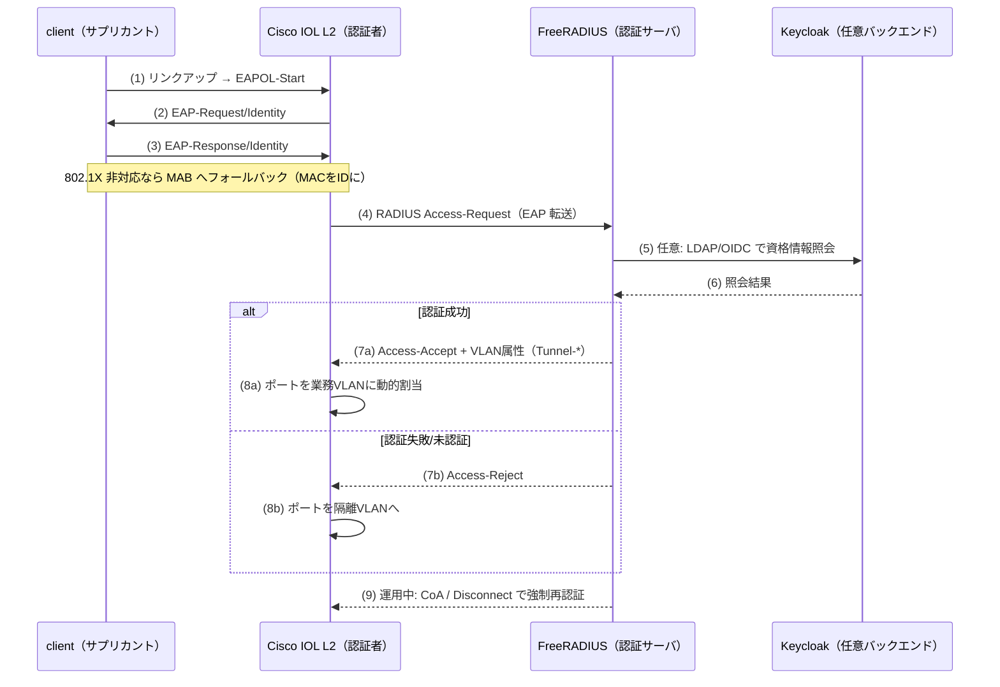

# N1 解説 — NAC / 802.1X（FreeRADIUS + Cisco IOL L2）

## 1. このフェーズで何が実現されるか

N1 では端末を LAN に参加させる前に認証する。Cisco IOL L2 スイッチを認証者（Authenticator）に、FreeRADIUS を認証サーバに置き、802.1X（EAP）または MAB（MAC 認証バイパス）で入口を締める。認証結果に応じて、そのポートを **業務 VLAN** か **隔離 VLAN** に動的に割り当てる。稼働中のセッションは CoA（Change of Authorization）で強制的に再認証・隔離できる。

- **ビフォー**: スイッチにケーブルを挿せば誰でも LAN に参加でき、IP を取れてしまう。認証は「アプリに入るとき」に初めて問われる（もう手遅れ）。
- **アフター**: ポートにリンクアップした瞬間、認証が済むまで通信できない。未認証・認証失敗の端末は隔離 VLAN に落ち、業務セグメントの IP すら取れない。「ネットワークに参加させるかどうか」を最初の関門にする。

これは L7 トラック（Phase 0-6）が docker の中で「アプリ層の関所」を作ったのに対し、**物理/L2 の入口そのものを関所にする**という別軸の統制。ゼロトラストの「明示的検証」を、アプリより手前のネットワーク接続点で効かせる。

## 2. なぜこの構成か

| 観点 | 商用製品 | 本ラボの OSS 選定 | 選定理由 |
|---|---|---|---|
| NAC / 802.1X | Cisco ISE, Aruba ClearPass | **FreeRADIUS + Cisco IOL L2** | RADIUS は arm64 イメージ取得済み。IOL の dot1x/CoA は実機検証対象（[軽量検証計画_nwzt](../03_詳細設計/軽量検証計画_nwzt.md)）。ISE/ClearPass の中核（RADIUS ポリシーエンジン）を OSS で忠実に追体験できる |

なぜ FreeRADIUS + IOL の 2 コンポーネント構成にするか:

- **ISE や ClearPass の実体は「RADIUS サーバ + ポリシーエンジン + GUI」**。この中核は RADIUS プロトコルであり、FreeRADIUS の `users` / `clients.conf` を書けば ISE の「ポリシーセット」に相当するものを手で組める。GUI やダッシュボードは商用の付加価値だが、認証・認可の判断ロジックそのものは RADIUS で完全に再現できる。
- **認証者（スイッチ）は実機の挙動が要**。dot1x・MAB・動的 VLAN・CoA は IOS の機能であり、これは Cisco IOL でしか再現できない。docker コンテナのソフト RADIUS だけでは「スイッチがポートを VLAN に張り替える」という NAC の肝が体験できないため、IOL を解禁する（D-7）。

**実務でこの知識がどこで効くか**: Cisco 実務経験があるなら、`aaa new-model` と `radius server` の設定は見慣れているはず。N1 はその「RADIUS の向こう側」——つまり認証サーバが Access-Accept に何を載せて返しているか——を自分の手で開けて見る作業になる。ISE を設計する案件では「認証ポリシー」と「認可プロファイル」を分けて考えるが、FreeRADIUS ではそれぞれ `users`（認証条件）と返却 VLAN 属性（認可プロファイル）に対応する。この対応が腹落ちすると、ISE の GUI が裏で何をやっているか、CCNP Security の 802.1X 問題が「プロトコルのどの往復の話か」が具体的に見えるようになる。切り分けの現場でも「未認証端末が隔離 VLAN に落ちない」障害を、スイッチ側（dot1x 設定）と RADIUS 側（VLAN 属性）のどちらの問題か層で分けられる。

## 3. 仕組みの核心

802.1X（EAP）の認証シーケンスと、Access-Accept に載る VLAN 属性の流れが N1 の核心。[NW-ZT_論理構成設計](../02_基本設計/NW-ZT_論理構成設計.md) の N1 シーケンスがそのまま対応する。



ポイント:

- **認証は L2 で完結し、IP はその後**。EAPOL は IP を持たない端末とスイッチの間のやりとり。認証が済んで VLAN が決まってから DHCP で IP を取る。だから「IP アドレスに依存しない入口制御」になる。IP ベースの ACL より手前で効く。
- **VLAN 割当の実体は RADIUS 属性**。Access-Accept に載る `Tunnel-Type=VLAN(13)` / `Tunnel-Medium-Type=802(6)` / `Tunnel-Private-Group-ID=<VLAN-ID>` の 3 属性の組で、スイッチはポートをその VLAN に張り替える。この 3 属性が「認可プロファイル」の中身。
- **MAB はフォールバック**。プリンタや IP 電話のような 802.1X サプリカントを持たない端末は、MAC アドレスを ID 代わりに認証する（MAC Authentication Bypass）。セキュリティは弱いが、現場では必須の逃し弁。
- **CoA が動的性の肝**。一度認証して業務 VLAN にいる端末を、運用中に RADIUS 側から「隔離 VLAN に落とせ」と命令できる。これが N3（NDR）の異常検知と繋いだ自動封じ込め（SOAR）の下地になる。

## 4. 自分で触って確認する手順（実装後にこの手順で確認）

N1 は今回スコープでは未デプロイ（設計値）。実装後、以下の手順でゲート条件（未認証→隔離 VLAN、認証成功→業務 VLAN、CoA で強制再認証）を段階的に確認する想定。IOL 側の詳細設定は概念と主要コマンドに留める（丸写しでなく、意味を理解して打てる粒度）。

### 手順1: FreeRADIUS を起動し、認証が通ることを radtest で確認する

まず認証サーバ単体を検証する。スイッチを挟む前に「RADIUS が正しく Accept を返すか」を切り離して確認するのが定石。

```bash
# FreeRADIUS をデバッグモードで前面起動（要求/応答が全部見える）
docker exec -it clab-nwzt-freeradius radiusd -X

# 別ターミナルから、テストユーザで認証要求を投げる
docker exec clab-nwzt-freeradius radtest testuser testpass 127.0.0.1 0 testing123
```

期待結果: `Received Access-Accept` が返る。`radiusd -X` 側のログに、`users` ファイルのどのエントリにマッチし、どの属性を返したかが行単位で出る。**まずここで「認証が RADIUS の往復として何をしているか」を目で見る**のが理解の起点。

### 手順2: 返却される VLAN 属性をデコードして見る

`users` ファイルで、成功時に VLAN 属性を返すよう設定する（概念）。

```text
# clients は clients.conf、ユーザ/属性は users に書く（概念例）
testuser  Cleartext-Password := "testpass"
          Tunnel-Type = VLAN,
          Tunnel-Medium-Type = IEEE-802,
          Tunnel-Private-Group-ID = "10"
```

`radiusd -X` のデバッグ出力で、Access-Accept に上記 3 属性が載っていることを確認する。ここで見えている `Tunnel-Private-Group-ID = "10"` が、スイッチ側でポートを VLAN 10 に張り替えるトリガそのもの。**「認可プロファイル = この 3 属性の組」だと腹落ちさせる**のがこの手順の狙い。

### 手順3: IOL L2 スイッチで dot1x を設定する（概念 + 主要コマンド）

Cisco IOL 側で、AAA と 802.1X、動的 VLAN 割当を有効化する。実務で見慣れた IOS 構文なので、意味を確認しながら投入する。

```text
! AAA と RADIUS サーバ登録
aaa new-model
radius server FR
 address ipv4 <freeradius-ip> auth-port 1812 acct-port 1813
 key testing123
aaa authentication dot1x default group radius
aaa authorization network default group radius

! グローバルで 802.1X と CoA を有効化
dot1x system-auth-control
aaa server radius dynamic-author
 client <freeradius-ip> server-key testing123

! アクセスポート側: 802.1X + MAB フォールバック、動的VLAN、失敗時は隔離VLAN
interface Ethernet0/1
 switchport mode access
 authentication port-control auto
 authentication event fail action authorize vlan 99
 mab
 dot1x pae authenticator
```

投入後、`show dot1x interface Ethernet0/1 details` と `show authentication sessions` で、そのポートの認証状態・割当 VLAN を確認できるようにしておく。

### 手順4: 未認証→隔離 VLAN、認証成功→業務 VLAN を対照確認する（学習の核心）

```text
! 認証成功端末を挿したポートで
show authentication sessions interface Ethernet0/1
!   → Status: Authorized / Vlan Policy: 10（業務VLAN）を確認

! 認証を通さない端末を挿したポートで
show authentication sessions interface Ethernet0/2
!   → Status: Unauthorized または Vlan Policy: 99（隔離VLAN）を確認
```

期待結果: **同じスイッチ・同じ設定でも、認証結果だけで割り当てられる VLAN が変わる**。認証成功端末は業務 VLAN（172.31.10.0/24）で app に到達でき、未認証端末は隔離 VLAN（172.31.99.0/24）に閉じ込められる。この対照が NAC の本質——「参加させるかどうかを認証で決める」——を体験する箇所。

### 手順5: CoA で稼働中セッションを強制再認証する

業務 VLAN で動いている端末を、RADIUS 側から動的に隔離する。

```bash
# FreeRADIUS 側から CoA-Request / Disconnect を該当セッションへ送る
docker exec clab-nwzt-freeradius echo "User-Name=testuser,NAS-IP-Address=<switch-ip>" | \
  radclient -x <switch-ip>:3799 disconnect testing123
```

期待結果: 稼働中の端末が切断・再認証される（設定次第で隔離 VLAN へ）。スイッチ側の `show authentication sessions` で状態が変わることを確認する。**「一度通した端末を、後から動的に落とせる」**ことが、N3 の検知と繋いだ自動封じ込めの前提だと理解する。

## 5. 考えどころ

- **本番設計ならどうするか**: 本番の ISE/ClearPass は、認証ポリシーに端末プロファイリング（デバイス種別の自動判別）、posture チェック（N1 では扱わない端末状態）、ゲスト/BYOD ポータル、TrustSec の SGT 付与までを一体で持つ。N1 は RADIUS の認証・認可の中核だけを切り出す。
- **このラボの簡略化ポイント**:
  - **EAP 方式は最小**。本番は EAP-TLS（証明書ベース）が主流だが、N1 はまず PEAP/パスワード or MAB で機序を体験する。証明書ベースのデバイス認証は L7 トラックの [phase6_解説](phase6_解説.md)（mTLS）で別途扱う。
  - **プロファイリングなし**。端末種別の自動判別（OUI/DHCP フィンガープリント）は実装しない。
  - **CoA のトリガは手動**。本番は SIEM/SOAR からの自動発火だが、N1 単体では手動で CoA を投げて機序を確認する。N3 と繋ぐと自動化できる（次項）。

## 6. つまずきポイント

- **認証は成功しているのに VLAN が変わらない**: [切り分けシート](../05_試験/切り分けシート.md) の層別（コンテナ→到達→TLS→認証→認可）で言えば「認証 OK・認可 NG」のパターン。RADIUS は Access-Accept を返しているが、VLAN 属性（`Tunnel-*` の 3 点セット）が欠けている、またはスイッチ側で `aaa authorization network` が入っていないことが多い。`radiusd -X` の出力で属性が載っているかを先に確認する。
- **radtest は通るのにスイッチからだと弾かれる**: `clients.conf` にスイッチの IP と共有鍵（key）が正しく登録されていない典型。RADIUS は「クライアント（=スイッチ）」を IP+共有鍵で認証するため、ここがズレると Access-Request 自体が捨てられる。
- **MAB 端末が業務 VLAN に入れない**: MAB のユーザ名は MAC アドレス文字列（小文字ハイフン区切り等、フォーマットが機種依存）。`users` のエントリと MAC の表記が一致していないと認証されない。`radiusd -X` で実際に飛んできた User-Name を確認して合わせる。
- IOL の dot1x/CoA が実機でどこまで動くかは未確定。動かない機能があれば [切り分けシート](../05_試験/切り分けシート.md) を複製して事象ごとに記録し、[軽量検証計画_nwzt](../03_詳細設計/軽量検証計画_nwzt.md) の切り分けに従う。

## 参照

- [NW-ZT_トラックロードマップ](../02_基本設計/NW-ZT_トラックロードマップ.md)（N1-N4 の全体像）
- [NW-ZT_論理構成設計](../02_基本設計/NW-ZT_論理構成設計.md)（N1 認証シーケンス・アドレス設計）
- [教材: NAC/802.1X/MAB/CoA/動的VLAN](../教材/06_NAC_802.1X_MAB_CoA_動的VLAN.md)
- [教材: Cisco ISE/TrustSec/Secure Access](../教材/05_Cisco_ISE_TrustSec_SecureAccess.md)
- [N1 構築スタブ](../04_構築/nwzt_track/N1_NAC/README.md)
- [切り分けシート](../05_試験/切り分けシート.md)
