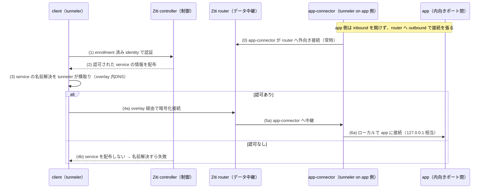

# N2 解説 — SDP型ZTNA（OpenZiti）

## 1. このフェーズで何が実現されるか

N2 では `app` の内向きポートを一切開けないまま、外向きの張り出し（app-connector）経由でのみ認可済みクライアントを到達させる。OpenZiti の controller / router / tunneler を使い、SDP（Software-Defined Perimeter）型の ZTNA を体験する。未認可のクライアントは `app` に到達できないどころか、**名前解決すらできない**（存在が隠される＝暗黙拒否）。

- **ビフォー**: `app` は待ち受けポート（例: 80/443）を開けており、経路さえ通ればスキャンで発見でき、接続を試みられる。IAP（L7 トラック Phase 2）を置いても、`app` のポート自体は開いたまま（IAP がその手前に立つだけ）。
- **アフター**: `app` は内向きポートを閉じ、Ziti router へ外向きに接続を張り出すだけ。攻撃者から見ると `app` はネットワーク上に「存在しない」。認可された identity を持つクライアントだけが、tunneler と overlay 経由で到達できる。

これが Zscaler ZPA や Cisco Secure Access が「VPN 代替」「アプリを見えなくする」と謳う仕組みの技術的な中身。N2 で自分の手で組むと、その一文の意味が具体的に分かる。

## 2. なぜこの構成か

| 観点 | 商用製品 | 本ラボの OSS 選定 | 選定理由 |
|---|---|---|---|
| SDP型ZTNA | Zscaler ZPA, Cisco Secure Access | **OpenZiti**（発展: Headscale / Netbird） | arm64 対応確定済み（[軽量検証結果](../03_詳細設計/軽量検証結果_2026-07-04.md)）。ZPA の broker + app-connector アーキテクチャを、controller + router + tunneler としてほぼ 1:1 で再現できる |

なぜ IAP 型（L7 Phase 2 の Pomerium）とは別に SDP 型を組むか:

- **IAP 型と SDP 型は「到達性の作り方」が根本的に違う**。IAP はアプリの前にリバースプロキシ（関所）を立てるが、アプリのポートは開いている（関所を回避する経路があれば届く）。SDP はアプリのポートを閉じ、outbound だけで overlay に参加させるため、**そもそも待ち受けが存在しない**。この差を頭でなく手で確認するのが N2 の目的。
- **ZPA の営業資料は「アプリを不可視化」「内向きファイアウォール穴を開けない」と書くが、その実装が app-connector（=Ziti router へ張り出す side）**。OpenZiti はこのモデルをそのまま OSS 化しているため、商用 ZPA の設計思想を最も忠実に追体験できる。

**実務でこの知識がどこで効くか**: Cisco 実務なら、リモートアクセスは AnyConnect + ASA/FTD の「VPN でネットワークに入れてから ACL で絞る」モデルが基準のはず。SDP はこれを裏返す——「ネットワークには入れず、アプリ単位の暗号化トンネルで、認可されたときだけ、そのアプリにだけ到達させる」。この違いが分かると、Secure Access や ZPA の PoC で「なぜファイアウォールに inbound 穴を開けなくていいのか」「なぜ社内アプリがインターネットから見えないのか」を説明できる。設計案件で「VPN 集約装置を SDP に置き換える」提案の技術的裏付けにもなる。

## 3. 仕組みの核心

controller が制御（誰が何に到達してよいか）を、router が実データの中継を担い、`app` 側は内向き非開放のまま router へ外向き接続する。この非対称性が SDP の核心。



ポイント:

- **`app` は inbound を開けない**。app-connector（app 側の tunneler）が router へ **outbound** で接続を張り、その常時接続を逆流させて到達させる。ファイアウォールの穴あけが不要になるのはこのため。攻撃者は `app` のポートをスキャンしても何も見つけられない。
- **暗黙拒否がデフォルト**。IAP は「アクセスして拒否される（拒否レスポンスが返る）」が、SDP は「認可されない service はそもそも配布されない」ため、**名前解決の段階で失敗する**。存在が見えない＝攻撃対象面（アタックサーフェス）が消える。これが IAP と SDP の最も大きな体験差。
- **identity と policy が制御の実体**。各ノードは enrollment で一意の identity（証明書）を受け取り、controller の service-policy が「どの identity がどの service に到達してよいか」を定義する。これが ZPA の「アクセスポリシー」に対応する。
- **overlay ネットワーク**。tunneler が OS の名前解決とパケットを横取りし、Ziti の暗号化 overlay に流す。アプリ本体は無改修（Ziti SDK を組み込む埋め込み型もあるが、tunneler 方式ならアプリはそのまま）。

### IAP 型（Pomerium）との実装差

| 観点 | IAP 型（L7 Phase 2 / Pomerium） | SDP 型（N2 / OpenZiti） |
|---|---|---|
| アプリのポート | 開いている（プロキシが手前に立つ） | **閉じている**（outbound のみ） |
| 未認可の挙動 | アクセスして拒否/リダイレクト | **名前解決すら失敗**（不可視） |
| 到達性の作り方 | リバースプロキシ経由 | overlay + app-connector の張り出し |
| ファイアウォール | inbound 許可が必要 | inbound 穴あけ不要 |
| 代表製品 | Google IAP, Pomerium | Zscaler ZPA, Cisco Secure Access |

同じ「ZTNA」でも、この 2 型は攻撃対象面の消し方が根本的に異なる。N2 は SDP 側を、L7 Phase 2 は IAP 側を担当し、両方を手で組むことで「ZTNA とひとことで言っても実装は 2 系統ある」を体験する。

## 4. 自分で触って確認する手順（実装後にこの手順で確認）

N2 は今回スコープでは未デプロイ（設計値）。実装後、以下の手順でゲート条件（内向き非開放のまま app-connector 経由でのみ到達、未認可は名前解決不可）を段階的に確認する想定。

### 手順1: controller / router を起動し、健全性を確認する

```bash
# controller の起動確認
docker exec clab-nwzt-ziti-controller ziti edge login localhost:1280 -u admin -p <pw>
docker exec clab-nwzt-ziti-controller ziti edge list edge-routers
```

期待結果: controller に管理ログインでき、router が online として一覧に出る。まず制御面が生きていることを確認する。

### 手順2: identity を発行し、client / app に enrollment する

```bash
# client 用と app-connector 用の identity を作成
docker exec clab-nwzt-ziti-controller ziti edge create identity client-id -o client.jwt
docker exec clab-nwzt-ziti-controller ziti edge create identity app-id -o app.jwt

# 各ノードの tunneler に enrollment（jwt を渡すと証明書に交換される）
docker exec clab-nwzt-client ziti-edge-tunnel enroll --jwt /path/client.jwt --identity /path/client.json
```

期待結果: 各ノードが一意の identity 証明書を得る。ここで配布される証明書が、以降の到達可否判断の主体になる。

### 手順3: service と policy を定義する（到達性の設計）

```bash
# app への service を定義（app 側は 127.0.0.1:80 で待ち受け、inbound は開けない）
docker exec clab-nwzt-ziti-controller ziti edge create config app-intercept intercept.v1 \
  '{"protocols":["tcp"],"addresses":["app.ziti"],"portRanges":[{"low":80,"high":80}]}'
docker exec clab-nwzt-ziti-controller ziti edge create config app-host host.v1 \
  '{"protocol":"tcp","address":"127.0.0.1","port":80}'
docker exec clab-nwzt-ziti-controller ziti edge create service app-svc \
  --configs app-intercept,app-host

# client-id だけに app-svc への dial を許可、app-id に bind を許可
docker exec clab-nwzt-ziti-controller ziti edge create service-policy app-dial Dial \
  --service-roles '@app-svc' --identity-roles '@client-id'
docker exec clab-nwzt-ziti-controller ziti edge create service-policy app-bind Bind \
  --service-roles '@app-svc' --identity-roles '@app-id'
```

期待結果: 「client-id は app.ziti に dial（到達）してよい」「app-id が app を bind（張り出す）」というポリシーが定義される。これが ZPA のアクセスポリシーに対応する。

### 手順4: app 側の inbound が閉じたまま、client からだけ到達できることを確認する（学習の核心）

```bash
# app 側が inbound を開けていないことを確認（外からポートスキャンしても見えない）
docker exec clab-nwzt-external nmap -Pn -p 80 <app-ip>   # → filtered/closed（応答なし）

# 認可済み client は overlay 経由の名前 app.ziti で到達できる
docker exec clab-nwzt-client curl -sv http://app.ziti/
```

期待結果: `external` からの直接スキャンでは `app` の 80 番が見えない（inbound 非開放）。一方 `client` は overlay の名前 `app.ziti` で応答を得る。**「同じ app なのに、経路と identity 次第で見える/見えないが決まる」**ことを対照で確認する。

### 手順5: 未認可端末は名前解決すら失敗することを確認する（SDP の核心）

```bash
# external は identity を持たない（または dial ポリシー対象外）
docker exec clab-nwzt-external nslookup app.ziti   # → 解決できない
docker exec clab-nwzt-external curl -sv http://app.ziti/   # → 名前解決の段階で失敗
```

期待結果: 未認可端末では `app.ziti` が **名前解決の段階で失敗**する（拒否レスポンスすら返らない）。IAP 型なら「アクセスして 403」だが、SDP 型は「存在が見えない」。**この差が SDP の本質**であり、L7 Phase 2（IAP）と対照すると体感できる。

## 5. 考えどころ

- **本番設計ならどうするか**: 本番の ZPA/Secure Access は、グローバル分散した broker（コネクタクラウド）で遅延最適化し、posture（端末状態）・地理・時間帯を認可条件に組み込み、SIEM 連携やセッション録画まで持つ。N2 は controller/router/tunneler の最小構成で「不可視化と暗黙拒否」の核だけを再現する。
- **このラボの簡略化ポイント**:
  - **posture 連携なし**。端末状態を条件にした dial 制御は N2 では扱わない（L7 Phase 6 の posture claim と概念は共通）。
  - **HA なし**。controller/router を冗長化しない。本番は controller の HA と router のメッシュが前提。
  - **発展の選択肢**: メッシュ VPN 型の Headscale / Netbird は「拠点間 overlay」に寄った別アプローチ。SDP の「アプリ単位・不可視化」の核を体験するには OpenZiti が最も素直。

## 6. つまずきポイント

- **enrollment は成功したのに到達できない**: [切り分けシート](../05_試験/切り分けシート.md) の層別で言えば「到達 NG・認可 NG」の切り分けが要。identity は発行済みでも service-policy（Dial）の identity-roles に含まれていないケースが多い。`ziti edge list service-policies` でポリシーの対象を確認する。
- **app.ziti が名前解決できない（認可済みのはずなのに）**: tunneler が OS の名前解決を横取りできていない（tunneler 未起動、または intercept.v1 config のアドレス指定ミス）。まず tunneler プロセスが上がっているか、intercept の `addresses` が問い合わせている名前と一致しているかを確認する。
- **app 側の bind が張れない**: app-connector（app 側 tunneler）が host.v1 config の宛先（127.0.0.1:80）に接続できない＝app 本体が上がっていない、またはポート番号のズレ。SDP の失敗は「app 側の張り出しが成立していない」ことが多く、client 側ではなく app 側の tunneler ログを先に見る。
- 事象は [切り分けシート](../05_試験/切り分けシート.md) を複製して 1 件ずつ記録する。

## 参照

- [NW-ZT_トラックロードマップ](../02_基本設計/NW-ZT_トラックロードマップ.md)（N2 の位置づけ・依存）
- [NW-ZT_論理構成設計](../02_基本設計/NW-ZT_論理構成設計.md)（N2 概略トポロジ）
- [教材: SASE/SSE と SDP vs IAP](../教材/02_SASE_SSE_と_SDP_vs_IAP.md)
- [教材: Zscaler ZIA/ZPA](../教材/03_Zscaler_ZIA_ZPA.md)
- [N2 構築スタブ](../04_構築/nwzt_track/N2_SDP_ZTNA/)
- [phase2_解説（IAP型との対比）](phase2_解説.md)
- [切り分けシート](../05_試験/切り分けシート.md)
