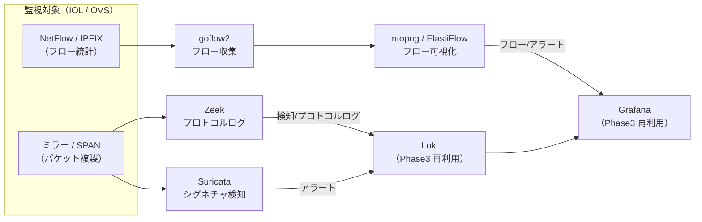

# N3 解説 — NDR（Zeek/Suricata + goflow2 + ntopng）

## 1. このフェーズで何が実現されるか

N3 では east-west（横方向）を含む通信を可視化し、フロー統計と DPI 振る舞いから異常を検知して既存 SIEM に集約する。ミラーポート（SPAN）から取り出したトラフィックを Zeek/Suricata が DPI・振る舞い解析し、NetFlow/IPFIX で吐き出したフロー統計を goflow2 が収集して ntopng で可視化する。検知ログとフローは L7 トラックの Loki/Grafana（Phase 3）に集約する。「侵害は起きる前提」で、起きた後に**気づける目**を作るのが N3。

- **ビフォー**: 通信の中身は基本ブラックボックス。south-north（外向き）の入口には L7 Phase 4 の Suricata（IDS）があるが、内部の端末同士（east-west）の通信は誰も見ていない。侵害端末が横に広がっても検知できない。
- **アフター**: east-west を含むトラフィックがミラーで複製され、Zeek がプロトコルログを、Suricata がシグネチャ検知を出し、NetFlow が「誰が誰と、いつ、どれだけ」通信したかを記録する。スキャン挙動や想定外の east-west が Grafana のダッシュボードに現れる。

## 2. なぜこの構成か

| 観点 | 商用製品 | 本ラボの OSS 選定 | 選定理由 |
|---|---|---|---|
| NDR | Darktrace, Cisco Secure Network Analytics (Stealthwatch) | **Zeek/Suricata + goflow2 + ntopng**（発展: ElastiFlow） | 収集・検知エンジンを OSS で組み、可視化は既存 Loki/Grafana を再利用。Stealthwatch の「NetFlow ベース挙動分析」と Darktrace の「DPI 振る舞い検知」を 2 系統に分けて追体験できる |

なぜ「DPI（Zeek/Suricata）」と「フロー（goflow2/ntopng）」の 2 系統を併存させるか:

- **商用 NDR は実は 2 系統の合わせ技**。Cisco Secure Network Analytics（Stealthwatch）は **NetFlow ベース**（フロー統計から挙動異常を出す）、Darktrace は **DPI + 教師なし学習**（パケットの中身と平常時からのズレ）が中心。N3 で goflow2/ntopng（フロー）と Zeek/Suricata（DPI）を両方置くのは、この 2 つのアプローチの違いを手で確認するため。
- **既存 SIEM に乗せる（D-3 の延長）**。可視化基盤（Loki/Grafana）は L7 Phase 3 で作ったものをそのまま流用し、N3 では収集・検知エンジンだけを足す。「検知エンジンは差し替え可能、可視化は共通基盤」という実務的なアーキテクチャを体験する。

### north-south IDS と east-west NDR の違い（重要）

| 観点 | L7 Phase 4 の IDS（Suricata） | N3 の NDR |
|---|---|---|
| 見る方向 | **north-south**（内↔外、SWG 経路上） | **east-west**（内部端末同士）＋ north-south |
| 主目的 | 外向き通信の不審検知・侵入検知 | 侵害後の**横移動**・内部偵察の検知 |
| データ源 | プロキシ/ゲートウェイ経路上のトラフィック | ミラー/SPAN・NetFlow（経路に依存しない複製） |
| 前提 | 「境界で止める」 | 「侵害は起きる前提、起きた後に気づく」 |

同じ Suricata を使っても、**どこにセンサを置き、何を見るか**が違う。Phase 4 は境界の関所で外向きを見る IDS、N3 は内部にミラーを引いて横方向を見る NDR。この配置の差が「侵入検知」と「侵害検知」の違いそのもの。

**実務でこの知識がどこで効くか**: Cisco 実務なら NetFlow（`ip flow-export` / `flow monitor`）や SPAN（`monitor session`）は設定したことがあるはず。N3 はその出力先——NetFlow コレクタや SPAN の受け側——で「集めたフローから何が読めるか」を体験する作業になる。Stealthwatch を提案・設計する案件で「なぜ NetFlow だけで挙動異常が出せるのか」「SPAN と NetFlow をどう使い分けるか」を説明できるようになる。切り分けの現場でも、「内部で変な通信が起きている気がする」という曖昧な相談を、フロー可視化とDPIログという具体的な証拠に落とし込める。

## 3. 仕組みの核心

ミラー/NetFlow の 2 経路で取り出したトラフィックを、DPI とフローの 2 エンジンで解析し、既存 SIEM に集約する。[NW-ZT_論理構成設計](../02_基本設計/NW-ZT_論理構成設計.md) の N3 可視化パイプラインが対応する。



ポイント:

- **ミラーは「経路に割り込まない」観測**。SPAN/ミラーはトラフィックを複製するだけで、通信そのものには介入しない（インライン IPS と違い、遅延も切断も起こさない）。だから east-west を広く・安全に観測できる。可視化に徹する N3 の思想と合う。
- **Zeek と Suricata は役割が違う**。Suricata は「既知の悪性パターン（シグネチャ）に一致するか」を見る IDS 寄り。Zeek は「何が起きたか」をプロトコル単位で構造化ログにする（conn.log / dns.log / http.log 等）。**Suricata が「これは既知の攻撃」、Zeek が「そもそも何が通ったかの台帳」**という補完関係。
- **NetFlow は中身を見ずに「関係」を見る**。ペイロードは見ず、5-tuple（送信元/宛先 IP・ポート・プロトコル）とバイト数・パケット数・時刻だけを記録する。だから暗号化されていても「誰が誰とどれだけ通信したか」は分かる。スキャン（多数宛先への短時間接続）や横移動（普段話さない端末同士の通信）はフローの形で現れる。
- **可視化は共通基盤に集約**。検知エンジンが何であれ、出力先は Loki（ログ）と Grafana（ダッシュボード）に統一。エンジンを足しても可視化の作り直しは不要。

## 4. 自分で触って確認する手順（実装後にこの手順で確認）

N3 は今回スコープでは未デプロイ（設計値）。実装後、以下の手順でゲート条件（ミラー/NetFlow から異常フローを検知し Grafana で可視化）を段階的に確認する想定。IOL 側のミラー設定は概念と主要コマンドに留める。

### 手順1: ミラー（SPAN）を設定し、複製が届くことを確認する

Cisco IOL 側で監視対象ポートを SPAN の送信元に、センサ接続ポートを宛先にする。

```text
! 監視したいポート群を source、Zeek/Suricata が繋がるポートを destination に
monitor session 1 source interface Ethernet0/1 - 2 both
monitor session 1 destination interface Ethernet0/3
```

センサ側で、複製が実際に流れてきているかをまず確認する。

```bash
# センサのインターフェースで生パケットが見えるか（検知エンジンより先に配線を確認）
docker exec clab-nwzt-sensor tcpdump -ni eth1 -c 20
```

期待結果: 監視対象の通信がセンサ側 tcpdump に映る。**検知の前に「そもそもミラーが届いているか」を切り離して確認する**のが定石（届いていなければ何も検知できない）。

### 手順2: Zeek / Suricata を起動し、通常トラフィックのログが出ることを確認する

```bash
# Zeek をミラー受信インターフェースで起動 → conn.log 等が生成される
docker exec clab-nwzt-sensor zeek -i eth1
docker exec clab-nwzt-sensor tail -f /opt/zeek/logs/current/conn.log

# Suricata を同インターフェースで起動 → eve.json にイベントが出る
docker exec clab-nwzt-sensor suricata -i eth1
docker exec clab-nwzt-sensor tail -f /var/log/suricata/eve.json
```

期待結果: 平常時でも `conn.log`（Zeek）にフロー単位のレコードが、`eve.json`（Suricata）にプロトコルイベントが書かれる。まず「通った通信が構造化ログになる」ことを確認する。

### 手順3: スキャン挙動を意図的に流して検知させる（学習の核心）

異常を「起こして」検知させる。攻撃者の横移動・偵察を模した通信を投げる。

```bash
# ある端末から同一セグメント内を広くポートスキャン（横方向の偵察を模す）
docker exec clab-nwzt-client nmap -sS 172.31.10.0/24
```

期待結果: Suricata が scan 系シグネチャで発報し（`eve.json` に alert）、Zeek の `conn.log` に「1 送信元から多数宛先への短時間接続」が並ぶ。**「侵害端末が横に広がる」動きが、フローと DPI の両方でどう見えるか**を対照で確認する。これが east-west 可視化の核心。

### 手順4: NetFlow を有効化し、フローを goflow2 で収集する

IOL 側で NetFlow/IPFIX エクスポートを設定し、goflow2 のコレクタへ送る。

```text
! フローを定義してコレクタ（goflow2）へエクスポート
flow record ZT-REC
 match ipv4 source address
 match ipv4 destination address
 match transport source-port
 match transport destination-port
flow exporter ZT-EXP
 destination <goflow2-ip>
 transport udp 2055
flow monitor ZT-MON
 record ZT-REC
 exporter ZT-EXP
interface Ethernet0/1
 ip flow monitor ZT-MON input
```

```bash
# goflow2 がフローを受けているか
docker logs --tail 20 clab-nwzt-goflow2
```

期待結果: goflow2 がフローレコードを受信しログに出す。手順3 のスキャンが、**ペイロードを見ずとも 5-tuple の形（1 送信元→多数宛先）で** goflow2 に現れることを確認する。

### 手順5: Grafana で可視化されることを確認する

```logql
# Loki に集約された Suricata/Zeek のアラートを LogQL で引く
{container="clab-nwzt-sensor"} |= "alert" or "scan"
```

ntopng ダッシュボードでフローのトップトーカー・宛先分布を見て、スキャン元がグラフ上で突出することを確認する。**検知（Loki）とフロー（ntopng/Grafana）の両面で同じ事象が見える**ことが、2 系統併存の意味を体感する箇所。

## 5. 考えどころ

- **本番設計ならどうするか**: 本番の Darktrace/Stealthwatch は、平常時のベースラインを機械学習で学習し「その端末にとって異常か」を相対判定する（固定シグネチャに頼らない）。証跡の保全、self-learning、SOAR 連携での自動対応まで持つ。N3 はシグネチャ検知とフロー可視化という「気づく目」の骨格に留める。
- **N1 の CoA と繋いだ SOAR 的自動封じ込め（発展案）**: N3 は「検知」まで、N1 は「隔離」まで単体で完結するが、両者を繋ぐと自動封じ込めになる。**Suricata/Zeek の検知 → webhook → FreeRADIUS へ CoA-Request → 該当端末を隔離 VLAN へ**、という API-first の自動応答パイプラインが組める。「検知したら人が対応」から「検知したら数秒で自動隔離」への発展は、SOAR（Security Orchestration, Automation and Response）の最小実装として体験価値が高い。N3 のアラートに送信元 IP → MAC → スイッチポート/RADIUS セッションを逆引きする対応表が要になる。
- **このラボの簡略化ポイント**:
  - **機械学習ベースの異常検知なし**。ベースライン学習は行わず、シグネチャ + 明示的なフロー閾値で検知する。
  - **フルパケットキャプチャ保全なし**。証跡の長期保存・法的保全は扱わない。
  - **ミラー帯域の制約**。SPAN は高負荷時にパケットを取りこぼす。本番はタップ（物理分岐）や専用パケットブローカを使う。

## 6. つまずきポイント

- **検知エンジンは動いているのにアラートが出ない**: [切り分けシート](../05_試験/切り分けシート.md) の層別で言えば「到達（ミラー配線）」の問題であることが最多。ミラーがセンサに届いていない（`monitor session` の source/destination 取り違え、センサ側 NIC が promiscuous でない）と、エンジンは正常でも入力がゼロ。**手順1 の tcpdump で配線を先に切り分ける**。
- **NetFlow が goflow2 に届かない**: エクスポータの宛先 IP/ポート（UDP 2055 等）とコレクタの待ち受けが不一致、または UDP がセグメント間で落ちている。`docker logs goflow2` にレコード受信がゼロなら、まず疎通（UDP）を確認する。
- **Grafana に出ない**: 検知は出ているが Loki への送信（Promtail 等の集約経路）が繋がっていない。L7 Phase 3 の Loki/Grafana を再利用するため、N3 固有の集約設定（どのログファイルを拾うか）の追加漏れが典型。Loki 側で該当 container のラベルが見えるかを確認する。
- 事象は [切り分けシート](../05_試験/切り分けシート.md) を複製して 1 件ずつ記録する。

## 参照

- [NW-ZT_トラックロードマップ](../02_基本設計/NW-ZT_トラックロードマップ.md)（N3 の位置づけ・依存）
- [NW-ZT_論理構成設計](../02_基本設計/NW-ZT_論理構成設計.md)（N3 可視化パイプライン・SOAR 発展）
- [教材: Palo Alto Prisma/NGFW（Content-ID）](../教材/04_PaloAlto_Prisma_NGFW.md)
- [教材: Cisco ISE/TrustSec/Secure Access](../教材/05_Cisco_ISE_TrustSec_SecureAccess.md)
- [N3 構築スタブ](../04_構築/nwzt_track/N3_NDR/)
- [phase4_解説（north-south IDS との対比）](phase4_解説.md)
- [切り分けシート](../05_試験/切り分けシート.md)
