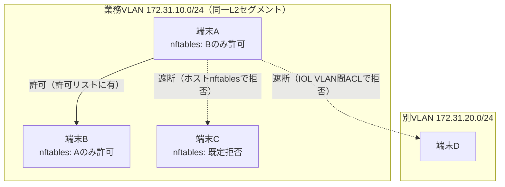

# N4 解説 — μセグメンテーション（IOL VLAN/ACL + nftables）

## 1. このフェーズで何が実現されるか

N4 では同一ゾーン（同一 VLAN・同一サブネット）内の端末同士の east-west 通信を、許可リスト方式で最小権限化する。「業務 VLAN に入れた＝何にでも到達してよい」ではなく、「業務 VLAN 内でも、A と B は話してよいが、A と C は話してはいけない」という粒度まで絞る。侵害端末が同一セグメント内を横に広がる動き（ラテラルムーブメント）を物理的に困難にする。N1 で作った VLAN 基盤の**内側**をさらに細分するのが N4。

- **ビフォー**: N1 で認証を通り業務 VLAN（172.31.10.0/24）に入った端末同士は、同一サブネット内なので自由に ping も接続もできる。1 台が侵害されると、そこを踏み台に同 VLAN の全端末へ横移動できてしまう。
- **アフター**: 同一 VLAN 内でも、許可リストにない端末間の通信は遮断される。侵害された 1 台から隣の端末への ping が通らず、横移動が「その 1 台の中で止まる」。

これは N1（入口を締める）を前提に、その**先の内部通信**を締める最後の一手。ゼロトラストの「侵害は起きる前提」を、ネットワークの内側で成立させる。

## 2. なぜこの構成か

| 観点 | 商用製品 | 本ラボの OSS 選定 | 選定理由 |
|---|---|---|---|
| μセグメンテーション | Cisco TrustSec/SGT, Illumio | **Cisco IOL VLAN/ACL + ホスト nftables** | ネットワーク層（IOL の VLAN 間 ACL）とホスト層（nftables の分散 FW）の二層で、TrustSec の「タグベース制御」と Illumio の「ホスト側分散適用・中央管理」の両思想を追体験できる |

なぜ「ネットワーク層（IOL ACL）」と「ホスト層（nftables）」の二層で組むか:

- **商用 μセグは大きく 2 系統**。Cisco TrustSec は **ネットワーク機器側**で SGT（Security Group Tag）を付与し、機器の SGACL で制御する（ネットワーク中心）。Illumio は各 **ホストに常駐エージェント**を入れ、ホスト自身のファイアウォールを中央から一括制御する（ホスト中心・分散適用）。N4 で IOL ACL と nftables を両方置くのは、この 2 つの適用点の違いを手で確認するため。
- **VLAN 間と VLAN 内で効かせる層が違う**。VLAN を**またぐ**通信は L3 スイッチ/ルータの ACL で止められるが、**同一 VLAN 内**（L2、同一ブロードキャストドメイン）の端末間通信はルータを経由しないため L3 ACL では止まらない。ここを止めるにはホスト側の nftables（または PVLAN/L2 ACL）が要る。二層構成はこの「VLAN 間は ACL、VLAN 内はホスト FW」という役割分担そのもの。

**実務でこの知識がどこで効くか**: Cisco 実務なら VLAN 間 ACL（`ip access-list` を SVI に適用）は書いたことがあるはず。だが「同一 VLAN 内の端末同士を止めたい」と言われたとき、L3 ACL では止まらないことに気づけるかが分かれ目。N4 はこの「同一セグメント内の横移動をどう止めるか」を、PVLAN/ホスト FW という具体で体験する。TrustSec を提案する案件で「なぜ IP ベース ACL でなくタグベースなのか（IP が変わっても追随する）」を説明でき、Illumio のような分散 FW 製品の PoC で「エージェント方式の中央管理とは結局ホストの iptables/nftables を一括で書くこと」だと中身から理解できる。ゼロトラスト設計で必ず問われる「ラテラルムーブメントをどこで止めるか」への具体的な答えを持てる。

## 3. 仕組みの核心

VLAN をまたぐ通信はネットワーク層の ACL で、同一 VLAN 内の通信はホスト層の nftables で止める。この二層の役割分担が N4 の核心。



二層の役割:

- **L2/L3 層（IOL VLAN 間 ACL）= VLAN をまたぐ制御**。SVI（VLAN インターフェース）に ACL を適用し、業務 VLAN → 別 VLAN の到達を許可リストで絞る。ルータ/L3 スイッチを経由する通信だけが対象。TrustSec ならここが SGT/SGACL に置き換わる（IP でなくタグで判定）。
- **ホスト層（nftables）= VLAN 内の端末間制御**。同一 VLAN 内の端末同士はルータを経由しない（L2 で直結）ため、L3 ACL では止まらない。各ホストの nftables で「自分が受け入れてよい相手」を許可リスト化する。これが Illumio 的な分散 FW の中央管理思想——制御点を各ホストに分散配置し、ポリシーは中央で一元管理——の実体。

ポイント:

- **「認証を通った」と「何にでも到達してよい」は別**。N1 で業務 VLAN に入れることと、その VLAN 内の全端末に到達してよいことは無関係。N4 はこの区別を通信レベルで強制する。ゼロトラストの「最小権限」を east-west に適用する箇所。
- **既定拒否（default deny）が原則**。許可リストに無い通信は落とす。端末 C は「誰からも指定されていない」ので、A からも B からも到達できない。ホワイトリスト方式にすることで、新たな横移動経路が勝手に生えない。
- **IP でなく「役割」で書きたい**。IP ベースの許可リストは端末が増減・再割当されると破綻する。TrustSec の SGT はこれを「役割タグ」で解決する（IP が変わってもタグが同じなら同じ扱い）。N4 の nftables は IP ベースで機序を体験し、その限界から「なぜタグベースが要るか」を理解する。

## 4. 自分で触って確認する手順（実装後にこの手順で確認）

N4 は今回スコープでは未デプロイ（設計値）。N1 の VLAN 基盤が前提。実装後、以下の手順でゲート条件（同一 VLAN 内で許可リスト外の端末間 ping が遮断され、横移動が止まる）を段階的に確認する想定。IOL 側の ACL 設定は概念と主要コマンドに留める。

### 手順1: μセグ適用前の「素通し」状態を先に確認する（対照の基準づくり）

まず制御を入れる前に、同一 VLAN 内が自由に通ることを記録しておく。これが「止まった」を証明する対照基準になる。

```bash
# 端末A → 端末B（同一VLAN内）
docker exec clab-nwzt-hostA ping -c3 <hostB-ip>
# 端末A → 端末C（同一VLAN内）
docker exec clab-nwzt-hostA ping -c3 <hostC-ip>
```

期待結果: この時点では A→B、A→C とも 3/3 応答（同一サブネットなので素通し）。**「制御前は全部通る」を先に記録する**のが、後で「止まった」を明確にするための起点。

### 手順2: ホスト nftables で許可リスト（既定拒否）を適用する

各ホストで、受け入れてよい相手だけを許可し、それ以外を落とす。

```bash
# 端末B: Aからの通信だけ許可、他は既定拒否（概念）
docker exec clab-nwzt-hostB nft add table inet microseg
docker exec clab-nwzt-hostB nft add chain inet microseg input '{ type filter hook input priority 0 ; policy drop ; }'
docker exec clab-nwzt-hostB nft add rule inet microseg input ip saddr <hostA-ip> accept
docker exec clab-nwzt-hostB nft add rule inet microseg input ct state established,related accept
```

端末 C にも同様に「既定拒否・A からの明示許可なし」を適用する。**制御点を各ホストに分散配置し、許可リストを書く**のが Illumio 的分散 FW の実体だと確認する。

### 手順3: 許可リスト外の端末間 ping が遮断されることを確認する（学習の核心）

```bash
# 端末A → 端末B（許可リストに有）→ 通るべき
docker exec clab-nwzt-hostA ping -c3 <hostB-ip>
# 端末A → 端末C（許可リストに無）→ 止まるべき
docker exec clab-nwzt-hostA ping -c3 <hostC-ip>
```

期待結果: A→B は通り、**A→C は同一 VLAN 内なのに遮断される**（100% packet loss）。手順1 では両方通っていたのが、C だけ止まる。**「同一セグメント内でも、許可リスト次第で到達可否が変わる」**——ゼロトラストの east-west 最小権限——を対照で体感するのがこの手順の核心。

### 手順4: 侵害端末からの横移動が止まるシナリオを確認する

端末 A が侵害されたと仮定し、そこから同一 VLAN 内を広くスキャン・接続しようとする動きを再現する。

```bash
# 侵害を想定した端末Aから、同一VLAN全体へ横移動を試みる
docker exec clab-nwzt-hostA nmap -sn 172.31.10.0/24
docker exec clab-nwzt-hostA nmap -p 22,80,445 <hostC-ip>
```

期待結果: A から許可リストに載っている相手（B）以外は応答せず、スキャンが空振りする。**「1 台が侵害されても、そこから隣へ広がれない」**＝横移動の封じ込め。侵害の影響がその 1 台に閉じることを確認する。

### 手順5: VLAN 間 ACL（IOL）も併せて確認する（二層目）

同一 VLAN 内はホスト nftables で、VLAN をまたぐ通信は IOL の ACL で止まることを確認する。

```text
! 業務VLAN(10)→別VLAN(20)を許可リストで絞る（概念）
ip access-list extended BIZ-TO-OTHER
 permit tcp 172.31.10.0 0.0.0.255 host 172.31.20.10 eq 443
 deny   ip 172.31.10.0 0.0.0.255 172.31.20.0 0.0.0.255
interface Vlan10
 ip access-group BIZ-TO-OTHER out
```

```bash
# 端末A(VLAN10) → 端末D(VLAN20) の許可外ポート → IOL ACL で遮断
docker exec clab-nwzt-hostA curl -sv --connect-timeout 3 http://<hostD-ip>/
```

期待結果: VLAN をまたぐ通信は IOL の SVI ACL で、VLAN 内は nftables で止まる。**「またぐ制御はネットワーク層、内側の制御はホスト層」という二層の分担**を、遮断される場所の違いで確認する。

## 5. 考えどころ

- **本番設計ならどうするか**: 本番の TrustSec は SGT を認証時（N1 の RADIUS）に付与し、機器間で伝播させて SGACL で一元制御する（IP に依存しない役割ベース）。Illumio はホストエージェントを全台に配り、依存関係マップから推奨ポリシーを自動生成し、中央コンソールで一括適用・可視化する。N4 は IP ベースの nftables と ACL で機序を体験し、その手作業感から「なぜ商用はタグ/エージェントで自動化するのか」を逆算する。
- **N1 との連携（タグ付与の起点）**: 本来 SGT は N1 の認証時に RADIUS で付与するのが筋。N4 の μセグは N1 の VLAN 基盤に乗るだけでなく、「認証時に役割を決め、その役割で内部到達性を制御する」という TrustSec の全体像を、N1+N4 を繋いで理解できる。
- **このラボの簡略化ポイント**:
  - **タグベースでなく IP ベース**。SGT/SGACL の自動伝播は扱わず、IP 直書きの許可リストで機序を体験する（本番はここが破綻するのでタグ化する）。
  - **中央管理コンソールなし**。各ホストの nftables を手で書く。Illumio 的な「依存関係マップ→ポリシー自動生成→一括配布」の運用面は再現しない。
  - **PVLAN は簡略**。同一 VLAN 内分離は本来 Private VLAN（isolated/community port）でも実現できるが、N4 ではホスト nftables を主軸に体験する。

## 6. つまずきポイント

- **nftables を入れたのに全通信が止まる/全部通る**: [切り分けシート](../05_試験/切り分けシート.md) の層別で言えば「到達（ホスト FW）」の設定ミス。既定ポリシー（`policy drop`）を入れたのに `ct state established,related accept` を書き忘れると戻りパケットが落ちて双方向通信が壊れる。逆に既定を accept のままにすると許可リストが効かない。**まず素の疎通（手順1）を基準に、1 ルールずつ効果を確認する**。
- **同一 VLAN 内なのに IOL ACL で止めようとして止まらない**: 最頻の誤解。同一 VLAN 内の通信はルータ/SVI を経由しないため、SVI に当てた L3 ACL は通らない。同一 VLAN 内はホスト nftables か PVLAN で止める、という層の切り分けを最初に確認する。
- **VLAN 間 ACL の方向（in/out）が逆**: SVI への `ip access-group` の in/out を取り違えると、意図と逆方向を絞ってしまう。トラフィックの向きと SVI から見た in/out を図に描いて確認する。
- 事象は [切り分けシート](../05_試験/切り分けシート.md) を複製して 1 件ずつ記録する。

## 参照

- [NW-ZT_トラックロードマップ](../02_基本設計/NW-ZT_トラックロードマップ.md)（N4 の位置づけ・N1 依存）
- [NW-ZT_論理構成設計](../02_基本設計/NW-ZT_論理構成設計.md)（N4 概略・アドレス設計）
- [教材: Cisco ISE/TrustSec/Secure Access](../教材/05_Cisco_ISE_TrustSec_SecureAccess.md)
- [教材: 商用製品→OSS 対応表](../教材/07_商用製品_OSS対応表.md)
- [N4 構築スタブ](../04_構築/nwzt_track/N4_microseg/)
- [nwzt_N1_解説（VLAN 基盤の前提）](nwzt_N1_解説.md)
- [切り分けシート](../05_試験/切り分けシート.md)
