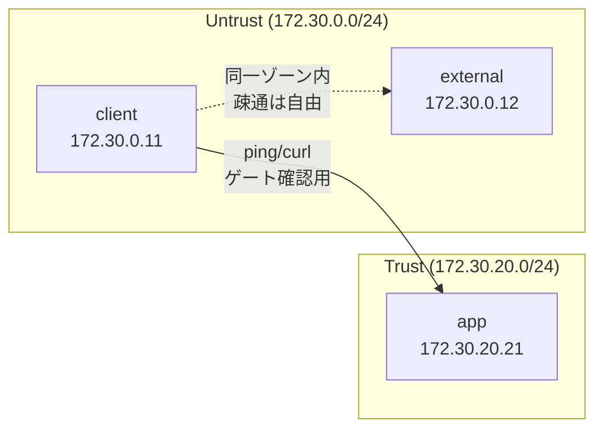

# Phase 0 解説 — 土台（ゾーン分離とゲート試験）

## 1. このフェーズで何が実現されるか

Phase 0 は、Zero Trust の6観点すべてが乗る「土台」を作る。具体的には docker bridge で4ゾーン（Untrust / DMZ / Trust / 可観測）を分離し、`wbitt/network-multitool` を流用した3ノード（`client` / `app` / `external`）で最小の疎通経路を確認する。あわせて frontmatter・HTML ビルド・git といった本ラボの運用規約が正しく回ることも確認する。

- **ビフォー**: ネットワークもドキュメント規約も存在しない、まっさらな状態。
- **アフター**: `client`（Untrust）→ `app`（Trust）に ping/curl が通り、`external`（Untrust）は別ノードとして独立している。ゾーンは切られているが、Phase 1 以降で導入する関所（IAP）はまだ無いため、この段階での `client`→`app` 疎通は「関所を後から挿入するための土台確認」であり、最終形の通信経路ではない。

この段階では認証も認可も検査も行われない。あくまで「ゾーンを分けられること」「ノードが意図通りに配置できること」「規約が壊れずに回ること」を確認するフェーズである。

## 2. なぜこの構成か

Phase 0 自体に対応する商用製品は無い（土台・下ごしらえの位置づけ）。ただし、ここで採用した考え方は商用 ZT 製品のアーキテクチャそのものと対応する。

| 本ラボでの要素 | 商用 ZT 製品での対応概念 | 対応の意味 |
|---|---|---|
| docker bridge によるゾーン分離（Untrust/DMZ/Trust/可観測） | Zscaler・Cisco Secure Access 等の「セグメント」「マイクロセグメンテーション」 | ネットワークを役割ごとに区切り、境界を明示する発想は商用 ZT でも共通 |
| Untrust→Trust の直通禁止 | ZTNA の「暗黙の信頼をなくす」原則そのもの | VPN のようにネットワークに乗れば内部が見える、という設計を最初から排除する |
| `wbitt/network-multitool` の使い回し | 商用製品の PoC 環境で使う疎通確認端末 | 本質はエンドポイントではなく「疎通経路の検証」なので、専用アプリを自作しない（D-6, YAGNI） |

なぜ Phase 0 から始めるか: いきなり Keycloak や Pomerium を入れると、ネットワーク設計のミスなのか OSS 設定のミスなのか切り分けが難しくなる。先にゾーンと疎通だけを確定させておくことで、Phase 1 以降の問題切り分けが「土台は健全」という前提の上で進められる。

**実務でこの知識がどこで効くか**: Cisco 系の実務経験がある読者にとって、VLAN/ゾーンベースファイアウォールの設計思想と直結する。ASA/FTD のゾーン（inside/outside/dmz）や ACL の「デフォルト拒否」と同じ発想が、docker bridge + コンテナ配置というソフトウェア的な手段で再現されている、と読み替えると理解が早い。

## 3. 仕組みの核心

Phase 0 のネットワーク構造は次の通り（[基本設計書](../02_基本設計/基本設計書.md)・[論理構成設計](../02_基本設計/論理構成設計.md) より）。



ポイントは3つ。

1. **ゾーンは docker bridge（サブネット）の単位で切る**。`zt-untrust`（172.30.0.0/24）、`zt-trust`（172.30.20.0/24）はそれぞれ別の bridge であり、L3 的に隔離されている。
2. **Phase 0 では関所が無い**ため、`client`→`app` の疎通は「本来はここに IAP が挟まる」という前提の仮経路である。Phase 2 で Pomerium/oauth2-proxy が入ると、この直通経路は無くなり、関所経由に置き換わる。
3. **名前解決は docker 組み込み DNS**（サービス名）を使う。IP アドレスは補助情報であり、コンテナ間通信は `app` のようなサービス名で行う。

## 4. 自分で触って確認する手順

Phase 0 はこのタスクと並行してデプロイ実施中のため、以下は**現行の手順**として記載する（[ログインコマンド](../00_ログイン/ログインコマンド.md)・[試験計画書](../05_試験/試験計画書.md) T-0-* 準拠）。

### 手順1: VM へ接続する

```bash
ssh clab@orb
docker --version
containerlab version
```

### 手順2: ノードが3台とも Up か確認する（T-0-1）

```bash
docker ps --format 'table {{.Names}}\t{{.Image}}\t{{.Status}}'
```

期待結果: `clab-zero-client` / `clab-zero-app` / `clab-zero-external` の3コンテナが `Up` 状態で表示される。コンテナ名の `clab-<lab名>-<node名>` はcontainerlab の命名規約。

### 手順3: client → app の疎通を確認する（T-0-2, T-0-3）

```bash
docker exec clab-zero-client ping -c 3 app
docker exec clab-zero-client curl -sS http://app/
```

期待結果: ping は 3/3 応答。curl は `app`（multitool のデフォルトページ）の応答本文が返る。ここで**なぜ `app` という名前で届くのか**を意識する — IP を直接指定せず、docker の組み込み DNS がサービス名を解決している。

### 手順4: client がどのゾーンに属しているか確認する（T-0-4）

```bash
docker exec clab-zero-client ip -4 addr show
```

期待結果: `172.30.0.0/24`（Untrust）のアドレスが割り当てられている。`app` 側で同様に確認すると `172.30.20.0/24`（Trust）になっているはずで、**別サブネットのノード同士が疎通できている**ことが Phase 0 の土台部分の確認ポイントになる。

### 手順5: external が client と隔離されていないことを確認する（同一ゾーン内は自由疎通の設計）

```bash
docker exec clab-zero-client ping -c 3 external
```

期待結果: 同じ Untrust ゾーン内なので疎通できる。Phase 4 でこの経路が SWG 強制経由に置き換わる前段階として、「今は素通し」であることを確認しておく。

### 手順6: 規約ビルドが通ることを確認する（T-0-5）

```bash
node 規約/ビルド/build.mjs --check
```

期待結果: pass。frontmatter の必須項目・NFC ファイル名・相対リンク切れが検出されない。

## 5. 考えどころ

- **本番設計ならどうするか**: 実際の ZT 導入では、ゾーン分離だけでなく VPC/VLAN のルーティングテーブル、セキュリティグループ、ファイアウォールルールの多重防御を組み合わせる。本ラボは docker bridge 1層のみで、L2/L3 の作り込み（ルーティング・NAT・ACL の詳細）は行わない（D-1）。
- **このラボの簡略化ポイント**:
  - 冗長化なし（単一 VM・単一コンテナ）。可用性は検証対象外。
  - `client`→`app` の直通経路は Phase 0 限定の暫定経路。本番相当の ZT では最初から関所必須で、こうした「関所なし疎通」は許容されない。
  - IOL（実機/仮想ルータの L2/L3 検証）とは連携しない。ZT の主眼は L7 の認可であり、L2/L3 の作り込みは目的が異なる（D-1）。

## 6. つまずきポイント

- **コンテナ名が想定と違う**: containerlab の命名規約 `clab-<lab名>-<node名>` を前提にコマンドを打つと、lab 名が違って `No such container` になることがある。まず `docker ps` で実際の名前を確認する。
- **ping は通るが curl が失敗する**: L2 到達（ping）と L7 到達（HTTP）は別の層。ping OK なのに curl NG なら、`app` 側のサービスプロセスが起きているか（`docker logs clab-zero-app`）を先に見る。[切り分けシート](../05_試験/切り分けシート.md) の「L1 コンテナ起動→L2 ネットワーク到達」の順で下から確認する。
- **frontmatter ビルドが落ちる**: `date` の形式（YYYY-MM-DD）や `tags` の配列表記の崩れが典型的な原因。[frontmatterスキーマ](../../規約/frontmatterスキーマ.md) と diff を取ると早い。
- **DNS 解決に失敗する**: docker bridge のカスタムネットワーク作成順序によっては組み込み DNS が効かないことがある。`docker network inspect zt-untrust` でノードが正しく参加しているか確認する。

## 参照

- [基本設計書](../02_基本設計/基本設計書.md)
- [論理構成設計](../02_基本設計/論理構成設計.md)
- [段階ロードマップ](../02_基本設計/段階ロードマップ.md)
- [IPアドレス管理表](../02_基本設計/IPアドレス管理表.md)
- [試験計画書](../05_試験/試験計画書.md)
- [ログインコマンド](../00_ログイン/ログインコマンド.md)
