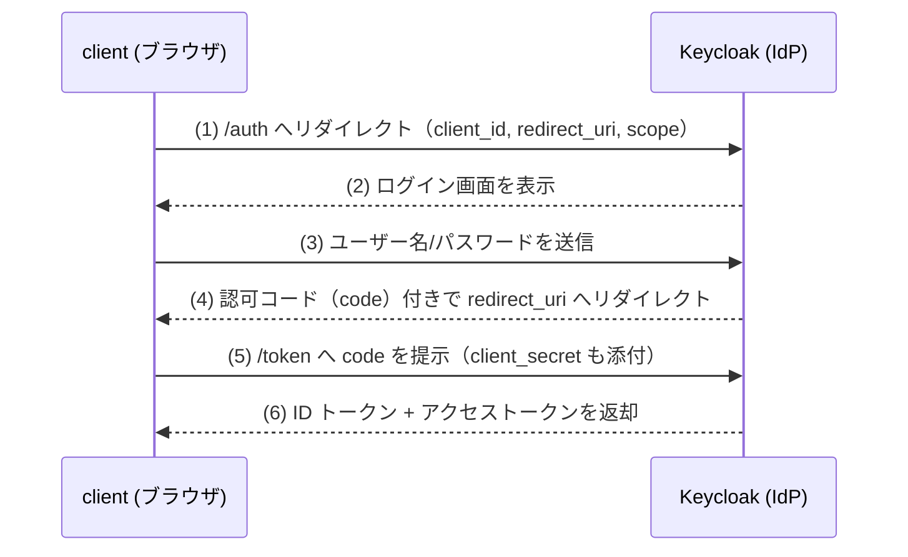

# Phase 1 解説 — ID統制（Keycloak / OIDC）

## 1. このフェーズで何が実現されるか

Phase 1 では Keycloak を OIDC の IdP（Identity Provider）として立て、認可コードフローで ID トークン・アクセストークンを発行できる状態を作る。これは Zero Trust の「誰であるか」を一元的に検証する起点であり、Phase 2（IAP）・Phase 6（デバイス統制）が認証を委譲する先になる。

- **ビフォー**: Phase 0 の `client`/`app`/`external` は疎通できるが、誰がアクセスしているかを検証する仕組みが無い。
- **アフター**: `client` は Keycloak にログインして OIDC トークンを取得できる。realm・client・ユーザー・ロールが Keycloak の内蔵 DB で管理され、以降の Phase がこのトークンを認可判断の材料にできる。

このフェーズ単体では「誰が」を検証できるようになるだけで、`app` へのアクセス制御はまだ行われない（それは Phase 2 の役目）。

## 2. なぜこの構成か

| 観点 | 商用製品 | 本ラボの OSS 選定 | 選定理由 |
|---|---|---|---|
| ID統制（IdP/SSO） | Okta, Microsoft Entra ID | **Keycloak** | [軽量検証結果](../03_詳細設計/軽量検証結果_2026-07-04.md) で arm64 ネイティブ対応を実測確認（confidence: High）。追加のエミュレーションが不要で、そのまま VM 上で動く |

なぜ Keycloak か:

- **arm64 実績**: `quay.io/keycloak/keycloak:latest` の manifest list に arm64 プラットフォームが含まれることを実測済み。ブロッカーになる懸念がない。
- **内蔵 DB で完結**: OpenLDAP のような外部ディレクトリ連携は発展課題に回し、Phase 1 では Keycloak 内蔵の DB でユーザー・ロールを完結させる（YAGNI）。
- **なぜ ID統制が最初か**: [段階ロードマップ](../02_基本設計/段階ロードマップ.md) の依存関係の骨子にある通り、「ID（P1）が全ての起点」。IAP（P2）は認証判断を IdP に委譲する構成のため、IdP が先に立っていなければ IAP のテストすらできない。

**実務でこの知識がどこで効くか**: Okta や Entra ID を業務で使ったことがあっても、その裏側の OIDC のプロトコル的な動きまでは意識しないことが多い。Keycloak は管理画面もログもすべて手元で見えるため、「realm」「client」「redirect URI」「scope」といった OIDC の語彙を、ブラックボックスの商用 IdP ではなく自分のログで確認しながら身につけられる。SASE/ZTNA 案件でIdP連携の設定を読む・書く場面（Entra ID アプリ登録、Okta アプリ統合など）でこの語彙がそのまま通じる。

## 3. 仕組みの核心

OIDC の認可コードフロー（Authorization Code Flow）が Phase 1 の核。



ポイント:

- **認可コードは1回限り・短命**。ブラウザの URL に一瞬現れる `code` パラメータをそのままトークンとして使うわけではなく、裏でサーバー間通信（`client_secret` 付き）に交換することで、フロントチャネルにトークン本体が露出しない設計になっている。
- **ID トークンとアクセストークンは別物**。ID トークン（JWT）は「誰であるか」の証明で `email`・`sub` などの claim を持つ。アクセストークンは「何ができるか」の証明で、API 呼び出しの認可に使う。
- **realm/client/scope の役割分担**: realm はユーザー・ロールの管理単位（テナントに相当）。client は「このアプリからログインを許可する」という登録単位。scope は要求する情報の範囲（`openid`, `profile`, `email` など）。

## 4. 自分で触って確認する手順（実装後にこの手順で確認）

Phase 1 は今回スコープでは未デプロイ（設計値）。実装後、以下の手順で [試験計画書](../05_試験/試験計画書.md) T-1-* のゲート条件を確認する想定。

### 手順1: Keycloak が起動し、管理画面に到達できるか（T-1-1）

```bash
ssh clab@orb
docker ps --format 'table {{.Names}}\t{{.Image}}\t{{.Status}}' | grep keycloak
```

ブラウザ or curl で管理画面 URL（実装時に確定、[ログインコマンド](../00_ログイン/ログインコマンド.md) 参照）にアクセスし、admin 認証情報（環境変数で注入したもの。設定に直書きしない）でログインできることを確認する。

### 手順2: realm/client が作成されているか確認する（T-1-2）

Keycloak 管理コンソールで対象 realm を開き、Clients 一覧に認可コードフロー用の client（`redirect_uri` が Phase 2 の IAP に一致）が存在することを確認する。

### 手順3: OIDC トークンを curl で取得する（T-1-3、学習の核心）

```bash
curl -X POST "http://<keycloak-host>:8080/realms/<realm>/protocol/openid-connect/token" \
  -d "grant_type=password" \
  -d "client_id=<client-id>" \
  -d "client_secret=<client-secret>" \
  -d "username=<test-user>" \
  -d "password=<test-password>"
```

期待結果: `access_token` / `id_token` / `refresh_token` を含む JSON が返る。

### 手順4: 取得した ID トークンの中身を自分の目で確認する（学習のための追加手順）

JWT は `ヘッダー.ペイロード.署名` の3パートを `.` で連結した文字列。ペイロード部分だけ base64url デコードすれば中身が読める。

```bash
# id_token の2番目のセグメント(ペイロード)を取り出してデコード
echo "<id_token の2番目のドット区切り文字列>" | base64 -d 2>/dev/null | python3 -m json.tool
```

期待結果: `sub`（ユーザーID）、`email`、`exp`（有効期限）などの claim が JSON で見える。**「トークンとはただの署名付き JSON である」ことを自分の目で確認する**のがこの手順のねらい。ブラックボックスの商用 IdP では得にくい体験。

## 5. 考えどころ

- **本番設計ならどうするか**: 本番では Keycloak の内蔵 DB ではなく外部 RDB（PostgreSQL 等）に永続化し、クラスタ構成で冗長化する。TLS 終端も Keycloak 単体ではなくリバースプロキシ（本ラボなら Pomerium）側で行うのが一般的。
- **このラボの簡略化ポイント**:
  - **内蔵 DB のみ**（外部 RDB・OpenLDAP 連携なし）。実運用では既存の社内ディレクトリ（AD 等）との連携が必須になることが多いが、これは発展課題。
  - **シークレット管理**: admin 初期認証情報・client secret は環境変数注入と設計されているが、本番なら Vault 等のシークレットマネージャで管理し、ローテーションする運用が必要。
  - **HA なし**: 単一インスタンスのため、Keycloak が落ちれば ID統制全体が止まる。本番は最低限の冗長化が必須。

## 6. つまずきポイント

- **redirect_uri 不一致でエラー**: Phase 2 の IAP 側の redirect URI と Keycloak client 設定の redirect URI が1文字でも違うと `invalid_redirect_uri` になる。末尾スラッシュの有無に注意。
- **トークンが取れるのに Phase 2 で拒否される**: それは Phase 1 の問題ではなく Phase 2（IAP のポリシー設定）側の切り分け対象。[切り分けシート](../05_試験/切り分けシート.md) の層別（L4 認証 と L5 認可 は別層）で混同しないこと。
- **admin ログインができない**: 環境変数注入のタイミング（コンテナ起動時のみ読まれる等）によって反映されていないことがある。`docker logs` で Keycloak の起動ログに admin 作成関連の行があるか確認する。

## 参照

- [段階ロードマップ](../02_基本設計/段階ロードマップ.md)
- [論理構成設計](../02_基本設計/論理構成設計.md)（認証フロー）
- [phase1_id 構築スタブ](../04_構築/phase1_id/README.md)
- [軽量検証結果](../03_詳細設計/軽量検証結果_2026-07-04.md)
- [試験計画書](../05_試験/試験計画書.md)
- [切り分けシート](../05_試験/切り分けシート.md)
