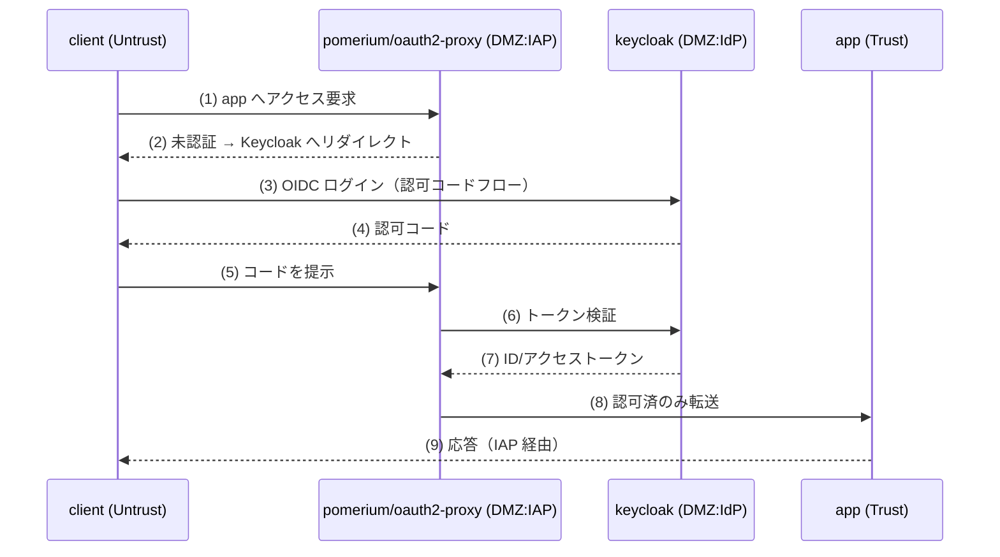

# Phase 2 解説 — NWセキュリティ（IAP / Pomerium）

## 1. このフェーズで何が実現されるか

Phase 2 では `app`（Trust ゾーン）の手前に関所（IAP: Identity-Aware Proxy）を置き、未認証アクセスを拒否する。認証そのものは Phase 1 の Keycloak に委譲し、認可済みリクエストのみ `app` へ転送する。まず oauth2-proxy で「未認証拒否」を最小構成で示し、Pomerium で認可ポリシーへ段階的に高度化する（D-5）。

- **ビフォー**: Phase 0 の状態では `client`→`app` が素通りだった。Phase 1 で IdP はできたが、`app` 自体はまだ誰でもアクセスできる。
- **アフター**: `client` が `app` に未認証でアクセスすると拒否/リダイレクトされる。Keycloak でログインした後にのみ `app` へ到達できる。Untrust から Trust への直通経路は消え、必ず DMZ の関所を経由する構成になる。

## 2. なぜこの構成か

| 観点 | 商用製品 | 本ラボの OSS 選定 | 選定理由 |
|---|---|---|---|
| NWセキュリティ（ZTNA/IAP） | Zscaler ZPA, Cisco Secure Access, Palo Alto Prisma Access | **oauth2-proxy → Pomerium**（発展: OpenZiti） | [軽量検証結果](../03_詳細設計/軽量検証結果_2026-07-04.md) で両イメージとも arm64 ネイティブ対応を実測確認（confidence: High） |

なぜ2段階（oauth2-proxy → Pomerium）にするか（D-5）:

- oauth2-proxy は「認証されているか / いないか」の二値判定に特化した軽量なリバースプロキシ。まず「未認証拒否」という ZTNA の最も基本的な性質を最小構成で確認する。
- Pomerium はさらに認可ポリシー（誰の・どの条件で・何を許可するか）を柔軟に書ける。段階的に導入することで、いきなり複雑な認可ポリシー言語に触れるコストを避ける（KISS）。
- Pomerium は Phase 6 の step-ca（mTLS/posture）とも連携できる設計であり、認可の入口を1点に集約する（基本設計書のセキュリティ方針「関所集中」）。

**実務でこの知識がどこで効くか**: Cisco の実務経験がある読者にとって、IAP は「アプリケーション層のファイアウォール + 認証」の合わせ技として理解すると早い。VPN でネットワークに参加させてから ACL で絞る発想（Cisco AnyConnect + ASA ACL）に対し、ZTNA/IAP は「そもそもネットワークに参加させず、アプリ単位でリクエストごとに検証する」。この違いが Zscaler ZPA や Cisco Secure Access の営業資料で語られる「VPN 代替」の技術的な中身であり、Pomerium の設定ファイルを読むとそれが具体的にどう実装されているかが見える。

## 3. 仕組みの核心

[論理構成設計](../02_基本設計/論理構成設計.md) のフロー1（認証フロー）がそのまま Phase 2 の核心。



ポイント:

- **IAP はマルチホーム**。Untrust（`client` からの受信）・DMZ（Keycloak への照会）・Trust（`app` への転送）の3ゾーンに足を持つ。これにより物理的にも「Untrust から Trust へは IAP を通らない限り届かない」構成になる。
- **セッションは IAP 側が持つ**。ユーザーは一度ログインすればセッションクッキーで以降のリクエストが検証される。トークンの検証・更新は IAP が肩代わりし、`app` 自体は認証ロジックを持たなくてよい（アプリケーション側の実装負担を減らす ZTNA のメリット）。
- **認可ポリシーは IAP の設定でコントロール**。Pomerium ではユーザー属性・グループ・（発展的には）posture claim を条件にポリシーを書ける。これが「最小権限」の原則を実現する箇所。

## 4. 自分で触って確認する手順（実装後にこの手順で確認）

Phase 2 は今回スコープでは未デプロイ（設計値）。実装後、[試験計画書](../05_試験/試験計画書.md) T-2-* に沿って以下を確認する想定。

### 手順1: 未認証アクセスが拒否されることを確認する（T-2-1）

```bash
docker exec clab-zero-client curl -sv http://<iap-host>/  # app への直接アクセスを試みる
```

期待結果: 200 ではなく、302（Keycloak へのリダイレクト）や 401/403 が返る。ここで**「未認証だと何も見えない」ことを実際に体験する**のが ZTNA の核心を理解する近道。

### 手順2: Keycloak でログインした後にアクセスできることを確認する（T-2-2）

ブラウザで IAP の URL にアクセスし、Keycloak のログイン画面にリダイレクトされることを確認、ログイン後に `app` の応答が返ることを確認する。

### 手順3: Untrust→Trust の直通が不可であることを確認する（T-2-3、最重要）

```bash
docker exec clab-zero-client curl -sv --connect-timeout 3 http://app/   # app に IAP を経由せず直接アクセス
```

期待結果: 到達できない（タイムアウト or 接続拒否）。**Phase 0 では通っていたこの経路が、Phase 2 導入後は塞がれている**ことを確認する。これが「関所を後から挿入する」という Phase 0→2 の設計意図そのものであり、変化を自分の目で見る手順として重要。

### 手順4: 認可 allow/deny のログを確認する

```bash
docker logs --tail 50 clab-zero-pomerium   # または oauth2-proxy
```

期待結果: allow/deny の判定行が出力される。Phase 3 でこれを Loki/Grafana に集約する前段として、まず生ログで判定の中身を見る。

## 5. 考えどころ

- **本番設計ならどうするか**: 本番の ZTNA/IAP はグローバル分散配置（エッジ PoP）で遅延を抑え、デバイス証明書・posture・地理情報・時間帯など多数のシグナルを認可判定に組み込む。本ラボの Pomerium 設定はそのごく一部（ID + 将来的な posture claim）のみを扱う。
- **このラボの簡略化ポイント**:
  - **TLS 終端**: 本ラボの IAP は自己署名証明書 or 平文で検証する想定（設計値）。本番は正規 CA 証明書での終端が必須。
  - **HA なし**: IAP が単一障害点になる。本番は複数リージョン・複数インスタンスでの冗長化が前提。
  - **認可ポリシーの粒度**: 本ラボは「ログイン済みか否か」程度の粗い粒度から始める。本番はロール・グループ・リソース単位の細かい認可ポリシーが必要。

## 6. つまずきポイント

- **ログインしても `app` に届かない**: [切り分けシート](../05_試験/切り分けシート.md) の重複パターンにある通り、「redirect URL 不一致（L4）＋ Trust 側転送経路欠落（L2）」の二重障害であることが多い。まず L2（IAP→app のネットワーク到達）を確認してから L4/L5 を疑う。
- **未認証拒否が効かない**: IAP がそもそも `app` への経路上に無い（Untrust→Trust の直通が生きたまま）ケースが典型。docker network の所属を再確認する。
- **ループリダイレクトになる**: セッションクッキーのドメイン設定や、IAP と Keycloak の時刻ズレ（NTP）が原因になることがある。`docker logs` で Keycloak 側のトークン検証エラーを確認する。

## 参照

- [段階ロードマップ](../02_基本設計/段階ロードマップ.md)
- [論理構成設計](../02_基本設計/論理構成設計.md)（認証フロー）
- [phase2_iap 構築スタブ](../04_構築/phase2_iap/README.md)
- [phase1_解説](phase1_解説.md)
- [試験計画書](../05_試験/試験計画書.md)
- [切り分けシート](../05_試験/切り分けシート.md)
