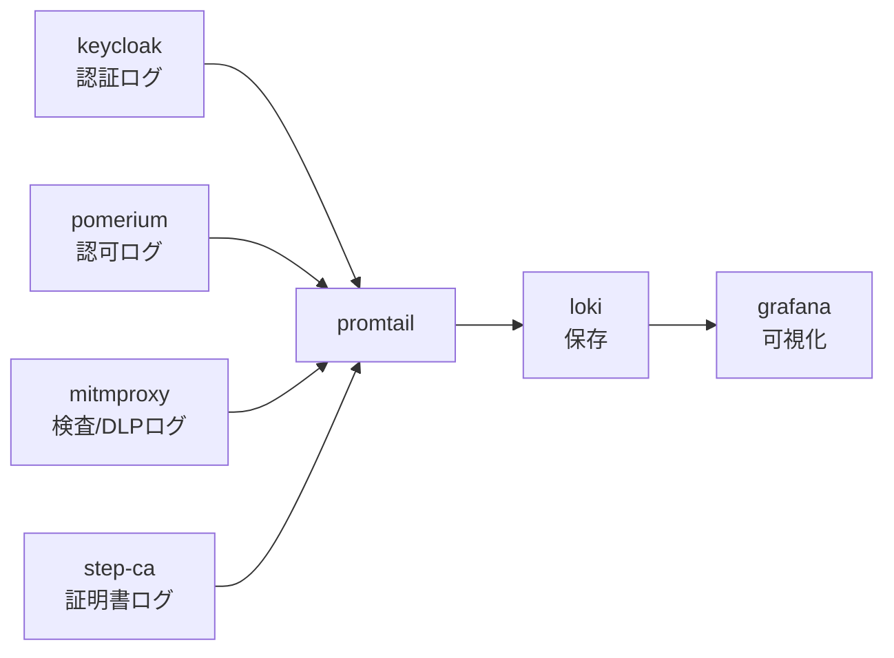

# Phase 3 解説 — SIEM（Loki + Grafana）

## 1. このフェーズで何が実現されるか

Phase 3 では各観点のログを集約・可視化する基盤（Loki + Promtail + Grafana）を立てる。Phase 1（認証ログ）・Phase 2（認可ログ）の記録を Grafana のダッシュボードで見えるようにする。このフェーズをあえて SWG/DLP（Phase 4/5）より前に置くのは、以降の Phase で「セキュリティ機構が本当に効いているか」を証拠つきで示すため（D-3）。

- **ビフォー**: Phase 1/2 の各コンポーネントは docker のコンテナログとしてログを吐いているが、生ログを都度 `docker logs` で追うしかない。件数の傾向や横断的な相関が見えない。
- **アフター**: Promtail が各ノードのログを収集し、Loki に保存され、Grafana でクエリ・ダッシュボード表示ができる。「未認証拒否は何件あったか」「認証成功は何件か」が一目でわかる。

## 2. なぜこの構成か

| 観点 | 商用製品 | 本ラボの OSS 選定 | 選定理由 |
|---|---|---|---|
| SIEM | Splunk, Microsoft Sentinel | **Grafana + Loki + Promtail**（軽量先行）。発展: Wazuh（統合 SIEM/EDR） | [軽量検証結果](../03_詳細設計/軽量検証結果_2026-07-04.md) で grafana/loki/promtail は全て arm64 ネイティブ対応（High）。wazuh-manager も arm64 対応だが `latest` タグが存在せずバージョンタグ明示が必須という運用上の注意点あり |

なぜ Loki 先行か（D-4）:

- Wazuh は統合 SIEM/EDR として強力だが、リソース見積が 2-4GB 級と重い。VM 全体のメモリ制約（NFR-2）を考えると、まず軽量な Loki+Grafana（512MB 級）で「ログを集めて見る」という SIEM の本質的な価値を確保し、Wazuh は発展課題に回す判断が合理的。
- **なぜ SIEM を早期投入するか（D-3）**: Phase 4（SWG）・Phase 5（DLP）は「検知・ブロックが機能しているか」を示す必要がある。SIEM が無い状態でこれらを実装すると、効果が見えないまま構築が進むリスクがある。先に「見る仕組み」を用意しておくことで、以降の Phase の実装がそのまま検証可能になる。

**実務でこの知識がどこで効くか**: Splunk や Sentinel の SPL/KQL クエリを書いたことがなくても、Grafana の LogQL（Loki のクエリ言語）は考え方が近い。「ラベルで絞り込み、正規表現でフィルタし、集計する」という SIEM クエリの基本パターンは共通しており、ここで学んだクエリ感覚は商用 SIEM に触れたときにも転用できる。またログの片方向集約という設計思想は、監査ログの改ざん耐性（ログ生成元がログを消せない）という監査・コンプライアンス要件の基礎になる。

## 3. 仕組みの核心

[論理構成設計](../02_基本設計/論理構成設計.md) のフロー3（ログフロー）が Phase 3 の核心。



ポイント:

- **Promtail はエージェント、Loki はストレージ、Grafana はビューア**という3層分担。Loki は Elasticsearch のような全文検索インデックスを持たず、ラベル（メタデータ）でログストリームを絞り込んでから中身を検索する設計（"like Prometheus, but for logs"）。これが軽量な理由の一つ。
- **片方向のログフロー**。各コンポーネント（生成元）から Loki への送信のみで、Loki から生成元への書き込みは発生しない。これにより「攻撃者がログを改ざん・削除できない」という監査ログの基本要件を、設計レベルで満たそうとしている（基本設計書のセキュリティ方針）。
- **可観測ゾーンは他ゾーンから片方向でのみ受信**し、Grafana の閲覧アクセス以外の戻り通信は無い設計。ゾーン分離の原則がここでも適用されている。

## 4. 自分で触って確認する手順（実装後にこの手順で確認）

Phase 3 は今回スコープでは未デプロイ（設計値）。実装後、[試験計画書](../05_試験/試験計画書.md) T-3-* に沿って以下を確認する想定。

### 手順1: Loki の準備状態を確認する

```bash
docker exec clab-zero-grafana wget -qO- http://loki:3100/ready
```

期待結果: `ready` が返る。

### 手順2: Promtail がログを収集しているか確認する（T-3-1）

```bash
docker logs --tail 50 clab-zero-promtail
```

期待結果: 各ターゲット（keycloak, pomerium 等）のログをスクレイプしているログ行が出力されている。

### 手順3: Grafana に Loki データソースを登録し、Phase 1/2 のログをクエリする（T-3-2、学習の核心）

Grafana の Explore 画面で LogQL クエリを実行する。

```logql
{container="clab-zero-keycloak"} |= "LOGIN"
```

```logql
{container="clab-zero-pomerium"} |= "deny"
```

期待結果: それぞれ Keycloak のログイン試行行、Pomerium の拒否判定行がタイムライン付きで表示される。**「ログとは何か」を生の文字列としてではなく、ラベルとタイムスタンプ付きの構造化データとして扱える**ことを体験するのがこの手順のねらい。

### 手順4: 未認証拒否・認証成功の件数を可視化するダッシュボードを作る（T-3-3）

```logql
sum(count_over_time({container="clab-zero-pomerium"} |= "deny" [5m]))
```

このようなクエリをパネル化し、時系列グラフとして「拒否件数の推移」を表示する。ここまでできると、Phase 2 で作った IAP が実際にリクエストを弾いていることの**証拠**になる。

## 5. 考えどころ

- **本番設計ならどうするか**: 本番の SIEM はログの長期保存（コンプライアンス要件で数年単位）、相関分析（複数ソースをまたいだ異常検知）、SOAR 連携（自動対応）まで含む。本ラボの Loki+Grafana は「ログを集めて見る」の一歩目に留まる。
- **このラボの簡略化ポイント**:
  - **保持期間・容量制限は未設計**。本番は保持ポリシー（retention）とストレージ容量管理が必須。
  - **相関ルール・アラートは手動クエリの域**。本番の SIEM は自動アラート・エスカレーションフローを持つ。
  - **Wazuh は後回し**。EDR 機能（エンドポイントでの異常検知）は本ラボのスコープ外で、SIEM（ログ集約・可視化）のみに絞っている。

## 6. つまずきポイント

- **Grafana でログが見えない**: [切り分けシート](../05_試験/切り分けシート.md) にある通り「ログ層は独立して壊れる」。他の Phase が正常でも、Promtail のラベル設定や対象コンテナのログ出力先（stdout/stderr か、ファイルか）だけが原因で L6 が単独 NG になりうる。
- **ラベルの粒度が粗すぎて絞り込めない**: Promtail の scrape config でコンテナ名以外のラベル（サービス種別など）を付けていないと、大量ログの中から目的の行を探しにくい。ラベル設計は Phase 3 実装時に見直す価値がある。
- **Loki が起動直後は ready を返さない**: 起動直後は数秒〜数十秒の初期化時間がかかることがある。即座に `/ready` を叩いてエラーになっても、少し待って再試行する。

## 参照

- [段階ロードマップ](../02_基本設計/段階ロードマップ.md)
- [論理構成設計](../02_基本設計/論理構成設計.md)（ログフロー）
- [phase3_siem 構築スタブ](../04_構築/phase3_siem/README.md)
- [軽量検証結果](../03_詳細設計/軽量検証結果_2026-07-04.md)
- [試験計画書](../05_試験/試験計画書.md)
- [切り分けシート](../05_試験/切り分けシート.md)
