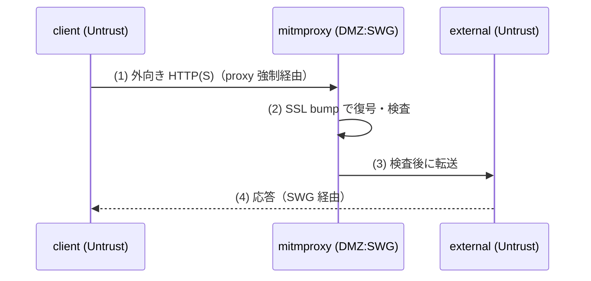

# Phase 4 解説 — WEBセキュリティ（SWG / mitmproxy）

## 1. このフェーズで何が実現されるか

Phase 4 では `client` の外向き Web 通信を SWG（Secure Web Gateway）に強制経由させ、SSL bump（TLS 復号）で通信内容を可視化し、不審通信を IDS で検知して SIEM（Phase 3）に発報する。第一候補は mitmproxy（SSL bump 一本）で、代替として Squid（SSL bump）+ Suricata（IDS）の組み合わせを検討する。

- **ビフォー**: Phase 0 の状態では `client`→`external` の外向き通信は素通しで、内容は誰にも検査されない。
- **アフター**: `client` の外向き通信はすべて mitmproxy（または Squid）を強制的に経由し、TLS で暗号化された内容も復号して中身が見える状態になる。不審な通信パターンは IDS が検知し、Loki に記録される。

このフェーズは Phase 5（DLP）の土台にもなる。同一のプロキシ経路上に DLP アドオンを載せるため、Phase 4 で確立した「強制経由 + 復号」の経路がそのまま活用される。

## 2. なぜこの構成か

| 観点 | 商用製品 | 本ラボの OSS 選定 | 選定理由 |
|---|---|---|---|
| WEBセキュリティ（SWG/CASB） | Zscaler ZIA, Netskope | **mitmproxy**（第一候補）。代替: Squid + Suricata | [軽量検証結果](../03_詳細設計/軽量検証結果_2026-07-04.md) で mitmproxy・squid・suricata すべて arm64 ネイティブ対応を実測確認（3つとも High、当初のMed見込みから確度が上がった） |

なぜ mitmproxy に集約するか（D-2）:

- mitmproxy 単体で SSL bump（TLS 復号）と Python アドオンによる内容検査の両方が可能。Squid + Suricata + c-icap のような多段構成に比べて、arm64 VM のリソースを節約できる。
- 検証の結果、mitmproxy・Squid・Suricata のいずれも arm64 対応が確認されたため、実装時にどちらの構成でも成立する見込みだが、リソース効率と実装のシンプルさ（KISS）から mitmproxy 一本化が第一候補になっている。

**実務でこの知識がどこで効くか**: Zscaler ZIA や Netskope のような SWG/CASB 製品は「クラウド上でTLS復号して中身を見る」ブラックボックスとして使われることが多いが、その内部でやっていることは mitmproxy の SSL bump と本質的に同じ（自己署名 CA を端末に信頼させ、中間者として振る舞う）。この仕組みを手元で動かして体験しておくと、企業のプロキシ証明書がなぜ端末にインストールされているのか、なぜ特定のアプリ（証明書ピニングをするもの）だけプロキシ経由で失敗するのか、といった実務上のトラブルシュートの理解が深まる。

## 3. 仕組みの核心

[論理構成設計](../02_基本設計/論理構成設計.md) のフロー2（プロキシフロー）が Phase 4 の核心。



SSL bump（TLS 復号）の仕組み:

1. `client` が `https://external/` へアクセスしようとすると、実際には mitmproxy へ接続する（プロキシ強制経由設定、または透過プロキシ）。
2. mitmproxy は `client` に対して**自分が発行した証明書**を提示し、TLS セッションを確立する（"サーバーのふり"）。
3. 同時に mitmproxy は本物の `external` に対して別の TLS セッションを張る（"クライアントのふり"）。
4. 結果として `client`↔mitmproxy↔`external` の2本の TLS セッションが繋がり、mitmproxy はその中間で平文の中身を読める。

この仕組みが成立する前提は**`client` が mitmproxy の CA 証明書を信頼している**こと。信頼していなければブラウザは証明書エラーを出す。これは「正規の中間者攻撃」を意図的に構築しているのと同義であり、なぜラボ限定の前提が重要かの理由になる（後述）。

## 4. 自分で触って確認する手順（実装後にこの手順で確認）

Phase 4 は今回スコープでは未デプロイ（設計値）。実装後、[試験計画書](../05_試験/試験計画書.md) T-4-* に沿って以下を確認する想定。

### 手順1: 外向き通信が proxy 経由に強制されているか確認する（T-4-1）

```bash
docker exec clab-zero-client env | grep -i proxy
docker exec clab-zero-client curl -sv http://external/
```

期待結果: `HTTP_PROXY`/`HTTPS_PROXY` が mitmproxy を指している。curl のログ（`-v`）で mitmproxy を経由していることがわかる（Via ヘッダ等）。

### 手順2: mitmproxy の CA 証明書を `client` に信頼させる

```bash
# mitmproxy が発行する CA 証明書を取得して client にインストール
docker exec clab-zero-client curl -o /tmp/mitmproxy-ca.pem http://mitm.it/cert/pem
docker exec clab-zero-client update-ca-certificates  # 証明書ストアに反映（ディストロによりコマンド差異あり）
```

### 手順3: SSL bump で HTTPS 内容が可視化できることを確認する（T-4-2、学習の核心）

```bash
docker exec -it clab-zero-mitmproxy mitmweb --web-host 0.0.0.0
```

その後、`client` から `https://external/` へアクセスし、mitmweb の Web UI（[ログインコマンド](../00_ログイン/ログインコマンド.md) 想定 8081 番）でリクエスト/レスポンスの中身（ヘッダー、ボディ）が平文で見えることを確認する。**「TLS で暗号化されているはずの通信の中身が、経路の途中で丸見えになる」**ことを実際に見るのがこの手順の核心。

### 手順4: IDS 発報が Loki に届くことを確認する（T-4-3）

```bash
docker logs --tail 50 clab-zero-suricata   # または mitmproxy 側の検知ログ
```

Grafana で以下のようなクエリを実行し、検知イベントが表示されることを確認する。

```logql
{container="clab-zero-suricata"} |= "ALERT"
```

## 5. 考えどころ

- **本番設計ならどうするか**: 本番の SWG は全社員の全通信を扱うため、透過的なプロキシ配置（PAC ファイル配布や DNS/ルーティングでの強制）、証明書ピニングを行うアプリの例外リスト管理、SSL bump 対象外にすべき通信（銀行系など法規制対象）の除外設定が必須になる。
- **このラボの簡略化ポイント（特に重要）**:
  - **SSL bump はラボ内通信に限定**する前提を明記する（基本設計書のセキュリティ方針）。SSL bump は技術的には正規の中間者攻撃であり、実運用で無断に他人の通信を復号すれば違法・重大なプライバシー侵害になりうる。本ラボはあくまで自分が管理する検証環境内の通信のみを対象にする。
  - **証明書ピニング対応アプリは考慮しない**。実運用では mitmproxy が入っても復号できない通信（証明書ピニングされたアプリ）があり、それをどう扱うかが SWG 導入の実務上の課題になる。
  - **IDS ルールは最小限**。Suricata の商用相当のルールセット（有償フィード等）は使わず、基本的な検知のみで「検知→SIEM」の導線を確認する。

## 6. つまずきポイント

- **SSL bump が失敗し証明書エラーになる**: `client` が mitmproxy の CA 証明書を信頼していないことが最多の原因。[切り分けシート](../05_試験/切り分けシート.md) の L3（TLS 証明書）で `openssl s_client` を使い、証明書チェーンを確認する。
- **プロキシ経由にならず直接通信してしまう**: 環境変数（`HTTP_PROXY`/`HTTPS_PROXY`）の設定漏れ、または透過プロキシのルーティング設定漏れ。L2（ネットワーク到達）ではなく経路の強制設定（アプリ層）の問題であることに注意。
- **Suricata/Squid が arm64 で不安定**: [軽量検証結果](../03_詳細設計/軽量検証結果_2026-07-04.md) では arm64 対応を確認済みだが、実際の起動・ルール適用で問題が出た場合は mitmproxy 一本化のルール（D-2 の代替差し替え）に切り替える。

## 参照

- [段階ロードマップ](../02_基本設計/段階ロードマップ.md)
- [論理構成設計](../02_基本設計/論理構成設計.md)（プロキシフロー）
- [phase4_swg 構築スタブ](../04_構築/phase4_swg/README.md)
- [軽量検証結果](../03_詳細設計/軽量検証結果_2026-07-04.md)
- [試験計画書](../05_試験/試験計画書.md)
- [切り分けシート](../05_試験/切り分けシート.md)
