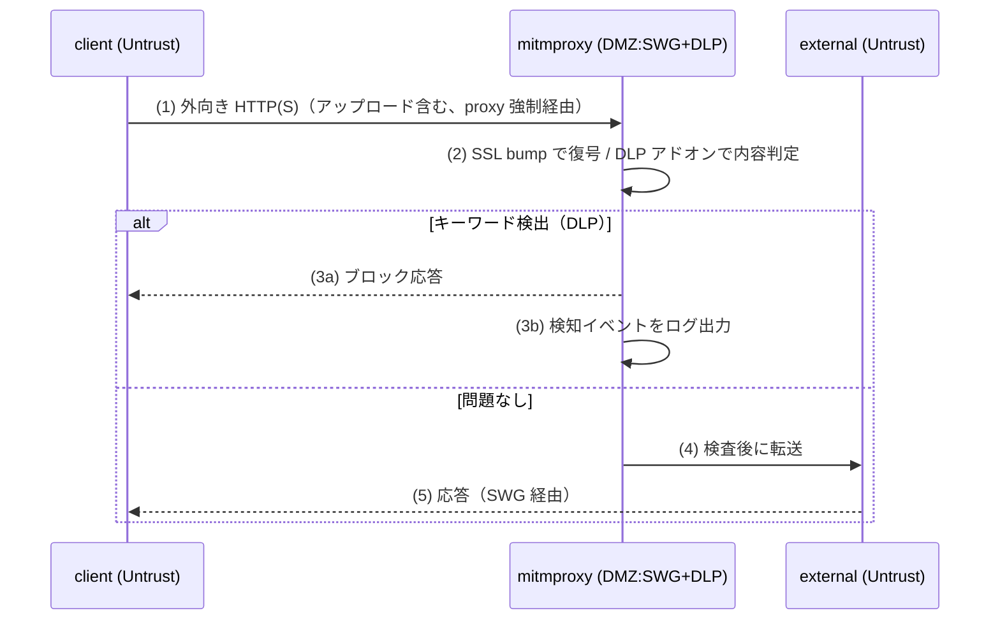

# Phase 5 解説 — DLP（mitmproxy アドオン）

## 1. このフェーズで何が実現されるか

Phase 5 では、Phase 4 の SWG（mitmproxy）に Python アドオンを同居させ、アップロード内容を検査する。機密キーワードを含むデータの持ち出しを検知・ブロックし、検知イベントを SIEM（Loki）に記録する。DLP（Data Loss Prevention）を OSS で代替する。

- **ビフォー**: Phase 4 の状態では、外向き通信は SSL bump で可視化されているが、内容の是非を判断する仕組みは無い。中身は見えているが、誰も判断していない状態。
- **アフター**: `client` が機密キーワードを含むファイルをアップロードしようとすると、mitmproxy のアドオンがリクエストボディを検査し、キーワードを検出した場合はブロック応答を返す。検知イベントは Loki に記録され、Grafana で確認できる。

## 2. なぜこの構成か

| 観点 | 商用製品 | 本ラボの OSS 選定 | 選定理由 |
|---|---|---|---|
| DLP / IRM | 各種商用 DLP 製品 | **mitmproxy Python アドオン**（SWG と兼務）。代替: c-icap + ClamAV | [軽量検証結果](../03_詳細設計/軽量検証結果_2026-07-04.md) で mitmproxy は arm64 対応済み（High、SWG と共用イメージ）。一方 `clamav/clamav` は arm64 manifest が amd64 のみで確定的に非対応（要代替） |

なぜ SWG と DLP を同一コンポーネントに集約するか（D-2）:

- DLP は「プロキシを通過する通信の内容を検査する」機能であり、Phase 4 で確立した SSL bump の経路（すでに中身が復号されている）にそのまま相乗りできる。別途 Suricata/c-icap のような検査エンジンを追加する必要がない。
- 検証の結果、DLP/アンチウイルス系でよく使われる ClamAV は arm64 非対応（`clamav/clamav:latest` の manifest list が amd64 のみ）と確定した。ウイルススキャンを伴う本格的な c-icap + ClamAV 構成は本ラボでは組めないため、**キーワードベースの内容検査に絞った mitmproxy アドオン一本化**が現実的な選択になる。

**実務でこの知識がどこで効くか**: 商用 DLP 製品（例: Symantec DLP、Microsoft Purview）は「正規表現・辞書・機械学習分類器でコンテンツを判定し、ポリシーに応じてブロック/警告/監査ログのみ、を出し分ける」という設計。mitmproxy アドオンでのキーワード検知はこの最小構成版であり、DLP 製品のポリシーエンジンが内部で何をしているかの直感を養える。プロキシ経路への処理差し込み（アドオン、インターセプタ、フィルタ）というパターンは、CASB や API ゲートウェイの実装にも共通する考え方。

## 3. 仕組みの核心

[論理構成設計](../02_基本設計/論理構成設計.md) のフロー2（プロキシフロー）の分岐部分が Phase 5 の核心。



ポイント:

- **検知と遮断は分離された処理**。mitmproxy のアドオンは `request()` フックでリクエストボディを検査し、キーワードが見つかれば `flow.response` を差し替えてブロック応答を返す（クライアントには到達させない）。一方でログ出力は検知した事実そのものを記録する処理であり、ブロックするかどうかとは独立して動く（監査ログとしての DLP の役割）。
- **アドオンは Phase 4 の同一プロセスに追加ロードされる**だけで、新しいコンポーネントは増えない。`mitmdump -s dlp_addon.py` のように既存の mitmproxy 起動コマンドにアドオンスクリプトを渡すだけで機能が追加される。
- **内容検査の対象は「復号済みの平文」**。Phase 4 の SSL bump が成立していることが Phase 5 の前提（依存関係: Phase 5 は Phase 4 の後）。TLS が復号されていなければアドオンはただの暗号化バイト列しか見えず、キーワード検査ができない。

## 4. 自分で触って確認する手順（実装後にこの手順で確認）

Phase 5 は今回スコープでは未デプロイ（設計値）。実装後、[試験計画書](../05_試験/試験計画書.md) T-5-* に沿って以下を確認する想定。

### 手順1: DLP アドオンがロードされているか確認する

```bash
docker logs --tail 50 clab-zero-mitmproxy
```

期待結果: アドオンの起動ログ（キーワードリストの読み込み等）が出力されている。

### 手順2: 機密キーワードを含むアップロードを試み、検知されることを確認する（T-5-1, T-5-2、学習の核心）

```bash
# 機密キーワードを含むダミーファイルを作成してアップロードを模擬
docker exec clab-zero-client sh -c 'echo "confidential-keyword-here" > /tmp/secret.txt'
docker exec clab-zero-client curl -sv -F "file=@/tmp/secret.txt" http://external/upload
```

期待結果: 通常の 200 応答ではなく、ブロック応答（例: 403 や独自のブロックページ）が返る。ここで**「同じ curl コマンドでも、中身次第で結果が変わる」**ことを確認するのがこの手順のねらい。SWG（Phase 4）は経路を検査するだけだったが、DLP（Phase 5）は内容の意味を判断している違いを体感する。

### 手順3: キーワードを含まないアップロードは通ることを確認する（対照実験）

```bash
docker exec clab-zero-client sh -c 'echo "just some normal text" > /tmp/normal.txt'
docker exec clab-zero-client curl -sv -F "file=@/tmp/normal.txt" http://external/upload
```

期待結果: 通常通り 200 が返る。手順2 とこの手順を両方試すことで、DLP が「常にブロックしているわけではなく、内容で判断している」ことを対照的に確認できる。

### 手順4: 検知イベントが SIEM に記録されることを確認する（T-5-3）

Grafana で以下のクエリを実行する。

```logql
{container="clab-zero-mitmproxy"} |= "DLP_BLOCK"
```

期待結果: 手順2 で発生させた検知イベントがログとして表示される。

## 5. 考えどころ

- **本番設計ならどうするか**: 本番の DLP は正規表現・辞書だけでなく、機械学習によるコンテンツ分類（個人情報・機密文書のパターン認識）、ファイル形式を問わない中身抽出（Office 文書・PDF 内のテキスト抽出）、暗号化されたアーカイブへの対応まで踏み込む。本ラボはキーワード完全一致・正規表現レベルの最小実装に留まる。
- **このラボの簡略化ポイント**:
  - **誤検知/未検知の閾値検証は PoC 範囲に限定**。本番の DLP 導入では誤検知率（False Positive）を業務影響が出ない水準まで下げるチューニングに時間がかかるが、本ラボでは「検知の仕組みが動くこと」の確認に留める。
  - **キーワード定義は設定で外部化**し、値を直書きしない設計にするが、本番のような分類ラベル管理（機密度レベル、部署別ポリシーなど）までは実装しない。
  - **暗号化ファイルへの対応なし**。zip パスワード付きファイルなどはそのままでは中身を検査できない（本番でも共通の課題だが、対策は範囲外）。

## 6. つまずきポイント

- **アドオンをロードしても検知が発火しない**: リクエストボディのエンコーディング（multipart/form-data のパース漏れなど）が原因になりやすい。まず平文の `text/plain` ボディで検知するかを確認し、multipart のケースはその後に切り分ける。
- **ブロック応答は返るがログに記録されない**: ブロック処理とログ出力処理が別のフック関数（`request()` と `response()` など）に分かれている実装だと、片方だけ実装漏れになることがある。
- **SSL bump が効いていないのに DLP を疑ってしまう**: Phase 5 は Phase 4 に依存するため、まず [phase4_解説](phase4_解説.md) の手順で SSL bump が成立しているかを確認する。復号できていなければ DLP アドオンには何も検査できるものがない。[切り分けシート](../05_試験/切り分けシート.md) の層別で「下層 NG が根本」の原則に従い、L3（TLS）を先に確認する。

## 参照

- [段階ロードマップ](../02_基本設計/段階ロードマップ.md)
- [論理構成設計](../02_基本設計/論理構成設計.md)（プロキシ/DLP フロー）
- [phase5_dlp 構築スタブ](../04_構築/phase5_dlp/README.md)
- [phase4_解説](phase4_解説.md)
- [軽量検証結果](../03_詳細設計/軽量検証結果_2026-07-04.md)
- [試験計画書](../05_試験/試験計画書.md)
- [切り分けシート](../05_試験/切り分けシート.md)
