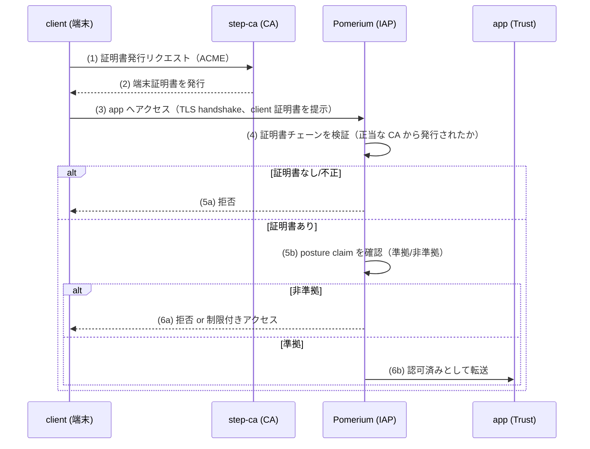

# Phase 6 解説 — デバイス統制（step-ca / mTLS）

## 1. このフェーズで何が実現されるか

Phase 6 では端末証明書（mTLS: 相互 TLS 認証）を使い、「管理された端末かどうか」を検証する。あわせて posture claim（端末状態を表す属性、例: OS のバージョンが準拠しているか）を認可判断の入力にし、条件によって到達可否を分岐させる。ID（誰か、Phase 1）＋デバイス（何の端末か、Phase 6）の二軸で「明示的検証」を完成させる、本ラボの最終フェーズ。

- **ビフォー**: Phase 2 までの状態では、「正しい ID でログインした」ことは検証できるが、その ID が使っている端末が管理された正当な端末かどうかは問われない。個人の私物端末でも、正しいパスワードさえ知っていれば `app` に到達できてしまう。
- **アフター**: `client` は step-ca が発行した証明書を持つ端末として mTLS でその正当性を証明する。証明書を持たない端末（`external` はこの状態のまま）は拒否される。さらに posture claim（準拠/非準拠）によって、同じ証明書を持つ端末でも状態次第でアクセス可否が変わる。

## 2. なぜこの構成か

| 観点 | 商用製品 | 本ラボの OSS 選定 | 選定理由 |
|---|---|---|---|
| デバイス統制（MDM/EPP/EDR） | Microsoft Intune, CrowdStrike | **step-ca**（mTLS 証明書発行・posture claim モック）＋ osquery 補助 | [軽量検証結果](../03_詳細設計/軽量検証結果_2026-07-04.md) で step-ca は arm64 対応済み（High）。一方 osquery の公式 Docker イメージは arm64 非対応（amd64 のみ実測確認）と確定 |

なぜ posture claim をモックにするか（FR-2）:

- osquery（端末の詳細な状態を SQL クエリで取得するツール）は本来デバイス統制の要だが、公式 Docker イメージが arm64 をサポートしていないことが実測で判明した。ネイティブバイナリの自前ビルドや Wazuh agent への統合機能での代替は工数が大きいため、本ラボでは posture claim を**固定属性のモック**（例: 「この端末は準拠 = true」という値を決め打ちで持たせる）に割り切る。
- 重要なのは「posture という属性を認可判断の入力にできる設計になっているか」を示すことであり、posture 収集の実装の作り込みそのものは主眼ではない（実装可能性の PoC という要件定義の位置づけに合致）。

**実務でこの知識がどこで効くか**: Intune や CrowdStrike のようなデバイス管理製品は、端末に常駐エージェントを入れてデバイス証明書を配布し、コンプライアンス状態（暗号化の有無、OS パッチレベル等）を継続的にレポートする。この「証明書でデバイスを識別し、posture で状態を条件分岐する」という発想は、企業の Conditional Access（条件付きアクセス）ポリシーの根幹。mTLS のハンドシェイクを自分の手で構築・検証しておくと、企業ネットワークで「証明書のない端末が弾かれる」「OS が古いと VPN に繋がらない」といった挙動の裏側が具体的に見えるようになる。

## 3. 仕組みの核心

mTLS ハンドシェイクと posture claim の連携が Phase 6 の核心。



ポイント:

- **mTLS は「相互」認証**。通常の HTTPS はサーバー証明書のみでサーバーの正当性を検証するが、mTLS ではクライアント（`client`）側も証明書を提示し、サーバー（ここでは IAP）がそれを検証する。「あなたが誰か」（Phase 1 の ID）とは独立した「あなたの端末が何か」を証明する層。
- **posture claim は証明書とは別の判断材料**。証明書があっても posture が非準拠なら拒否・制限、という条件分岐ができることで、「端末を持っているか」と「その端末が今、安全な状態か」を分けて評価できる。これが二軸検証（ID×デバイス）の実体。
- **CA（step-ca）が信頼の起点**。IAP（Pomerium）は「step-ca が発行した証明書かどうか」だけを確認すればよく、個々の端末を個別に信頼する必要がない。CA を中心にした信頼のスケーラビリティがこの仕組みの本質。

## 4. 自分で触って確認する手順（実装後にこの手順で確認）

Phase 6 は今回スコープでは未デプロイ（設計値）。実装後、[試験計画書](../05_試験/試験計画書.md) T-6-* に沿って以下を確認する想定。

### 手順1: CA を初期化し、`client` に証明書を発行する

```bash
docker exec clab-zero-step-ca step ca health
docker exec clab-zero-client step ca certificate "client.zt.local" client.crt client.key \
  --ca-url https://step-ca:9000 --root /path/to/root_ca.crt
```

期待結果: `client` に証明書（`client.crt`）と秘密鍵（`client.key`）が生成される。

### 手順2: 証明書を持たない端末（`external`）を拒否することを確認する（T-6-1、学習の核心）

```bash
# external は証明書なしのまま app へのアクセスを試みる
docker exec clab-zero-external curl -sv https://<iap-host>/
```

期待結果: TLS ハンドシェイクの段階で拒否される（`alert handshake failure` 等）。認証（Phase 1）や認可（Phase 2）の話に到達する前に、mTLS の層で弾かれることを確認する。

### 手順3: 証明書を持つ `client` はアクセスできることを対照確認する

```bash
docker exec clab-zero-client curl -sv --cert client.crt --key client.key https://<iap-host>/
```

期待結果: mTLS ハンドシェイクが成功し、以降 Phase 1/2 の認証・認可フローに進む。手順2 との対照で「証明書の有無だけで結果が変わる」ことを確認する。

### 手順4: posture claim（準拠/非準拠）で到達可否が変わることを確認する（T-6-2）

posture のモック値を切り替える（設定ファイルまたは環境変数、実装時に確定）。

```bash
# posture = 非準拠 に切り替えた状態で再試行
docker exec clab-zero-client curl -sv --cert client.crt --key client.key https://<iap-host>/
```

期待結果: 証明書は正当でも、posture が非準拠であれば拒否/制限される。**「証明書があるだけでは十分ではない」**ことを、同じ証明書のまま posture 値だけ変えて確認するのがこの手順の核心。

### 手順5: 拒否・許可の判定が SIEM に記録されることを確認する（T-6-3）

```logql
{container="clab-zero-pomerium"} |= "mtls" or "posture"
```

## 5. 考えどころ

- **本番設計ならどうするか**: 本番の MDM/EPP は継続的なエージェント常駐でリアルタイムに posture を収集し（ディスク暗号化状態、EDR 稼働状況、パッチレベルなど）、証明書の失効・再発行のライフサイクル管理（CRL/OCSP）も運用する。本ラボは証明書発行と固定 posture のモックに留まる。
- **このラボの簡略化ポイント**:
  - **posture 収集は実装しない（モック）**。osquery の arm64 非対応という制約もあり、実際のエンドポイント状態を継続的に取得する仕組みは本ラボのスコープ外。
  - **証明書のライフサイクル管理は最小**。失効（revocation）・自動更新（renewal）のフローは本格実装しない。本番ではこれが運用の中心課題になる。
  - **CA の可用性・鍵管理**。本番の CA はHSM（ハードウェアセキュリティモジュール）等で秘密鍵を保護するが、本ラボの step-ca は単一コンテナで完結する簡易構成。

## 6. つまずきポイント

- **証明書はあるのに拒否される**: [切り分けシート](../05_試験/切り分けシート.md) の重複パターンにある通り、mTLS（L3 相当）は通っても、posture claim の値が想定と違う、または IAP 側のポリシー設定漏れという別レイヤーの問題であることが多い。まず TLS ハンドシェイク自体が成功しているかを `openssl s_client` で切り分ける。
- **ACME 発行フローでエラーになる**: step-ca と `client` の時刻がずれている（NTP 未同期）と証明書の有効期間の検証で失敗することがある。
- **posture 値を変えても挙動が変わらない**: Pomerium 側のポリシー設定で posture claim を条件式に組み込み忘れているケースが多い。「証明書の検証」と「posture の評価」は別の設定項目であることを意識する。

## 参照

- [段階ロードマップ](../02_基本設計/段階ロードマップ.md)
- [論理構成設計](../02_基本設計/論理構成設計.md)（デバイス統制）
- [phase6_device 構築スタブ](../04_構築/phase6_device/README.md)
- [phase2_解説](phase2_解説.md)
- [軽量検証結果](../03_詳細設計/軽量検証結果_2026-07-04.md)
- [試験計画書](../05_試験/試験計画書.md)
- [切り分けシート](../05_試験/切り分けシート.md)
