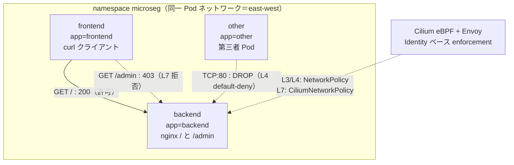

# テーマ microseg_cilium マイクロセグメンテーション（Cilium/eBPF）— NW-ZT N4 実装

Illumio / VMware NSX / Cisco Secure Workload(Tetration) が担うマイクロセグメンテーションの核心「**同一セグメント（east-west）の通信を default-deny にし、許可した端末・パスだけを通して横移動を遮断する**」を、OSS の Cilium/eBPF + Kubernetes NetworkPolicy / CiliumNetworkPolicy で再現する。テーマZERO [NW-ZT トラック N4](../ZERO_zero_trust/02_基本設計/NW-ZT_トラックロードマップ.md) の実装先。思想の解説は [解説: N4 μセグ](../ZERO_zero_trust/解説/nwzt_N4_解説.md)。

> N4 解説は Cisco IOL VLAN/ACL + ホスト nftables で「二層μセグ」を説明している。本テーマはその**思想を Kubernetes/Cilium で実装した OSS 版**（テーマ42 が N3 NDR 解説の OSS 版だったのと同じ位置づけ）。nftables の IP 直書き許可リストの限界を、Cilium の Identity ベース宣言的ポリシーが解消する点が学びの核心。

## 構成（east-west 3 段遮断）

- **frontend→backend `GET /`** = 許可（200）。
- **frontend→backend `GET /admin`** = L7 で拒否（403、Cilium/Envoy）。
- **other→backend** = L3/L4 default-deny で遮断（SYN 段階で DROP）。

## 前提環境

- OrbStack VM `clab`（arm64）、`ssh clab@orb`。docker（ユーザーは docker グループ所属＝k3d は sudo 不要）。
- ツール（arm64 実測）: kubectl v1.36.2 / k3d v5.9.0 / cilium CLI v0.19.4 / Cilium 1.19.3 / hubble v1.19.4。`deploy.sh tools` で `~/.local/bin` に取得。
- イメージ: nginx:alpine、wbitt/network-multitool、quay.io/cilium/*（arm64）。

## 手順（04_構築/）

1. `./deploy.sh deploy` — tools 取得＋k3d クラスタ（標準 CNI 無効化）＋Cilium 導入（G1）
2. `./deploy.sh workload` — microseg ns に frontend/backend/other（G2）
3. `./deploy.sh test` — 素通し疎通（全 200）
4. `./deploy.sh policy-l4` → `./deploy.sh test` — L3/L4 default-deny（other 遮断＝G3）
5. `./deploy.sh policy-l7` → `./deploy.sh test` — L7 パス制御（/admin 403＝G4）
6. `./deploy.sh hubble` — verdict 観測（G5）
7. 片付け: `./deploy.sh destroy`

マニフェスト: [10-workloads.yaml](04_構築/manifests/10-workloads.yaml)（ワークロード）、[20-netpol-l4.yaml](04_構築/manifests/20-netpol-l4.yaml)（標準 NetworkPolicy）、[30-cnp-l7.yaml](04_構築/manifests/30-cnp-l7.yaml)（CiliumNetworkPolicy）。

## 到達点

L3/L4/L7 の 3 段で east-west default-deny を実証済み（[試験結果](05_試験/試験結果_2026-07-05.md)）。同一ワークロードにポリシーを重ね、other だけが 200→000、/admin だけが 200→403 に落ちる対照を示した。Hubble で L4=SYN DROP・L7=HTTP request DROP→403 と遮断の深さの違いまで観測。詰まりどころ（k3d+Cilium の API サーバ検出、標準 NetworkPolicy と CNP の OR マージ）は [構築ログ](04_構築/構築ログ_2026-07-05.md)。

## 学べること

east-west マイクロセグの L3/L4/L7 の役割分担、Kubernetes NetworkPolicy と CiliumNetworkPolicy の違い（L7/HTTP を書けるのは CNP）、Cilium の Identity ベース制御（IP でなく label）、eBPF+Envoy による L7 enforcement、Hubble による verdict 可視化。商用（Illumio/NSX/Secure Workload）の内部構造理解。

## 商用製品との対応

| 商用製品 | アプローチ | 本ラボの OSS 対応 |
|---|---|---|
| Illumio | ホストエージェント分散 FW・中央管理・依存関係マップ | Cilium が各ノードで eBPF 分散適用、宣言的ポリシーを中央（k8s API）で一元管理。CNP=中央ポリシー、エージェント=cilium-agent |
| VMware NSX | 分散ファイアウォール（DFW）・L7 コンテキスト | NetworkPolicy(L3/L4) + CiliumNetworkPolicy(L7 HTTP) の二段。DFW の L7 App-ID に相当するのが CNP の http rules |
| Cisco Secure Workload (Tetration) | フロー可視化→ポリシー自動生成→enforcement | Hubble(可視化) + CNP(enforcement)。N3 NDR(検知) と N4(遮断) を繋ぐと Tetration 的な「見える化→絞る」が再現できる |

nftables(N4 解説) の IP 直書き許可リストが端末増減で破綻する限界を、Cilium の **Identity（label ベース）** が構造的に解消（IP が変わっても label が同じなら同じ扱い）。これは Cisco TrustSec の SGT が解く問題そのもの。

## 参照

- [NW-ZT トラックロードマップ N4](../ZERO_zero_trust/02_基本設計/NW-ZT_トラックロードマップ.md)
- [解説: N4 μセグメンテーション](../ZERO_zero_trust/解説/nwzt_N4_解説.md)
- [構築ログ](04_構築/構築ログ_2026-07-05.md) / [試験結果](05_試験/試験結果_2026-07-05.md)
- [テーマ42 N3 NDR（直前の作業・east-west 検知）](../42_ndr_flow/README_Lab_Challenge.md)
