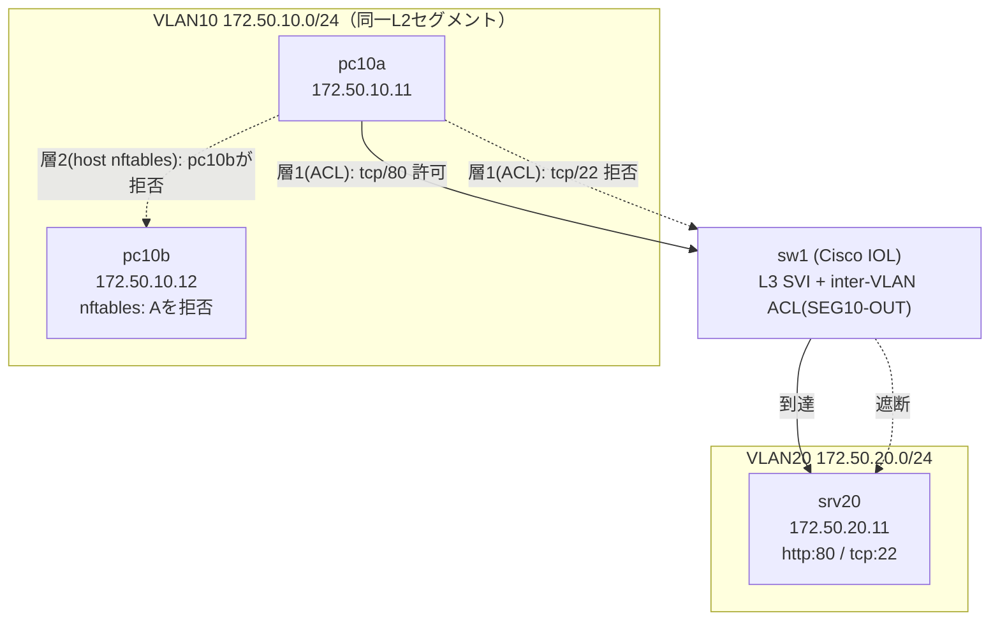

# テーマ microseg_nftables マイクロセグメンテーション（IOL VLAN/ACL + ホスト nftables）— NW-ZT N4 実装

Cisco TrustSec/SGT・Illumio が担うマイクロセグメンテーションの核心「**同一セグメント（east-west）の通信を default-deny にし、許可した端末・パスだけを通して横移動を遮断する**」を、Cisco IOL の VLAN + inter-VLAN ACL とホスト nftables の**二層構成**で実機実証する。テーマZERO [NW-ZT トラック N4](../ZERO_zero_trust/02_基本設計/NW-ZT_トラックロードマップ.md) の実装先。思想の解説は [解説: N4 μセグ](../ZERO_zero_trust/解説/nwzt_N4_解説.md)。

> 本テーマは N4 解説が示す「IOL VLAN/ACL + ホスト nftables」の**当初設計どおりの実装版**。姉妹版 [microseg_cilium](../microseg_cilium/README_Lab_Challenge.md) は同じ N4 の思想を Kubernetes/Cilium(eBPF) で実装した OSS 版で、Identity ベース制御による nftables の IP 直書きの限界克服を扱う。本テーマはその**手前の「素の姿」**——ネットワーク機器の VLAN/ACL とホストの静的パケットフィルタだけでは何ができて何ができないかを手で確認する。

## 学びの核心

**VLAN/ACL は「セグメント間（inter-VLAN）」しか制御できない。同一セグメント（同一 VLAN・同一サブネット）内の端末間通信は、ルータ/L3スイッチを経由しないため VLAN 間 ACL の対象にならない。** 同一セグメント内の横移動を止めるには、各ホスト自身のパケットフィルタ（nftables）が必要——これが Illumio のような分散FW製品が「ホストエージェント常駐」を選ぶ理由そのもの。

## 構成（2層の役割分担）

- **層1（粗い分離・VLAN間）**: sw1 の SVI（Vlan10）に適用した inter-VLAN ACL `SEG10-OUT` が、VLAN10→VLAN20 の到達を tcp/80 のみ許可・tcp/22 は拒否。
- **層2（細かい分離・VLAN内）**: 同一 VLAN10 内の pc10a→pc10b は sw1 のルーティングを経由しないため ACL が効かない。pc10b 自身の nftables (`ip saddr 172.50.10.11 drop`) で横移動を遮断。

## 前提環境

- OrbStack VM `clab`（arm64）、`ssh clab@orb`。containerlab 0.77 / docker 29.1.3。
- イメージ: `vrnetlab/cisco_iol:L2-advipservices-2017`（L3 SVI + inter-VLAN ACL 対応）、`microseg-endpoint:local`（ubuntu:24.04 + nftables/iproute2/iputils-ping/curl/ncat/python3、`04_構築/endpoint/Dockerfile` で自作）。
- コンテナ名は `clab-microseg-` 接頭辞、mgmt ネットワークは `clab-microseg-mgmt`（172.20.30.0/24）で、既存稼働中ラボ（`clab-dynamic-routing-lab-*` 等）と完全分離。

## 手順（04_構築/）

1. `./deploy.sh deploy` — 端末イメージ build → clab deploy → **iouyap 起動（ポート513、必須）** → データプレーンのオフロード無効化 → 端末 IP/GW/サービス設定（G1）
2. `sudo expect run_microseg.exp clab-microseg-sw1 sw1_microseg.cfg`（`./deploy.sh config` でも可）— sw1 に VLAN/SVI/ip routing/inter-VLAN ACL を投入
3. `./deploy.sh test` — G2（pc10a→srv20:80=到達・:22=遮断）と G3 適用前（pc10a→pc10b=到達）を確認
4. `./deploy.sh nft` — pc10b にホスト nftables（層2）を投入
5. `./deploy.sh test-g3-after` — G3 適用後（pc10a→pc10b=遮断）を確認、適用前後の対照が本ラボの核心
6. `sudo expect verify_microseg.exp clab-microseg-sw1` — ACL マッチカウンタを採取
7. 片付け: `./deploy.sh destroy`（**検証後は必ず実行**）

トポロジ: [microseg.clab.yml](04_構築/microseg.clab.yml)。スイッチ設定: [sw1_microseg.cfg](04_構築/sw1_microseg.cfg)（`ip routing` + VLAN10/20 + SVI + `ip access-list extended SEG10-OUT`）。

## 到達点

層1（inter-VLAN ACL）・層2（ホスト nftables）ともに実機実証済み（[試験結果](05_試験/試験結果_2026-07-05.md)）。層1は ACL マッチカウンタ（permit tcp/80=6 matches、deny tcp/22=1 match）、層2は適用前後の対照（3/3到達→0/3到達）とnftドロップカウンタ（0→3 packets）で、それぞれ実測エビデンスを取得した。詰まりどころ（iouyap起動、SVIの表示タイミング、expect並列実行時の競合）は[構築ログ](04_構築/構築ログ_2026-07-05.md)。

## 学べること

VLAN 間 ACL とホスト nftables の適用範囲の違い（inter-VLAN vs intra-VLAN）、Cisco IOL の L3 SVI + 拡張 ACL の実機構文、ACL マッチカウンタによる可視化、ホスト側分散FW（nftables）による east-west 制御の実装方法、Illumio のようなホストエージェント型分散FW製品が「なぜネットワーク機器の ACL だけでは不十分か」の具体的な根拠。

## 商用製品との対応

| 商用製品 | アプローチ | 本ラボの対応 |
|---|---|---|
| Cisco TrustSec (SGT/SGACL) | ネットワーク機器側でタグ(SGT)を付与し、機器のSGACLで判定（IPでなくタグ） | 本ラボの層1(IOL inter-VLAN ACL)は IP ベースの素朴な版。TrustSec は同じ「ネットワーク機器で判定」の思想を、IP でなくタグに置き換えて IP変更に強くしたもの |
| Illumio | 各ホストにエージェント常駐、ホスト自身のFW(iptables/nftables相当)を中央から一括制御 | 本ラボの層2(pc10bのnftables)は「ホスト自身がFWを持つ」思想そのもの。Illumioはこれを多数ホストに対して中央管理で自動配布する |
| VMware NSX (DFW) | ハイパーバイザ層の分散ファイアウォール | 層2のホストnftablesと同じ「トラフィックの発生源に近い場所で判定する」という分散FWの思想 |

nftables の IP 直書き許可リスト（`ip saddr 172.50.10.11 drop`）は、pc10a の IP が変わると追随できない構造的な限界を持つ。これを label/Identity ベースで解消するのが Cisco TrustSec の SGT や姉妹版 [microseg_cilium](../microseg_cilium/README_Lab_Challenge.md) の Cilium Identity。

## 参照

- [NW-ZT トラックロードマップ N4](../ZERO_zero_trust/02_基本設計/NW-ZT_トラックロードマップ.md)
- [解説: N4 μセグメンテーション](../ZERO_zero_trust/解説/nwzt_N4_解説.md)
- [構築ログ](04_構築/構築ログ_2026-07-05.md) / [試験結果](05_試験/試験結果_2026-07-05.md)
- [姉妹版 microseg_cilium（同じ N4 思想の Kubernetes/Cilium 実装）](../microseg_cilium/README_Lab_Challenge.md)
- [テーマ31 NAC/802.1X（N1、VLAN基盤・iouyap起動手法の手本）](../31_nac_dot1x/README_Lab_Challenge.md)
