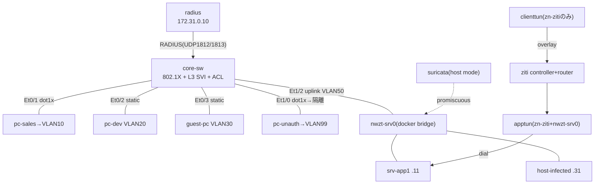

# 基本設計書: ゼロトラスト_ネットワーク特化

## 1. 設計方針

本テーマは [ゼロトラスト完全版 基本設計書](../../ゼロトラスト完全版/02_基本設計/基本設計書.md) が定義した統合ポイントのうち、ネットワーク層に閉じるものを実装対象に選ぶ。

| 完全版の統合ポイント/フロー | 本テーマでの実装 |
|---|---|
| I-2 認証→セグメント | RADIUS属性による動的VLAN割当（core-sw ↔ radius）→ inter-VLAN ACL(SEG10-OUT) |
| I-3 常時監視 | 東西SPAN代替として、サーバ室ブリッジ `nwzt-srv0` を Suricata が host mode でpromiscuous監視 |
| I-5 サーバ非公開化 | srv-app1 を OpenZiti overlay 経由のみ到達可能なダークサービスにする |
| F-A 社員PC入場 | 802.1X認証成功(pc-sales)→動的VLAN10→ACL通過でsrv-app1(tcp80)到達 |
| F-C 感染端末の検知 | host-infected の東西SYNスキャン→Suricata検知(sid:1000001)→層2 nftables 手動投入で隔離 |
| F-D リモート社員のZTNA到達 | clienttun→overlay(zn-ziti)→apptun→srv-app1。直接到達(172.31.50.11:80)は失敗する対照を示す |
| F-E サーバ間東西のμセグ | inter-VLAN ACL（層1）＋ 同一VLAN内ホストnftables（層2）の二層で東西を制御 |

I-1（ID統一）・I-4（検知→対応の自動CoA）・I-6（Webアプリ認可）・I-7（統合可観測の全社統合）・I-8（宣言型アクセス層）、およびL7由来のP0-P6は、いずれもL7層かCoA自動化を要するため本テーマのスコープ外とする。I-4のCoA自動隔離は完全版同様に◐設計のまま維持し、本テーマでは層2 nftables の手動投入によるデモに留める（[要件定義書](../01_要件定義/要件定義書.md) 制約）。

## 2. 全体構成

単一の IOL コアスイッチ `core-sw` に、802.1X認証者(L2)とL3 SVI + inter-VLAN ACL(L4)を統合し、業務端末・RADIUS・サーバ室ブリッジを収容する。N2(ZTNA)・N3(NDR)は containerlab の管理外で docker 併走させ、`deploy-all.sh` が一括オーケストレーションする。

| ノード名 | 役割 | ゾーン |
|---|---|---|
| core-sw | 802.1X認証者 + L3 SVI + inter-VLAN ACL | コア |
| radius | FreeRADIUS認証サーバ | VLAN100 コア・認証管理 |
| pc-sales | 営業端末（802.1X動的割当） | VLAN10 営業 |
| pc-dev | 開発端末（静的） | VLAN20 開発 |
| guest-pc | ゲスト端末（静的） | VLAN30 ゲスト |
| pc-unauth | 未認証端末（隔離自動割当） | VLAN99 隔離 |
| nwzt-srv0 | サーバ室VLAN50の実体ブリッジ（docker network） | VLAN50 サーバ室 |
| srv-app1 | 保護対象サーバ（http/80 + 疑似ssh/22） | VLAN50 サーバ室 |
| host-infected | 感染端末役（東西スキャン源） | VLAN50 サーバ室 |
| suricata/loki/promtail/grafana | NDR検知＋集約 | 監視SOC（論理VLAN90・host mode） |
| ziti / apptun / clienttun | ZTNAコントローラ/ルータ・app側/client側tunneler | ZTNA overlay（zn-ziti） |

## 3. アドレス設計方針

[ゼロトラスト完全版 IPアドレス管理表](../../ゼロトラスト完全版/02_基本設計/IPアドレス管理表.md) が定義した `172.31.0.0/16`・第3オクテット＝VLAN ID の設計を無変更で踏襲する。第4オクテットは `.1`=GW/SVI、`.10`台=認証、`.101〜`=端末の規則に従う。詳細なノード一覧・mgmt-ipv4・出自対応は [IPアドレス管理表](IPアドレス管理表.md) に集約する（本書は方針のみ）。

## 4. 冗長性・拡張性

- 本テーマは実デプロイ検証を目的とした単一構成であり、**冗長化しない**（core-swは単一ノード、可用性は検証対象外）。
- 拡張点: pc-dev/guest-pc用の独立アクセス層スイッチを追加すれば、完全版の「floor-sw」構成（アクセス層とコアの分離）に近づけられる。現状は単一IOLへの統合を優先している（D-1参照）。
- I-4（検知→対応の自動化）は soar-lite 等のCoA連携コンポーネントを追加すれば発展できるが、本テーマのスコープ外とする。

## 5. セキュリティ方針

| 項目 | 実装 | 検証ゲート |
|---|---|---|
| N1 動的VLAN | RADIUS `Tunnel-Private-Group-Id` によりpc-salesをVLAN10へ、no-responseのpc-unauthをVLAN99へ | B2 |
| N4 層1（inter-VLAN ACL） | core-sw SVI(Vlan10) に `SEG10-OUT` を適用し、srv-app1へのtcp/80のみ許可、tcp/22拒否 | B3 |
| N4 層2（ホストnftables） | srv-app1で host-infected(172.31.50.31) からの着信をdrop（同一VLAN内は層1ACLの対象外のため） | B3 |
| N3 常時監視 | Suricataが `nwzt-srv0` をhost modeでpromiscuous監視し、SYNスキャンをsid:1000001で検知 | B4 |
| N2 サーバ非公開化 | srv-app1はOpenZiti overlay経由のみ到達可能（apptunがdial、clienttunは直接到達不可） | B5 |

各ゲートの手順・期待結果は [05_試験/試験計画書.md](../05_試験/試験計画書.md) を参照。**本書作成時点では実デプロイ未実施のため、判定は空欄／未実施である。**

## 6. 設計判断の記録（考えどころ）

| # | 判断 | 選択 | 理由 |
|---|---|---|---|
| D-1 | アクセス層とコアを分離するか単一IOLに統合するか | 単一IOL(`core-sw`)に統合 | probe実機確認で `L2-advipservices-2017` が dot1x を PAE=AUTHENTICATOR として受理することを確認済み。テーマの主眼はNW層統合でありノード数を減らして検証を単純化する |
| D-2 | サーバ室VLAN50をIOL配下の別ノードにするかdocker bridgeで実体化するか | docker bridge `nwzt-srv0` として実体化 | Suricataのhost mode監視がbridgeインターフェース名を要求し、42_ndr_flow・microseg_nftablesで確立済みの手法を踏襲できる |
| D-3 | N2/N3をclabトポロジに含めるかdocker併走にするか | docker併走（`deploy-all.sh` が束ねる） | OpenZiti/Suricata/Loki/Grafanaはclabの`kind:linux`管理外の運用パターンとして出自テーマ(36/42)で確立済み |
| D-4 | I-4（検知→対応のCoA自動化）を実装するか | 見送り（完全版同様◐設計のまま） | RADIUS CoA(UDP/3799)自動連携にはsoar-lite等の追加コンポーネントが必要でスコープ超過。層2 nftablesの手動投入デモに留める |
| D-5 | 統合IPアドレス空間の再設計要否 | 完全版のIPアドレス管理表を無変更で踏襲 | 完全版との対応関係を明確にし、二重管理を避ける |

## 参照

- [01_要件定義/要件定義書.md](../01_要件定義/要件定義書.md)
- [IPアドレス管理表](IPアドレス管理表.md)
- [ネットワーク物理構成図](ネットワーク物理構成図.mermaid)
- [03_詳細設計/パラメータシート.md](../03_詳細設計/パラメータシート.md)
- [05_試験/試験計画書.md](../05_試験/試験計画書.md)
- [ゼロトラスト完全版 基本設計書](../../ゼロトラスト完全版/02_基本設計/基本設計書.md)
- [ゼロトラスト完全版 IPアドレス管理表](../../ゼロトラスト完全版/02_基本設計/IPアドレス管理表.md)
