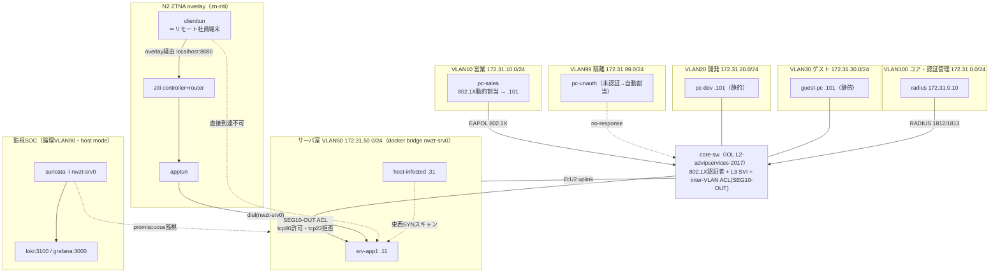

# ゼロトラスト_ネットワーク特化｜NW層統合実装 Lab Challenge

## 概要

**`ゼロトラスト_ネットワーク特化`** は、[ゼロトラスト完全版](../ゼロトラスト完全版/README_Lab_Challenge.md)が設計した仮想企業（1拠点・従業員約100名）の全社アーキテクチャのうち、**ネットワーク層 N1〜N4（NAC・ZTNA・NDR・μセグ）だけを1つの実在する社内LANに落とし込み、実デプロイまで行う実装テーマ**である。L7層（Keycloak/IAP/SIEM/mTLS等 P0-P6）は対象外とする。

完全版が「✅部品として実証済／◐設計のみ（接続は未接続）」の2状態で誠実に区別していたのに対し、本テーマは完全版のネットワーク層統合ポイント（I-2認証→セグメント／I-3常時監視／I-5サーバ非公開化）とE2Eフロー（F-A/F-C/F-D/F-E）を、**単一トポロジ上で実際に動く構成**として設計・実装する。`04_構築/`（[nwzt.clab.yml](04_構築/nwzt.clab.yml)・[core_sw_merged.cfg](04_構築/core_sw_merged.cfg)・[deploy-all.sh](04_構築/deploy-all.sh) 等）は構築部材として完成済みだが、**本ドキュメント作成時点では実デプロイによる動作確認（B1〜B6ゲート）は未実施**である。試験結果は実デプロイ後に別途 `05_試験/試験結果_YYYY-MM-DD.md` として記録する。

## トポロジ

単一の IOL コアスイッチ `core-sw`（802.1X認証者 + L3 SVI + inter-VLAN ACL）に、業務端末・RADIUS・サーバ室ブリッジを収容し、N2(ZTNA)・N3(NDR) は docker 併走で束ねる。



同一内容の単独参照版は [02_基本設計/ネットワーク物理構成図.mermaid](02_基本設計/ネットワーク物理構成図.mermaid)。

## 前提環境

| 項目 | 値 |
|---|---|
| ホスト | macOS（Apple Silicon / arm64） |
| VM | OrbStack VM `clab`（`ssh clab@orb`） |
| 仮想化基盤 | containerlab（core-sw のみ）＋ docker 併走（N2/N3） |
| コアSW | `vrnetlab/cisco_iol:L2-advipservices-2017`（probe実機確認で dot1x を PAE=AUTHENTICATOR として受理することを確認済み） |
| IOL注意 | データプレーンは deploy 直後に `iouyap`(513) 起動が必須（[clab運用規約](../規約/clab運用規約.md)）。config投入は expect の1 attach直列 |

## 開始手順

1. VM に接続する。詳細は [00_ログイン/ログインコマンド.md](00_ログイン/ログインコマンド.md)。
2. 設計を読む順序: [要件定義書](01_要件定義/要件定義書.md) → [IPアドレス管理表](02_基本設計/IPアドレス管理表.md) → [基本設計書](02_基本設計/基本設計書.md) → [ネットワーク物理構成図](02_基本設計/ネットワーク物理構成図.mermaid) → [パラメータシート](03_詳細設計/パラメータシート.md) → [CLI投入コマンド](03_詳細設計/CLI投入コマンド.md) → [試験計画書](05_試験/試験計画書.md)。
3. デプロイ（構築部材は完成済み。実行順は [deploy-all.sh](04_構築/deploy-all.sh) のサブコマンド順に従う）:
   ```bash
   cd 04_構築
   ./deploy-all.sh deploy   # prep_net → clab deploy → iouyap → データプレーン補正
   ./deploy-all.sh config   # core-sw へ core_sw_merged.cfg を投入
   ./deploy-all.sh auth     # pc-sales サプリカント起動 + srv-app1/host-infected サービス起動
   ./deploy-all.sh ziti     # N2 ZTNA(OpenZiti) 起動 + サービス/enrollment
   ./deploy-all.sh ndr      # N3 NDR(Suricata+Loki+Grafana) 起動
   ```

## Mission

段階ゲート B1〜B6 は [05_試験/試験計画書.md](05_試験/試験計画書.md) に詳細を持つ。ここでは概要のみ示す。

### Mission 1: B1 基盤疎通

`./deploy-all.sh deploy` → `config` で core-sw に設定が反映され、全ノードが起動していること。

**ゲート条件**: `./deploy-all.sh inspect` で全ノード running、`show ip interface brief | include Vlan` で全 SVI が up/up であること。

### Mission 2: B2 N1 動的VLAN

pc-sales が 802.1X 認証成功で VLAN10 に、pc-unauth が no-response で隔離VLAN99 に自動割当されること。

**ゲート条件**: `show authentication sessions` で pc-sales の Et0/1 が AUTHORIZED・VLAN10、Et1/0 が VLAN99 で表示されること。

### Mission 3: B3 N4 μセグ（2層）

pc-sales→srv-app1 は tcp/80 のみ到達し tcp/22 は遮断（層1 ACL）。層2 nftables 適用後、host-infected→srv-app1 の東西通信が遮断されること。

**ゲート条件**: `./deploy-all.sh verify` で HTTP=200・tcp22=BLOCKED、`./deploy-all.sh nft` 適用後に host-infected→srv-app1 が到達不能になること。

### Mission 4: B4 N3 検知

host-infected から srv-app1 への SYN スキャンが sid:1000001 で検知され、Loki/Grafana に集約されること。

**ゲート条件**: `./deploy-all.sh scan` → `./deploy-all.sh eve` で alert（sid 1000001）が確認できること。

### Mission 5: B5 N2 overlay到達

clienttun から overlay 経由（localhost:8080）で srv-app1 に到達し、直接到達（172.31.50.11:80）は失敗すること。

**ゲート条件**: [ztna/setup_ziti.sh](04_構築/ztna/setup_ziti.sh) の実証部分でオーバーレイ経由=HTTP 200、直接=unreachable であること。

### Mission 6: B6 E2E通し

Mission 1〜5 を通しで実施し、矛盾なく全ゲートを満たすこと。

**ゲート条件**: 試験結果を `05_試験/試験結果_YYYY-MM-DD.md` に記録できる状態であること（本テーマでは未作成、実デプロイ後にメインが記録）。

## 禁止事項

- **絶対パス（`/Users/…`）の埋め込み禁止**（相対リンクのみ）。
- **本テーマは L7層（P0-P6）を扱わない**（ID統制/IAP/SIEM/mTLS等は[ゼロトラスト完全版](../ゼロトラスト完全版/README_Lab_Challenge.md)の設計に譲る）。
- **`05_試験/試験結果_*.md` は本タスクでは作成しない**（実デプロイ後にメインセッションが実測値で記録する）。
- **通常運用の分担方針（構築はユーザー本人、Claudeは設計書・部材担当）を今回はユーザー指示により上書きし、Claudeが実デプロイ検証まで行う**。
- I-4（検知→対応の自動CoA隔離）は完全版同様に未実装（◐設計のまま）。本テーマでは層2 nftables の手動投入によるデモに留める。
- ファイル名は **NFC 正規化必須**。

## 参照

- [00_ログイン/ログインコマンド.md](00_ログイン/ログインコマンド.md)
- [01_要件定義/要件定義書.md](01_要件定義/要件定義書.md)
- [02_基本設計/基本設計書.md](02_基本設計/基本設計書.md)
- [02_基本設計/IPアドレス管理表.md](02_基本設計/IPアドレス管理表.md)
- [02_基本設計/ネットワーク物理構成図.mermaid](02_基本設計/ネットワーク物理構成図.mermaid)
- [03_詳細設計/パラメータシート.md](03_詳細設計/パラメータシート.md)
- [03_詳細設計/CLI投入コマンド.md](03_詳細設計/CLI投入コマンド.md)
- [05_試験/試験計画書.md](05_試験/試験計画書.md)
- [05_試験/切り分けシート.md](05_試験/切り分けシート.md)
- [ゼロトラスト完全版/README_Lab_Challenge.md](../ゼロトラスト完全版/README_Lab_Challenge.md)
- [31_nac_dot1x/README_Lab_Challenge.md](../31_nac_dot1x/README_Lab_Challenge.md)（N1出自）
- [36_ztna_openziti/README_Lab_Challenge.md](../36_ztna_openziti/README_Lab_Challenge.md)（N2出自）
- [42_ndr_flow/README_Lab_Challenge.md](../42_ndr_flow/README_Lab_Challenge.md)（N3出自）
- [microseg_nftables/README_Lab_Challenge.md](../microseg_nftables/README_Lab_Challenge.md)（N4出自）
