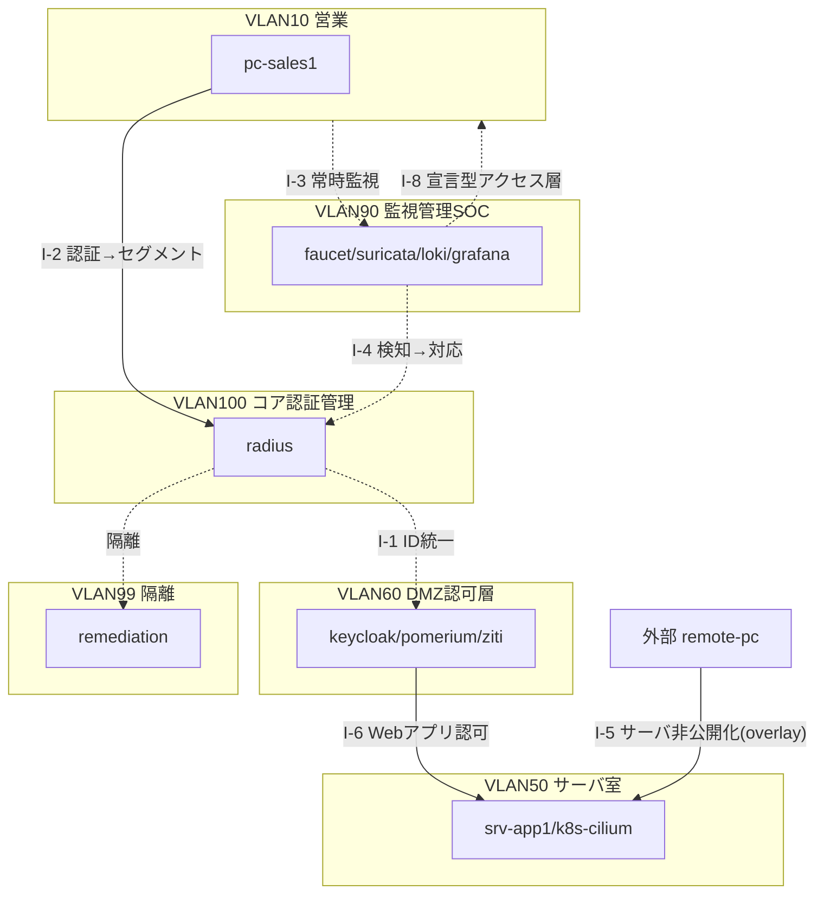

# ゼロトラスト完全版｜基本設計書

> **Phase番号（P0-P6）・N番号（N1-N4）・トラック区分は、各部品の出自ラボにおける管理単位として存続する。本書はそれらの到達点を1つの仮想企業LANへ再配置した設計であり、出自ラボ側のドキュメント（[ZERO_zero_trust 基本設計書](../../ZERO_zero_trust/02_基本設計/基本設計書.md) 等）そのものは変更しない。**

## 設計方針(3原則)

ゼロトラストの3原則を、仮想企業（1拠点・約100名）の統合アーキテクチャでどう実現しているかを対応づける。個々の対応の詳細は [ZERO_zero_trust 基本設計書](../../ZERO_zero_trust/02_基本設計/基本設計書.md) と [NW-ZT_論理構成設計](../../ZERO_zero_trust/02_基本設計/NW-ZT_論理構成設計.md) に譲り、本書はそれらを1社のLANへ統合した到達点を示す。

| ZT原則 | 意味 | 全社アーキでの実現 | 実装出自 |
|---|---|---|---|
| 明示的検証 | すべてのアクセスを毎回検証する | 802.1X（floor-sw1→radius）で入口ごとに認証。DMZ認可層(VLAN60)のIAP（pomerium）が全リクエストをkeycloakに照会。mTLS（step-ca）で端末も検証 | ✅N1動的VLAN(31)／◐IAP・mTLS(新設) |
| 最小権限 | 必要な範囲だけを許可する | 動的VLAN割当＋セグメント間ACL・east-westのdefault-denyで到達を最小化。srv-app1はoverlay経由のみ到達可能 | ✅N1(31)・N4(microseg_cilium/nftables)・N2(36) |
| 侵害前提 | 内部も信頼せず監視する | 全セグメントのミラー/ログを監視管理SOC(VLAN90)へ集約。NDR(suricata)がeast-west異常を検知し、SOAR連携（発展）で対応する | ✅N3(42)・N3補助(35)／◐SOAR連携(新設) |

## 全体構成

### 仮想企業モデル

1拠点・従業員約100名。社内LANは `172.31.0.0/16` に統一し、第3オクテット＝VLAN IDとする。セグメント定義・ノード一覧は [IPアドレス管理表](IPアドレス管理表.md) を正とする。

### 3プレーン構造

本アーキテクチャは3つのプレーンで構成する。

- **アイデンティティ/ポリシープレーン**: keycloak → radius → 動的VLAN割当 → μセグポリシー、の順でアイデンティティが物理/論理セグメンテーションへ変換される。
- **データプレーン**: 業務VLAN群（営業/開発/ゲスト/隔離）＋サーバ室＋DMZ認可層＋ZTNA overlayが実際のトラフィックを運ぶ。
- **監視プレーン**: SPAN/ミラー → NDR(suricata) → SIEM(loki/grafana) → SOAR(soar-lite)、の順で侵害前提の可視化・対応が連鎖する。

### 全社構成図（簡易）

詳細な物理/論理構成は [構成図（物理/論理）](構成図.html) を参照。

## アドレス設計方針

社内LANは `172.31.0.0/16` に統一し、第3オクテット＝VLAN IDとする再マッピング方式を採る。実機検証済のIP（31のSVI/FreeRADIUS）は無変更で採用し、他は全社設計値として新規採番する。詳細なノード一覧・採番規則・出自ラボ実IP対応表は [IPアドレス管理表](IPアドレス管理表.md) に集約する（本書は方針のみ）。

## 冗長性・拡張性

- 本フォルダは全社統合設計の到達点であり、**冗長化しない**（単一インスタンス構成、可用性は検証対象外）。
- 拡張点: SIEMはLoki先行からWazuhへ拡張可能（D-4、出自ZERO）。I-4（検知→対応）のCoA連携・soar-liteは発展課題として位置づける。
- I-8（宣言型アクセス層、faucet）は現状監視管理SOCの補助（ミラー/統計供給）に留まるが、将来的にアクセス層全体のVLAN/ACL宣言化へ拡張する方向性を持つ。

## セキュリティ方針（統合ポイント I-1〜I-8）

全社セグメントは統合ポイント I-1〜I-8 で接続される。詳細な表・状態は [統合アーキテクチャマップ](統合アーキテクチャマップ.md) の統合ポイント節に集約する。

| ID | 起点→終点 | プロトコル/IF概要 | 部品状態 | 接続状態 | 対応ゲート |
|---|---|---|---|---|---|
| I-1 ID統一 | keycloak→radius（KeycloakのIDを唯一の源泉としFreeRADIUSバックエンドに。有線802.1XとWeb SSOが同一ID） | LDAP(TCP/389)等・連携方式は選定未着手 | ◐ | ◐ | IG-I1 |
| I-2 認証→セグメント | radius→floor-sw（RADIUS属性 Tunnel-Private-Group-Id による動的VLAN）→core-sw ACL/μセグの前提 | RADIUS UDP/1812 | ✅(N1動的VLAN・N4 ACL/μセグ) | ◐ | IG-I2（旧IG-F1） |
| I-3 常時監視 | floor-sw/core-sw mirror(SPAN)→suricata | ミラーポート複製 | ✅(35 OVS mirror・42 promiscuous監視) | ◐(全社適用) | IG-I3 |
| I-4 検知→対応（本丸） | suricata eve.json→soar-lite(webhook)→radius CoA→floor-swポートVLAN変更（隔離VLAN99へ） | CoA UDP/3799 | ✅検知(42)／⬜CoA(T-N1-8未実施) | ◐ | IG-I4 |
| I-5 サーバ非公開化 | srv-app1はziti overlay経由のみ・VLAN50 inbound deny | ziti overlay(outboundのみ) | ✅(36 dark service) | ◐(全社適用) | IG-I5 |
| I-6 Webアプリ認可 | 社員ブラウザ→pomerium IAP(OIDC SSO=keycloak)＋step-ca mTLSクライアント証明書→srv-app | HTTPS/OIDC/mTLS | ◐ | ◐ | IG-I6 |
| I-7 統合可観測 | radius認証ログ・suricata eve・Hubble flow・IAPアクセスログ・gauge統計→promtail/loki→grafana | Loki HTTP API等 | ✅(42のeve→Loki実証) | ◐(統合) | IG-I7（旧IG-F2） |
| I-8 宣言型アクセス層（発展） | faucet→アクセスSW（VLAN/ACLをYAML宣言）＋gauge統計 | OpenFlow TCP/6653・Prometheus:9303 | ✅(35) | ◐(発展) | IG-I8 |

旧「層間連携5点」①〜⑤との対応: ①→I-2、②→I-7、③→I-4、④→I-5/I-6、⑤→I-1。

## 設計判断の記録

| # | 判断 | 選択 | 理由 | 出典 |
|---|---|---|---|---|
| D-1 | 出自ラボ（ZERO_zero_trust）でIOL連携するか | しない（docker networkで完結） | ZTの主眼はL7認可。IOLはx86で重く再現性を下げる | [ZERO_zero_trust 基本設計書](../../ZERO_zero_trust/02_基本設計/基本設計書.md)（出自ラボの決定として継承） |
| D-7 | 出自ラボ（31/35/36/42/microseg_*）でIOL連携するか | する | NAC/μセグはL2/L3が主眼でIOL必須。D-1は別ラボの決定でありこちらには及ばない | [ZERO_zero_trust 基本設計書](../../ZERO_zero_trust/02_基本設計/基本設計書.md)（出自ラボの決定として継承） |
| D-C1 | 二層トラックを解体するか | 全社1アーキに統合（Phase/N番号は実装出自ラベルとして存続） | 実務では単一の社内LANとして統合されるべき | 本書 |
| D-C2 | 全社アドレスの再マッピング方式 | ✅実証済IPは無変更、他は設計値として再採番 | エビデンスの一貫性と全社視点の統一を両立 | [IPアドレス管理表](IPアドレス管理表.md) |
| D-C3 | 隔離の終点をどこに置くか | CoA→VLAN99への動的移動を対応の終点とする | NACのCoA機構と一貫させる | [統合アーキテクチャマップ](統合アーキテクチャマップ.md) I-4 |
| D-C4 | リモートアクセス方式 | VPNではなくSDP overlay（I-5/F-D） | 内向きポート非開放のZT原則と整合 | [統合アーキテクチャマップ](統合アーキテクチャマップ.md) I-5 |

本フォルダ「ゼロトラスト完全版」は、各部品が出自ラボで実機実証済に到達した状態を、**仮想企業（1拠点・約100名）の1つの社内LANへ統合した設計**として集約するショーケースである。実機検証済なのは各ラボの「部品」であり、統合ポイントI-1〜I-8の「接続」は大半が◐設計のみに留まる点を明示し、誇張しない。

## 参照

- [要件定義書](../01_要件定義/要件定義書.md)
- [構成図（物理/論理・タブ切替）](構成図.html)
- [IPアドレス管理表](IPアドレス管理表.md)
- [統合アーキテクチャマップ](統合アーキテクチャマップ.md)
- [コンポーネント詳細設計](../03_詳細設計/コンポーネント詳細設計.md)
- [ZERO_zero_trust 基本設計書](../../ZERO_zero_trust/02_基本設計/基本設計書.md)
- [NW-ZT_トラックロードマップ](../../ZERO_zero_trust/02_基本設計/NW-ZT_トラックロードマップ.md)
- [NW-ZT_論理構成設計](../../ZERO_zero_trust/02_基本設計/NW-ZT_論理構成設計.md)
- [ゼロトラスト統合マップ](../../ZERO_zero_trust/02_基本設計/ゼロトラスト統合マップ.md)
