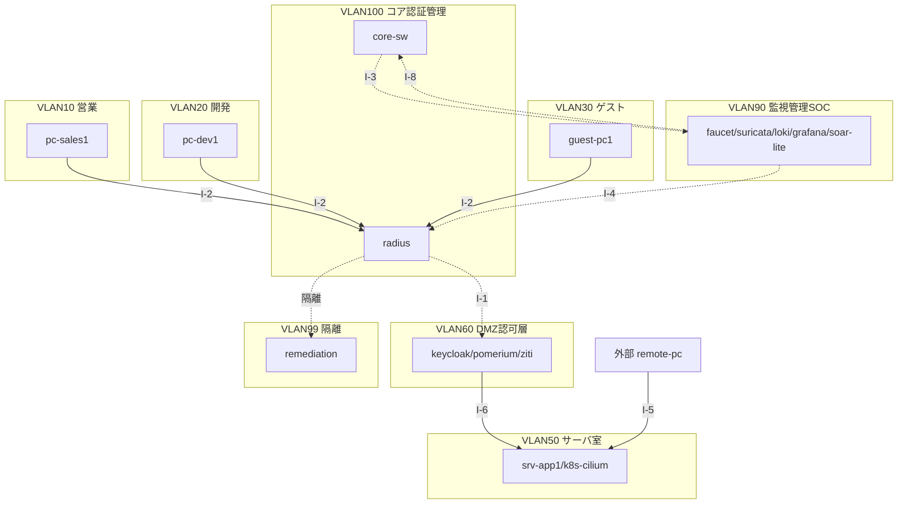

# ゼロトラスト完全版｜統合ショーケース Lab Challenge

> HTMLレポート版もある: [index.html](index.html)（本ドキュメント一式のビジュアル版。生成はビルド側で行う）

## 概要

**`ゼロトラスト完全版`** は、仮想企業（1拠点・従業員約100名）を想定し、各ラボで実機実証済のZTNA・NDR・L7ゼロトラスト部品を、1つの社内LAN（`172.31.0.0/16`）へ統合した**全社アーキテクチャ**のショーケースである。部品は既存テーマ（[ZERO_zero_trust](../ZERO_zero_trust/README_Lab_Challenge.md)、[31_nac_dot1x](../31_nac_dot1x/README_Lab_Challenge.md)、[36_ztna_openziti](../36_ztna_openziti/README_Lab_Challenge.md)、[42_ndr_flow](../42_ndr_flow/README_Lab_Challenge.md)、[35_faucet_sdn](../35_faucet_sdn/README_Lab_Challenge.md)、[microseg_cilium](../microseg_cilium/README_Lab_Challenge.md)、[microseg_nftables](../microseg_nftables/README_Lab_Challenge.md)）で個別に実機実証済であり、本フォルダは**それらを1社のLANへ統合した設計**に徹する（実装そのものは持たない）。

- 用途: ショーケース主・実務従。各実装テーマの学習（Mission）は本フォルダでは扱わない。
- 峻別方針: **✅ 部品として出自ラボで実機実証済** と **◐ 設計のみ（統合ポイント・全社適用は未接続）** を明確に分けて表示する（誇張しない）。ノード（部品）の状態と接続（統合ポイント）の状態は必ず別々に扱う。
- 現状: 各部品（P0=2026-07-04、N1-N4=2026-07-05、N3補助=2026-07-07）は実機実証済。統合ポイントI-1〜I-8・E2EフローF-A〜F-Eという「接続」はほぼ全てが◐設計のみに留まる。

## トポロジ

仮想企業（1拠点・約100名）の全社セグメントを1枚で俯瞰する。詳細な物理/論理構成は [構成図（物理/論理）](02_基本設計/構成図.html) を参照。

## 前提環境

| 項目 | 値 |
|---|---|
| ホスト | macOS（Apple Silicon / arm64） |
| VM | OrbStack VM `clab`（`ssh clab@orb`） |
| OS | Ubuntu 24.04 LTS / arm64 |
| 仮想化基盤 | containerlab（部品ごとにdocker完結／IOL連携が異なる。詳細は[基本設計書](02_基本設計/基本設計書.md)の設計判断D-1/D-7） |
| 部品の出自単位 | P0-P6（[ZERO_zero_trust](../ZERO_zero_trust/README_Lab_Challenge.md)）・N1-N4（[31_nac_dot1x](../31_nac_dot1x/README_Lab_Challenge.md)等） |

## 開始手順

1. VM に接続する。詳細は [00_ログイン/ログインコマンド.md](00_ログイン/ログインコマンド.md)。
2. 統合設計を読む順序: [要件定義書](01_要件定義/要件定義書.md) → [IPアドレス管理表](02_基本設計/IPアドレス管理表.md) → [基本設計書](02_基本設計/基本設計書.md) → [統合アーキテクチャマップ](02_基本設計/統合アーキテクチャマップ.md) → [構成図（物理/論理）](02_基本設計/構成図.html) → [コンポーネント詳細設計](03_詳細設計/コンポーネント詳細設計.md) → [試験計画書](05_試験/試験計画書.md) → [統合検証結果](05_試験/統合検証結果.md)。
3. 各部品の入口は次節「実装出自インデックス」を参照。
4. 実装ロードマップ（S0〜S6）は [04_構築/実装計画.md](04_構築/実装計画.md) を参照。

## 実装出自インデックス

各部品の実装・検証はここに委譲する（本フォルダは統合設計のみを持つ）。

### P0-P6（ZERO_zero_trust）

[ZERO_zero_trust/README_Lab_Challenge.md](../ZERO_zero_trust/README_Lab_Challenge.md)（Phase 0 実装済・Phase 1-6 は同ドキュメントの段階ロードマップ参照）。

### N1-N4（各実装テーマ）

- N1 NAC: [31_nac_dot1x/README_Lab_Challenge.md](../31_nac_dot1x/README_Lab_Challenge.md)
- N2 SDP-ZTNA: [36_ztna_openziti/README_Lab_Challenge.md](../36_ztna_openziti/README_Lab_Challenge.md)
- N3 NDR: [42_ndr_flow/README_Lab_Challenge.md](../42_ndr_flow/README_Lab_Challenge.md)（補助: [35_faucet_sdn/README_Lab_Challenge.md](../35_faucet_sdn/README_Lab_Challenge.md)）
- N4 μセグ: [microseg_cilium/README_Lab_Challenge.md](../microseg_cilium/README_Lab_Challenge.md)・[microseg_nftables/README_Lab_Challenge.md](../microseg_nftables/README_Lab_Challenge.md)

## Mission

本フォルダの到達条件は3階層ゲートで定義する。詳細な手順・期待結果は [05_試験/試験計画書.md](05_試験/試験計画書.md) を参照。

### 3階層ゲート — 概要

- **部品ゲート**（IG-L7-0〜6・IG-N1〜N4系）: P0・N1-N4は合格済（2026-07-05時点、N3補助は2026-07-07）。P1-P6は実装着手後に充足する。
- **統合ゲート**（IG-I1〜IG-I8）: 統合ポイントI-1〜I-8の接続確認。現状は全て未実施（設計のみ）。
- **E2Eゲート**（IG-FA〜IG-FE）: 代表シナリオF-A〜F-Eの到達確認。現状は全て未実施。

## 禁止事項

- **設定値（config）の答えをこのフォルダに書かない**（RADIUS/faucet.yaml/nftables/Suricataルール等の実設定は各実装テーマ側のみ。本フォルダは設計・フロー・ゲート・検証エビデンスの集約に留める）。
- **`任天堂UIデザイン案/` への書き込み禁止**（閲覧・参照のみ）。
- **絶対パス（`/Users/…`）の埋め込み禁止**（相対リンクのみ）。
- **実検証済と設計のみの混同禁止**（✅/◐ の表示を必ず維持する）。ノード（部品）の状態と接続（統合ポイント）の状態も混同しない。
- ファイル名は **NFC 正規化必須**。

## 参照

- [00_ログイン/ログインコマンド.md](00_ログイン/ログインコマンド.md)
- [01_要件定義/要件定義書.md](01_要件定義/要件定義書.md)
- [02_基本設計/基本設計書.md](02_基本設計/基本設計書.md)
- [02_基本設計/IPアドレス管理表.md](02_基本設計/IPアドレス管理表.md)
- [02_基本設計/統合アーキテクチャマップ.md](02_基本設計/統合アーキテクチャマップ.md)
- [03_詳細設計/コンポーネント詳細設計.md](03_詳細設計/コンポーネント詳細設計.md)
- [04_構築/実装計画.md](04_構築/実装計画.md)
- [05_試験/統合検証結果.md](05_試験/統合検証結果.md)
- [05_試験/試験計画書.md](05_試験/試験計画書.md)
- [ZERO_zero_trust/README_Lab_Challenge.md](../ZERO_zero_trust/README_Lab_Challenge.md)
