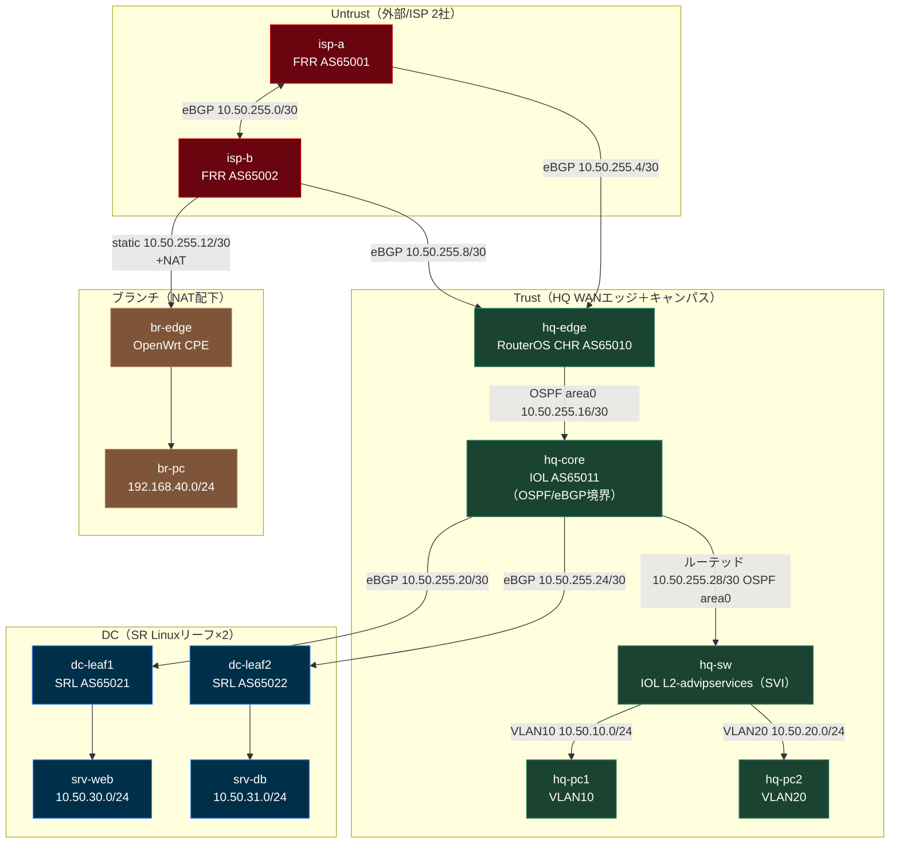

# マルチベンダ環境 — 1社を5ベンダーで再現する統合キャンパス+DC+WANラボ

> **動作確認済み（2026-07-17）**: 実機（OrbStack VM + containerlab）で全13ノード起動、
> `bash 05_試験/verify.sh` が **PASS=28 / FAIL=0** で全項目グリーンを達成。
> 詳細は [05_試験/試験結果報告書.md](05_試験/試験結果報告書.md) を参照。

## 概要

「1社の企業ネットワークを、ゾーンごとに最適ベンダーで構成する」完成済み環境。ISP（Untrustゾーン）・
WANエッジ・キャンパス（Trustゾーン）・DC・ブランチCPEの5役割を、実務でよく採用される組み合わせに
近いベンダーへ意図的に振り分け、**同じ目的の操作（経路確認・BGP/OSPF状態・設定投入・API取得）が
ベンダーによってどれだけ流儀が違うか**を1つのラボの中で横断比較できるようにする。
`03_詳細設計/ベンダー比較_同じ操作5流儀.md` が本テーマの目玉ドキュメントである。

## 5ベンダーの役割

```text
┌─────────────────────────── Untrust（ISP 2社・eBGP） ───────────────────────────┐
│   isp-a (FRR 10.2.1, AS65001)  ======eBGP======  isp-b (FRR 10.2.1, AS65002)   │
└──────────────┬───────────────────────────────────────────────┬────────────────┘
               │ eBGP                                          │ eBGP        │ static+NAT
               │                                                │             │
┌──────────────▼────────────────────────────────────────────────▼─┐     ┌─────▼─────┐
│         hq-edge (MikroTik RouterOS CHR 7.21.4, AS65010)          │     │  br-edge  │
│         デュアルホーム eBGP冗長 + REST API運用                    │     │ (OpenWrt) │
└──────────────────────────────┬───────────────────────────────────┘     │ ip/nft NAT│
                                │ OSPF area0                              └─────┬─────┘
┌───────────────────────────────▼────────────────────────────────┐             │
│   hq-core (Cisco IOL 15.7.3M2, AS65011)  ── OSPF area0 ──  hq-sw │       br-pc（LAN）
│   （OSPF/eBGP境界＝キャンパスの再配信ポイント）      (IOL L2-advipservices, SVI)│
└───────┬──────────────────────────┬───────────────────────────────┘
        │ eBGP                     │ eBGP              hq-sw配下: VLAN10=hq-pc1 / VLAN20=hq-pc2
        │                          │
┌───────▼────────┐        ┌────────▼───────┐
│ dc-leaf1 (SRL)  │        │ dc-leaf2 (SRL)  │   Nokia SR Linux v26.3.3 ×2
│ AS65021         │        │ AS65022         │   eBGP + JSON-RPC/gNMI自動化・ブート12秒
│ 配下: srv-web   │        │ 配下: srv-db    │
└─────────────────┘        └─────────────────┘
```

| ベンダー/イメージ | 役割 | 選定理由 |
|---|---|---|
| FRR 10.2.1 | ISP 2社（isp-a/isp-b） | AS運用・BGP経路制御・vtysh。OSSルーティングの本流 |
| MikroTik RouterOS CHR 7.21.4 | HQ WANエッジ（hq-edge） | デュアルホームeBGP冗長 + REST API運用 |
| Cisco IOL 15.7.3M2 / L2-advipservices-2017 | HQキャンパス（hq-core/hq-sw） | OSPF・VLAN・SVI・ルーテッドアップリンクによる境界設計 |
| Nokia SR Linux v26.3.3 | DCリーフ×2（dc-leaf1/dc-leaf2） | eBGP + JSON-RPC/gNMI自動化、arm64ネイティブでブート12秒 |
| OpenWrt 24.10.7（rootfs） | ブランチCPE（br-edge） | ip/nftを直叩きするNAT。uciは閲覧デモに留める（制約は下記） |

## トポロジ



## 前提環境

- OrbStack Linux VM（`clab@orb`）+ containerlab。
- arm64ネイティブ（FRR / SR Linux / OpenWrt）とx86 QEMUエミュレーション（RouterOS CHR、`QEMU_CPU=max`必須）が混在する。
- Cisco IOL 2台（hq-core / hq-sw）はGNS3世代イメージのためSSH不可。`docker attach`のコンソール運用のみ。
- 詳細な実測（起動秒数・判定・認証情報の出典）は
  [環境/イメージ可用性検証_2026-07-17.md](../環境/イメージ可用性検証_2026-07-17.md) と
  [環境/イメージ検証/devices.yaml](../環境/イメージ検証/devices.yaml) を正とする。

## 開始手順

1. **環境構築**（`ssh clab@orb` でVMにログインしてから実行）
   ```bash
   cd 04_構築
   ./deploy.sh deploy
   ```
   - `containerlab deploy` に加え、IOL（hq-core/hq-sw）の初期設定ダイアログへの自動応答、
     RouterOS（hq-edge）へのBGP/OSPF設定ssh投入、SR Linux（dc-leaf1/2）へのsr_cli設定投入を
     **全自動**で行う。IOL/RouterOS CHRのブート待ちを含め、**全13ノードがBGP/OSPF収束するまで
     約8〜10分**を見込む（コンテナ起動自体は下表の通り2〜3分だが、config後投入とルーティング収束の
     待ち時間が加わる）。
   - 自動投入が一部失敗した場合は `./deploy.sh config` で単独再実行できる（詳細:
     [04_構築/構築手順書.md](04_構築/構築手順書.md) §2・§4）。
2. **動作確認**
   ```bash
   cd 05_試験
   bash verify.sh
   ```
   - コンテナ13台の起動・疎通7項目・BGP5項目・OSPF・API2項目の計28項目をTSVで自動判定し、
     最終行に `SUMMARY PASS=28 FAIL=0`（正常時）を出力する。結果の記録例は
     [05_試験/試験結果報告書.md](05_試験/試験結果報告書.md) を参照。
3. **ログイン**
   機器へのログインコマンドは [00_ログイン/ログインコマンド.md](00_ログイン/ログインコマンド.md) を参照してください。
4. **ネットワークツールの活用**
   自作FastAPI製ネットワークツール（ping/config管理/ターミナル等）をこのラボで使う手順は
   [ネットワークツールの使い方/README.md](ネットワークツールの使い方/README.md) を参照してください。

## 所要時間（実測ベースの見込み）

| 項目 | 目安 |
|---|---|
| IOL×2（hq-core/hq-sw）起動 | 約96秒/台（既存ラボ実績） |
| RouterOS CHR（hq-edge）起動 | 約108秒（`chr7214`実測） |
| SR Linux×2（dc-leaf1/2）起動 | 約12秒/台（実測） |
| FRR×2・OpenWrt起動 | 数秒〜十数秒（arm64ネイティブ） |
| コンテナ13台の起動完了目安 | 約2〜3分（IOL/CHRのブート待ちが律速） |
| **`verify.sh` 全項目グリーンまでの総所要時間** | **約8〜10分**（起動2〜3分 + config後投入＋BGP/OSPF収束の待ち。2026-07-17実機実測） |

## 各ドキュメントへのリンク

- [00_ログイン/ログインコマンド.md](00_ログイン/ログインコマンド.md)
- [01_要件定義/要件定義書.md](01_要件定義/要件定義書.md)
- [02_基本設計/基本設計書.md](02_基本設計/基本設計書.md)
- [02_基本設計/IPアドレス管理表.md](02_基本設計/IPアドレス管理表.md)
- [03_詳細設計/パラメータシート.md](03_詳細設計/パラメータシート.md)
- [03_詳細設計/ベンダー比較_同じ操作5流儀.md](03_詳細設計/ベンダー比較_同じ操作5流儀.md)（目玉ドキュメント）
- [04_構築/構築手順書.md](04_構築/構築手順書.md)（§9に実機構築で判明した課題と対策）
- [05_試験/試験計画書.md](05_試験/試験計画書.md) / [05_試験/試験結果報告書.md](05_試験/試験結果報告書.md)
- [ネットワークツールの使い方/README.md](ネットワークツールの使い方/README.md)

## 拡張案

- **NX-OS titanium スパイン追加**: containerlabの `kind` が無くDocker直起動になるため、他ノードと同じ
  `deploy.sh` の一括管理に乗らない。追加する場合は**Tier3（x86フルVM）単独スロット運用**が前提
  （並列起動するとRAMが枯渇し他ラボを巻き込むOOMの実績あり。
  [環境/イメージ可用性検証_2026-07-17.md](../環境/イメージ可用性検証_2026-07-17.md) のOOM事故の項を参照）。
- **OpenWrt VM版化**: 現行の`openwrt/rootfs`はnetifdが動作せずuciが閲覧デモに留まる。将来的にVM型
  OpenWrt（`openwrt-*-x86-64-generic-ext4-combined.img`ベース、`vrnetlab/openwrt`）へ切り替えれば、
  uci commit/revertを含む本来のOpenWrt運用フローを再現できる。
